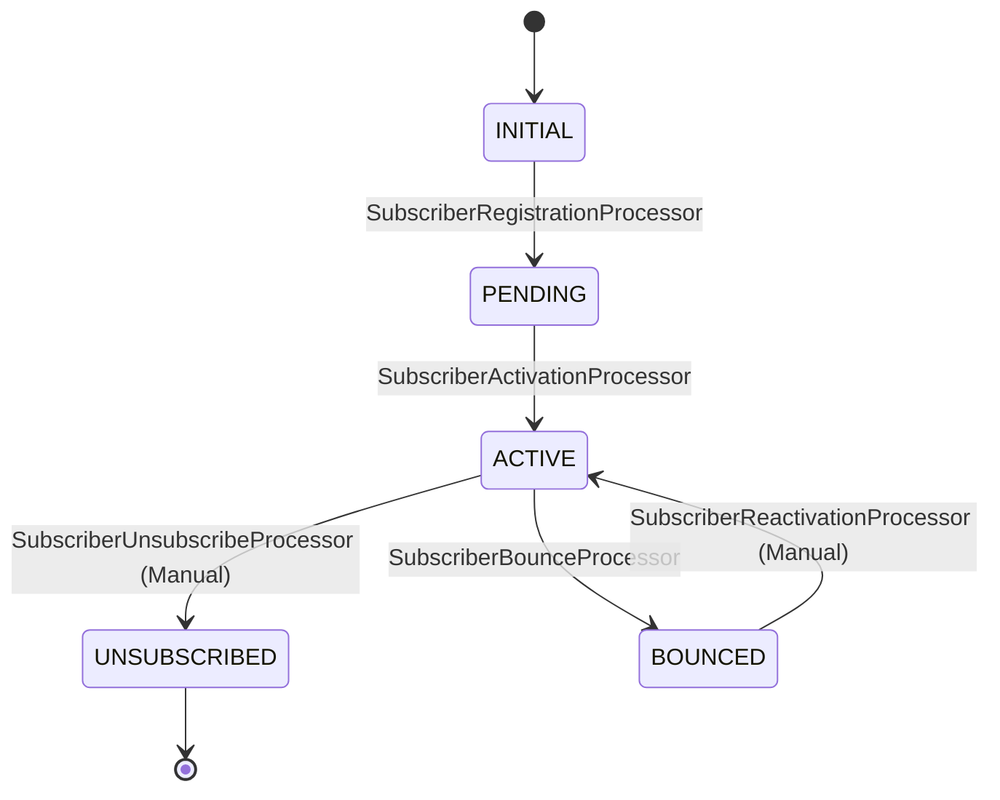
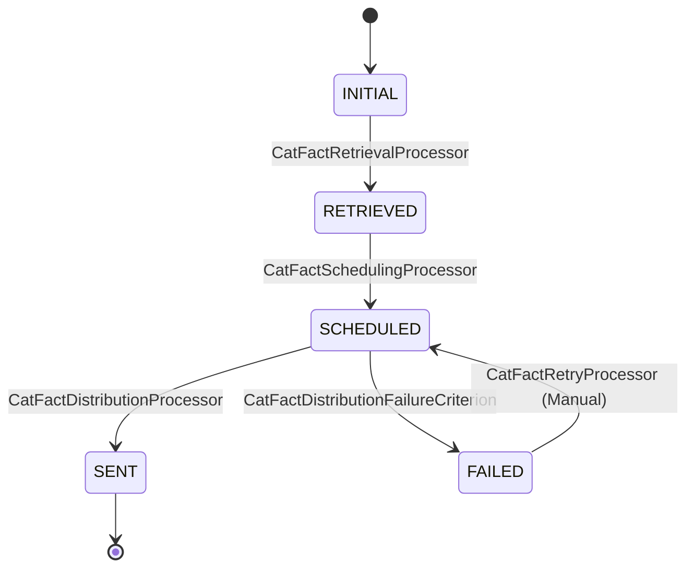
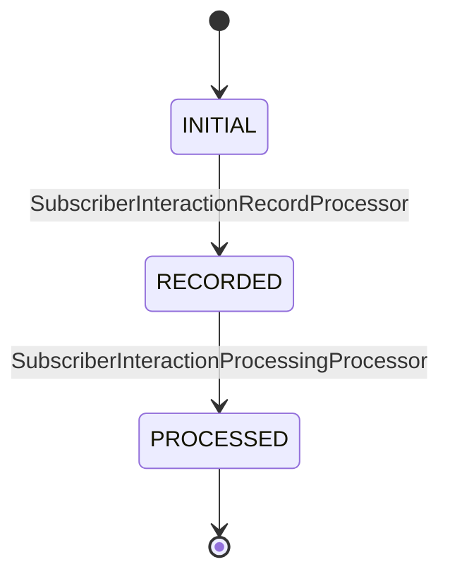
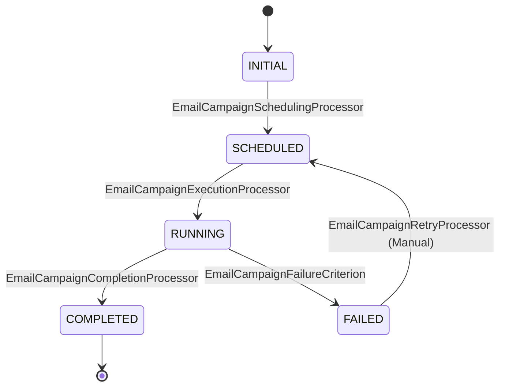

# Workflows

## Subscriber Workflow

**Name:** SubscriberWorkflow

**Description:** Manages the lifecycle of a subscriber from registration to unsubscription.

**States:**
- `INITIAL`: Starting state
- `PENDING`: Subscriber registered but not yet confirmed
- `ACTIVE`: Subscriber is active and receiving emails
- `UNSUBSCRIBED`: Subscriber has unsubscribed
- `BOUNCED`: Email bounced, subscriber temporarily inactive

**Transitions:**

1. **INITIAL → PENDING**
   - Type: Automatic
   - Processor: SubscriberRegistrationProcessor
   - Criterion: None
   - Description: User submits subscription form

2. **PENDING → ACTIVE**
   - Type: Automatic
   - Processor: SubscriberActivationProcessor
   - Criterion: None
   - Description: Subscriber is activated immediately (no email confirmation required)

3. **ACTIVE → UNSUBSCRIBED**
   - Type: Manual
   - Processor: SubscriberUnsubscribeProcessor
   - Criterion: None
   - Description: User clicks unsubscribe link

4. **ACTIVE → BOUNCED**
   - Type: Automatic
   - Processor: SubscriberBounceProcessor
   - Criterion: None
   - Description: Email bounced back

5. **BOUNCED → ACTIVE**
   - Type: Manual
   - Processor: SubscriberReactivationProcessor
   - Criterion: SubscriberReactivationCriterion
   - Description: Reactivate bounced subscriber

```mermaid
stateDiagram-v2
    [*] --> INITIAL
    INITIAL --> PENDING : SubscriberRegistrationProcessor
    PENDING --> ACTIVE : SubscriberActivationProcessor
    ACTIVE --> UNSUBSCRIBED : SubscriberUnsubscribeProcessor (Manual)
    ACTIVE --> BOUNCED : SubscriberBounceProcessor
    BOUNCED --> ACTIVE : SubscriberReactivationProcessor (Manual)
    UNSUBSCRIBED --> [*]
```

## CatFact Workflow

**Name:** CatFactWorkflow

**Description:** Manages the lifecycle of cat facts from retrieval to distribution.

**States:**
- `INITIAL`: Starting state
- `RETRIEVED`: Fact retrieved from external API
- `SCHEDULED`: Fact scheduled for weekly distribution
- `SENT`: Fact successfully sent to subscribers
- `FAILED`: Failed to send fact

**Transitions:**

1. **INITIAL → RETRIEVED**
   - Type: Automatic
   - Processor: CatFactRetrievalProcessor
   - Criterion: None
   - Description: Retrieve cat fact from external API

2. **RETRIEVED → SCHEDULED**
   - Type: Automatic
   - Processor: CatFactSchedulingProcessor
   - Criterion: None
   - Description: Schedule fact for weekly distribution

3. **SCHEDULED → SENT**
   - Type: Automatic
   - Processor: CatFactDistributionProcessor
   - Criterion: None
   - Description: Successfully distribute fact to subscribers

4. **SCHEDULED → FAILED**
   - Type: Automatic
   - Processor: None
   - Criterion: CatFactDistributionFailureCriterion
   - Description: Distribution failed

5. **FAILED → SCHEDULED**
   - Type: Manual
   - Processor: CatFactRetryProcessor
   - Criterion: CatFactRetryCriterion
   - Description: Retry failed distribution

```mermaid
stateDiagram-v2
    [*] --> INITIAL
    INITIAL --> RETRIEVED : CatFactRetrievalProcessor
    RETRIEVED --> SCHEDULED : CatFactSchedulingProcessor
    SCHEDULED --> SENT : CatFactDistributionProcessor
    SCHEDULED --> FAILED : CatFactDistributionFailureCriterion
    FAILED --> SCHEDULED : CatFactRetryProcessor (Manual)
    SENT --> [*]
```

## SubscriberInteraction Workflow

**Name:** SubscriberInteractionWorkflow

**Description:** Manages the lifecycle of subscriber interactions for tracking and reporting.

**States:**
- `INITIAL`: Starting state
- `RECORDED`: Interaction recorded in system
- `PROCESSED`: Interaction processed for reporting

**Transitions:**

1. **INITIAL → RECORDED**
   - Type: Automatic
   - Processor: SubscriberInteractionRecordProcessor
   - Criterion: None
   - Description: Record subscriber interaction

2. **RECORDED → PROCESSED**
   - Type: Automatic
   - Processor: SubscriberInteractionProcessingProcessor
   - Criterion: None
   - Description: Process interaction for reporting

```mermaid
stateDiagram-v2
    [*] --> INITIAL
    INITIAL --> RECORDED : SubscriberInteractionRecordProcessor
    RECORDED --> PROCESSED : SubscriberInteractionProcessingProcessor
    PROCESSED --> [*]
```

## EmailCampaign Workflow

**Name:** EmailCampaignWorkflow

**Description:** Manages the lifecycle of weekly email campaigns.

**States:**
- `INITIAL`: Starting state
- `SCHEDULED`: Campaign scheduled for execution
- `RUNNING`: Campaign is currently executing
- `COMPLETED`: Campaign completed successfully
- `FAILED`: Campaign failed to complete

**Transitions:**

1. **INITIAL → SCHEDULED**
   - Type: Automatic
   - Processor: EmailCampaignSchedulingProcessor
   - Criterion: None
   - Description: Schedule weekly email campaign

2. **SCHEDULED → RUNNING**
   - Type: Automatic
   - Processor: EmailCampaignExecutionProcessor
   - Criterion: EmailCampaignExecutionCriterion
   - Description: Start campaign execution

3. **RUNNING → COMPLETED**
   - Type: Automatic
   - Processor: EmailCampaignCompletionProcessor
   - Criterion: None
   - Description: Campaign completed successfully

4. **RUNNING → FAILED**
   - Type: Automatic
   - Processor: None
   - Criterion: EmailCampaignFailureCriterion
   - Description: Campaign failed during execution

5. **FAILED → SCHEDULED**
   - Type: Manual
   - Processor: EmailCampaignRetryProcessor
   - Criterion: EmailCampaignRetryCriterion
   - Description: Retry failed campaign

```mermaid
stateDiagram-v2
    [*] --> INITIAL
    INITIAL --> SCHEDULED : EmailCampaignSchedulingProcessor
    SCHEDULED --> RUNNING : EmailCampaignExecutionProcessor
    RUNNING --> COMPLETED : EmailCampaignCompletionProcessor
    RUNNING --> FAILED : EmailCampaignFailureCriterion
    FAILED --> SCHEDULED : EmailCampaignRetryProcessor (Manual)
    COMPLETED --> [*]
```
