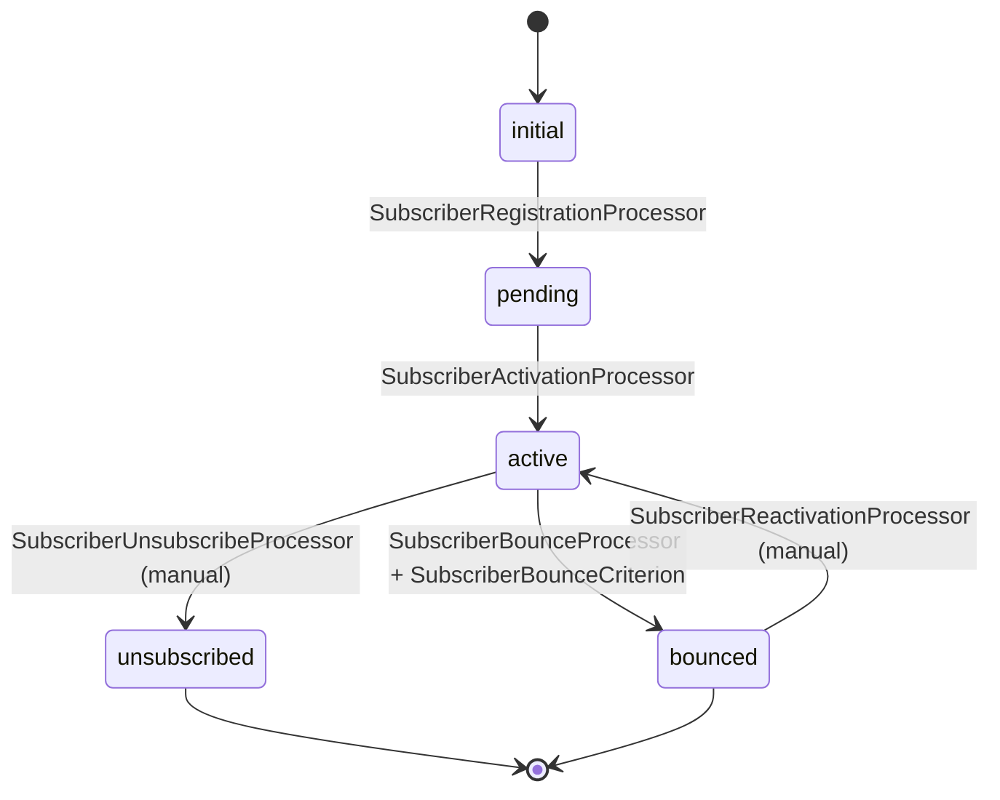
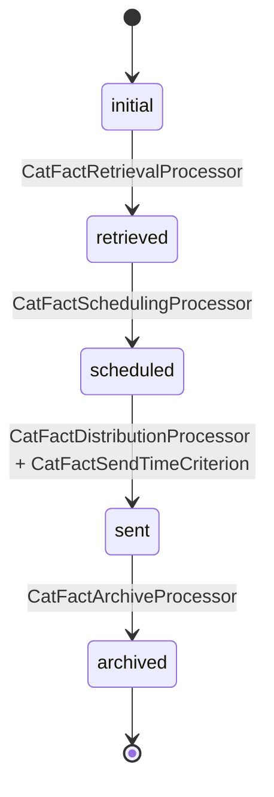
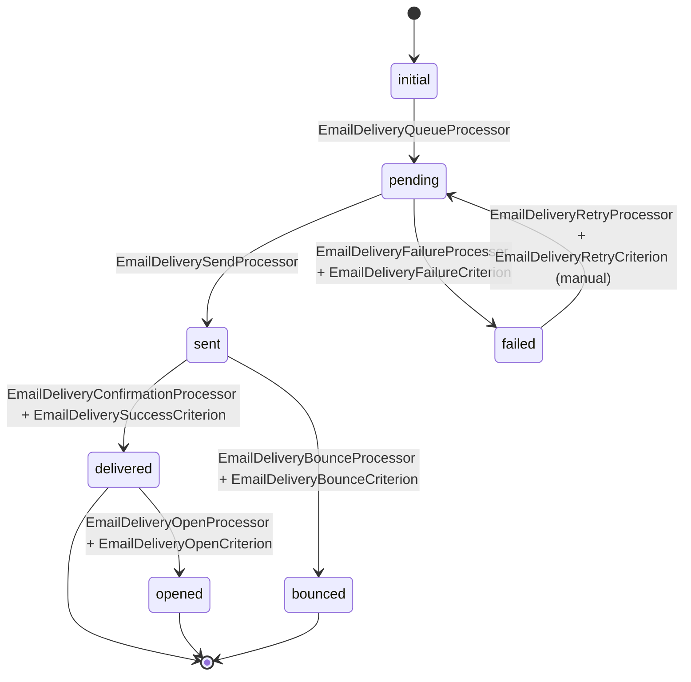
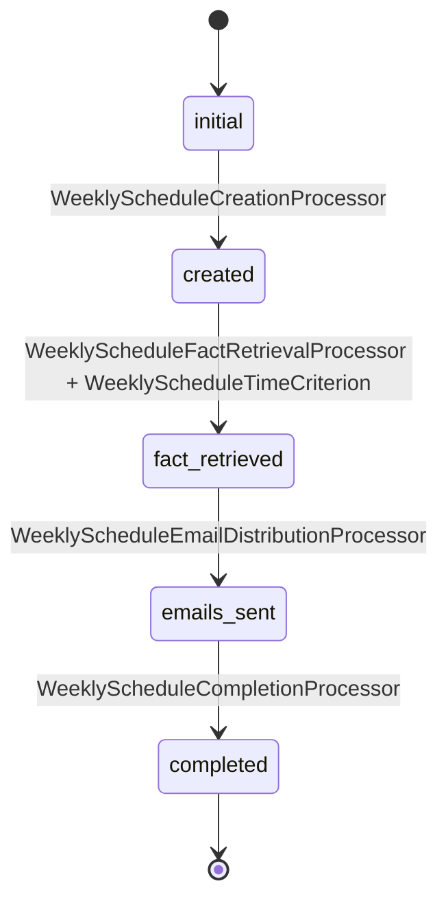

# Workflows

## Subscriber Workflow

**Name:** SubscriberWorkflow

**Description:** Manages the lifecycle of a subscriber from registration to unsubscription.

**States:**
- `initial`: Starting state
- `pending`: Subscriber has signed up but email not verified
- `active`: Subscriber is active and receiving emails
- `unsubscribed`: Subscriber has unsubscribed
- `bounced`: Email delivery failed permanently

**Transitions:**

1. **initial → pending**
   - Type: Automatic
   - Processor: SubscriberRegistrationProcessor
   - Criterion: None
   - Description: User signs up for subscription

2. **pending → active**
   - Type: Automatic
   - Processor: SubscriberActivationProcessor
   - Criterion: None
   - Description: Email verification completed or auto-activation

3. **active → unsubscribed**
   - Type: Manual
   - Processor: SubscriberUnsubscribeProcessor
   - Criterion: None
   - Description: User unsubscribes

4. **active → bounced**
   - Type: Automatic
   - Processor: SubscriberBounceProcessor
   - Criterion: SubscriberBounceCriterion
   - Description: Email delivery fails permanently

5. **bounced → active**
   - Type: Manual
   - Processor: SubscriberReactivationProcessor
   - Criterion: None
   - Description: Manual reactivation after bounce resolution

```mermaid
stateDiagram-v2
    [*] --> initial
    initial --> pending : SubscriberRegistrationProcessor
    pending --> active : SubscriberActivationProcessor
    active --> unsubscribed : SubscriberUnsubscribeProcessor (manual)
    active --> bounced : SubscriberBounceProcessor + SubscriberBounceCriterion
    bounced --> active : SubscriberReactivationProcessor (manual)
    unsubscribed --> [*]
    bounced --> [*]
```

---

## CatFact Workflow

**Name:** CatFactWorkflow

**Description:** Manages the lifecycle of a cat fact from retrieval to distribution.

**States:**
- `initial`: Starting state
- `retrieved`: Cat fact retrieved from API
- `scheduled`: Cat fact scheduled for sending
- `sent`: Cat fact sent to subscribers
- `archived`: Cat fact archived after sending

**Transitions:**

1. **initial → retrieved**
   - Type: Automatic
   - Processor: CatFactRetrievalProcessor
   - Criterion: None
   - Description: Retrieve cat fact from external API

2. **retrieved → scheduled**
   - Type: Automatic
   - Processor: CatFactSchedulingProcessor
   - Criterion: None
   - Description: Schedule cat fact for weekly distribution

3. **scheduled → sent**
   - Type: Automatic
   - Processor: CatFactDistributionProcessor
   - Criterion: CatFactSendTimeCriterion
   - Description: Send cat fact to all active subscribers

4. **sent → archived**
   - Type: Automatic
   - Processor: CatFactArchiveProcessor
   - Criterion: None
   - Description: Archive cat fact after successful distribution

```mermaid
stateDiagram-v2
    [*] --> initial
    initial --> retrieved : CatFactRetrievalProcessor
    retrieved --> scheduled : CatFactSchedulingProcessor
    scheduled --> sent : CatFactDistributionProcessor + CatFactSendTimeCriterion
    sent --> archived : CatFactArchiveProcessor
    archived --> [*]
```

---

## EmailDelivery Workflow

**Name:** EmailDeliveryWorkflow

**Description:** Manages the lifecycle of individual email deliveries to subscribers.

**States:**
- `initial`: Starting state
- `pending`: Email queued for delivery
- `sent`: Email sent successfully
- `delivered`: Email delivered to recipient
- `opened`: Email opened by recipient
- `failed`: Email delivery failed
- `bounced`: Email bounced permanently

**Transitions:**

1. **initial → pending**
   - Type: Automatic
   - Processor: EmailDeliveryQueueProcessor
   - Criterion: None
   - Description: Queue email for delivery

2. **pending → sent**
   - Type: Automatic
   - Processor: EmailDeliverySendProcessor
   - Criterion: None
   - Description: Send email to subscriber

3. **sent → delivered**
   - Type: Automatic
   - Processor: EmailDeliveryConfirmationProcessor
   - Criterion: EmailDeliverySuccessCriterion
   - Description: Confirm email delivery

4. **delivered → opened**
   - Type: Automatic
   - Processor: EmailDeliveryOpenProcessor
   - Criterion: EmailDeliveryOpenCriterion
   - Description: Track email opening

5. **pending → failed**
   - Type: Automatic
   - Processor: EmailDeliveryFailureProcessor
   - Criterion: EmailDeliveryFailureCriterion
   - Description: Handle delivery failure

6. **failed → pending**
   - Type: Manual
   - Processor: EmailDeliveryRetryProcessor
   - Criterion: EmailDeliveryRetryCriterion
   - Description: Retry failed delivery

7. **sent → bounced**
   - Type: Automatic
   - Processor: EmailDeliveryBounceProcessor
   - Criterion: EmailDeliveryBounceCriterion
   - Description: Handle permanent bounce

```mermaid
stateDiagram-v2
    [*] --> initial
    initial --> pending : EmailDeliveryQueueProcessor
    pending --> sent : EmailDeliverySendProcessor
    sent --> delivered : EmailDeliveryConfirmationProcessor + EmailDeliverySuccessCriterion
    delivered --> opened : EmailDeliveryOpenProcessor + EmailDeliveryOpenCriterion
    pending --> failed : EmailDeliveryFailureProcessor + EmailDeliveryFailureCriterion
    failed --> pending : EmailDeliveryRetryProcessor + EmailDeliveryRetryCriterion (manual)
    sent --> bounced : EmailDeliveryBounceProcessor + EmailDeliveryBounceCriterion
    delivered --> [*]
    opened --> [*]
    bounced --> [*]
```

---

## WeeklySchedule Workflow

**Name:** WeeklyScheduleWorkflow

**Description:** Manages the weekly schedule for cat fact distribution.

**States:**
- `initial`: Starting state
- `created`: Weekly schedule created
- `fact_retrieved`: Cat fact retrieved for the week
- `emails_sent`: Emails sent to subscribers
- `completed`: Weekly distribution completed

**Transitions:**

1. **initial → created**
   - Type: Automatic
   - Processor: WeeklyScheduleCreationProcessor
   - Criterion: None
   - Description: Create weekly schedule

2. **created → fact_retrieved**
   - Type: Automatic
   - Processor: WeeklyScheduleFactRetrievalProcessor
   - Criterion: WeeklyScheduleTimeCriterion
   - Description: Retrieve cat fact for the week

3. **fact_retrieved → emails_sent**
   - Type: Automatic
   - Processor: WeeklyScheduleEmailDistributionProcessor
   - Criterion: None
   - Description: Send emails to all active subscribers

4. **emails_sent → completed**
   - Type: Automatic
   - Processor: WeeklyScheduleCompletionProcessor
   - Criterion: None
   - Description: Mark weekly distribution as completed

```mermaid
stateDiagram-v2
    [*] --> initial
    initial --> created : WeeklyScheduleCreationProcessor
    created --> fact_retrieved : WeeklyScheduleFactRetrievalProcessor + WeeklyScheduleTimeCriterion
    fact_retrieved --> emails_sent : WeeklyScheduleEmailDistributionProcessor
    emails_sent --> completed : WeeklyScheduleCompletionProcessor
    completed --> [*]
```
