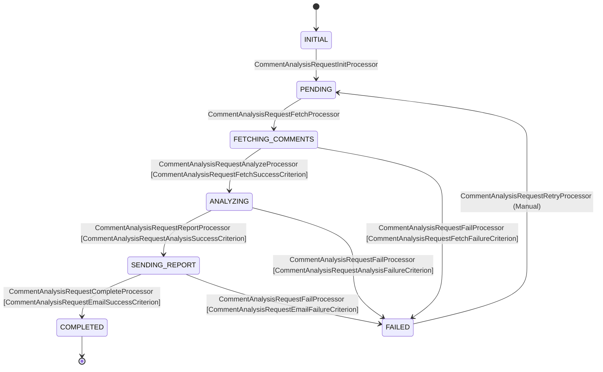
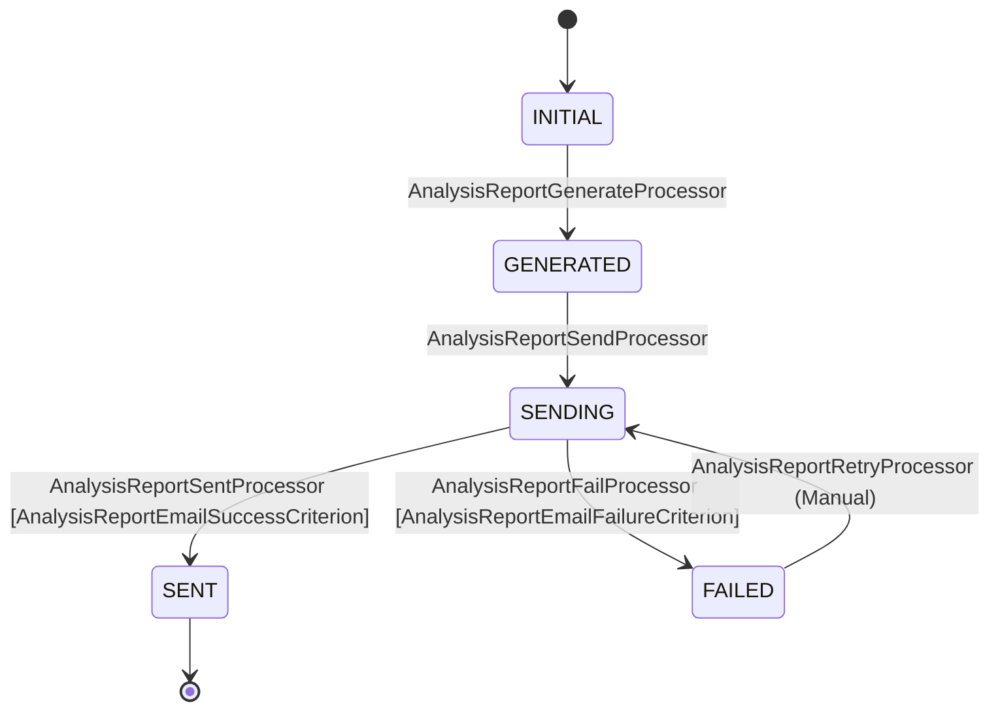

# Workflows

## CommentAnalysisRequest Workflow

**Description**: Manages the lifecycle of a comment analysis request from creation to completion.

**States**:
- `INITIAL`: Starting state (system managed)
- `PENDING`: Request created and waiting to be processed
- `FETCHING_COMMENTS`: Currently fetching comments from API
- `ANALYZING`: Comments fetched, analysis in progress
- `SENDING_REPORT`: Analysis complete, sending email report
- `COMPLETED`: Process completed successfully
- `FAILED`: Process failed at any stage

**Transitions**:

1. `INITIAL` → `PENDING`
   - **Type**: Automatic
   - **Processor**: CommentAnalysisRequestInitProcessor
   - **Criterion**: None
   - **Description**: Initialize the request and validate input data

2. `PENDING` → `FETCHING_COMMENTS`
   - **Type**: Automatic
   - **Processor**: CommentAnalysisRequestFetchProcessor
   - **Criterion**: None
   - **Description**: Start fetching comments from JSONPlaceholder API

3. `FETCHING_COMMENTS` → `ANALYZING`
   - **Type**: Automatic
   - **Processor**: CommentAnalysisRequestAnalyzeProcessor
   - **Criterion**: CommentAnalysisRequestFetchSuccessCriterion
   - **Description**: Begin analysis of fetched comments

4. `FETCHING_COMMENTS` → `FAILED`
   - **Type**: Automatic
   - **Processor**: CommentAnalysisRequestFailProcessor
   - **Criterion**: CommentAnalysisRequestFetchFailureCriterion
   - **Description**: Handle fetch failure

5. `ANALYZING` → `SENDING_REPORT`
   - **Type**: Automatic
   - **Processor**: CommentAnalysisRequestReportProcessor
   - **Criterion**: CommentAnalysisRequestAnalysisSuccessCriterion
   - **Description**: Generate and send email report

6. `ANALYZING` → `FAILED`
   - **Type**: Automatic
   - **Processor**: CommentAnalysisRequestFailProcessor
   - **Criterion**: CommentAnalysisRequestAnalysisFailureCriterion
   - **Description**: Handle analysis failure

7. `SENDING_REPORT` → `COMPLETED`
   - **Type**: Automatic
   - **Processor**: CommentAnalysisRequestCompleteProcessor
   - **Criterion**: CommentAnalysisRequestEmailSuccessCriterion
   - **Description**: Mark request as completed

8. `SENDING_REPORT` → `FAILED`
   - **Type**: Automatic
   - **Processor**: CommentAnalysisRequestFailProcessor
   - **Criterion**: CommentAnalysisRequestEmailFailureCriterion
   - **Description**: Handle email sending failure

9. `FAILED` → `PENDING`
   - **Type**: Manual
   - **Processor**: CommentAnalysisRequestRetryProcessor
   - **Criterion**: None
   - **Description**: Retry failed request

```mermaid
stateDiagram-v2
    [*] --> INITIAL
    INITIAL --> PENDING : CommentAnalysisRequestInitProcessor
    PENDING --> FETCHING_COMMENTS : CommentAnalysisRequestFetchProcessor
    FETCHING_COMMENTS --> ANALYZING : CommentAnalysisRequestAnalyzeProcessor [CommentAnalysisRequestFetchSuccessCriterion]
    FETCHING_COMMENTS --> FAILED : CommentAnalysisRequestFailProcessor [CommentAnalysisRequestFetchFailureCriterion]
    ANALYZING --> SENDING_REPORT : CommentAnalysisRequestReportProcessor [CommentAnalysisRequestAnalysisSuccessCriterion]
    ANALYZING --> FAILED : CommentAnalysisRequestFailProcessor [CommentAnalysisRequestAnalysisFailureCriterion]
    SENDING_REPORT --> COMPLETED : CommentAnalysisRequestCompleteProcessor [CommentAnalysisRequestEmailSuccessCriterion]
    SENDING_REPORT --> FAILED : CommentAnalysisRequestFailProcessor [CommentAnalysisRequestEmailFailureCriterion]
    FAILED --> PENDING : CommentAnalysisRequestRetryProcessor (Manual)
    COMPLETED --> [*]
```

## AnalysisReport Workflow

**Description**: Manages the lifecycle of an analysis report from generation to email delivery.

**States**:
- `INITIAL`: Starting state (system managed)
- `GENERATED`: Report has been generated
- `SENDING`: Email is being sent
- `SENT`: Email sent successfully
- `FAILED`: Email sending failed

**Transitions**:

1. `INITIAL` → `GENERATED`
   - **Type**: Automatic
   - **Processor**: AnalysisReportGenerateProcessor
   - **Criterion**: None
   - **Description**: Generate the analysis report

2. `GENERATED` → `SENDING`
   - **Type**: Automatic
   - **Processor**: AnalysisReportSendProcessor
   - **Criterion**: None
   - **Description**: Send the report via email

3. `SENDING` → `SENT`
   - **Type**: Automatic
   - **Processor**: AnalysisReportSentProcessor
   - **Criterion**: AnalysisReportEmailSuccessCriterion
   - **Description**: Mark report as sent

4. `SENDING` → `FAILED`
   - **Type**: Automatic
   - **Processor**: AnalysisReportFailProcessor
   - **Criterion**: AnalysisReportEmailFailureCriterion
   - **Description**: Handle email failure

5. `FAILED` → `SENDING`
   - **Type**: Manual
   - **Processor**: AnalysisReportRetryProcessor
   - **Criterion**: None
   - **Description**: Retry sending email

```mermaid
stateDiagram-v2
    [*] --> INITIAL
    INITIAL --> GENERATED : AnalysisReportGenerateProcessor
    GENERATED --> SENDING : AnalysisReportSendProcessor
    SENDING --> SENT : AnalysisReportSentProcessor [AnalysisReportEmailSuccessCriterion]
    SENDING --> FAILED : AnalysisReportFailProcessor [AnalysisReportEmailFailureCriterion]
    FAILED --> SENDING : AnalysisReportRetryProcessor (Manual)
    SENT --> [*]
```
