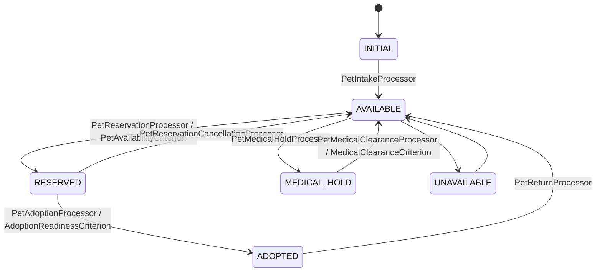
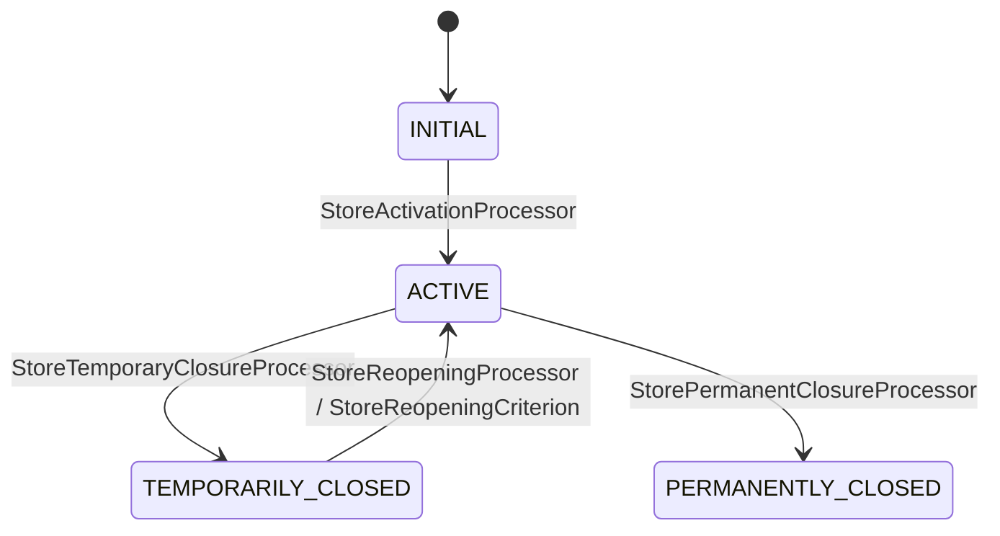
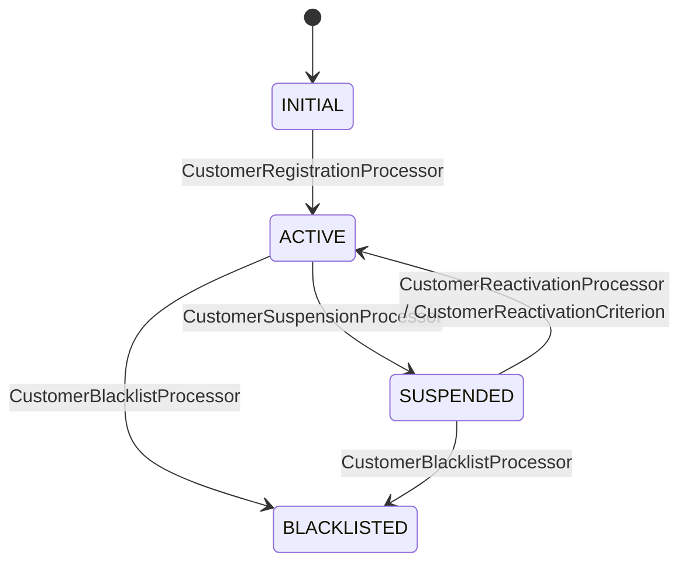

# Workflows for Purrfect Pets API

## Pet Workflow

**Name:** PetWorkflow

**States:**
- INITIAL (starting state)
- AVAILABLE (pet is available for adoption)
- RESERVED (pet is reserved for a customer)
- ADOPTED (pet has been adopted)
- MEDICAL_HOLD (pet is under medical care)
- UNAVAILABLE (pet is temporarily unavailable)

**Transitions:**

1. **INITIAL → AVAILABLE**
   - Type: Automatic
   - Processor: PetIntakeProcessor
   - Criterion: None
   - Description: Pet enters the system and becomes available

2. **AVAILABLE → RESERVED**
   - Type: Manual
   - Processor: PetReservationProcessor
   - Criterion: PetAvailabilityCriterion
   - Description: Pet is reserved for an approved adoption application

3. **RESERVED → ADOPTED**
   - Type: Manual
   - Processor: PetAdoptionProcessor
   - Criterion: AdoptionReadinessCriterion
   - Description: Pet adoption is completed

4. **RESERVED → AVAILABLE**
   - Type: Manual
   - Processor: PetReservationCancellationProcessor
   - Criterion: None
   - Description: Reservation is cancelled, pet becomes available again

5. **AVAILABLE → MEDICAL_HOLD**
   - Type: Manual
   - Processor: PetMedicalHoldProcessor
   - Criterion: None
   - Description: Pet needs medical attention

6. **MEDICAL_HOLD → AVAILABLE**
   - Type: Manual
   - Processor: PetMedicalClearanceProcessor
   - Criterion: MedicalClearanceCriterion
   - Description: Pet is cleared from medical hold

7. **ADOPTED → AVAILABLE**
   - Type: Manual
   - Processor: PetReturnProcessor
   - Criterion: None
   - Description: Pet is returned by adopter

8. **AVAILABLE → UNAVAILABLE**
   - Type: Manual
   - Processor: None
   - Criterion: None
   - Description: Pet becomes temporarily unavailable

9. **UNAVAILABLE → AVAILABLE**
   - Type: Manual
   - Processor: None
   - Criterion: None
   - Description: Pet becomes available again

```mermaid
stateDiagram-v2
    [*] --> INITIAL
    INITIAL --> AVAILABLE : PetIntakeProcessor
    AVAILABLE --> RESERVED : PetReservationProcessor / PetAvailabilityCriterion
    RESERVED --> ADOPTED : PetAdoptionProcessor / AdoptionReadinessCriterion
    RESERVED --> AVAILABLE : PetReservationCancellationProcessor
    AVAILABLE --> MEDICAL_HOLD : PetMedicalHoldProcessor
    MEDICAL_HOLD --> AVAILABLE : PetMedicalClearanceProcessor / MedicalClearanceCriterion
    ADOPTED --> AVAILABLE : PetReturnProcessor
    AVAILABLE --> UNAVAILABLE
    UNAVAILABLE --> AVAILABLE
```

---

## Store Workflow

**Name:** StoreWorkflow

**States:**
- INITIAL (starting state)
- ACTIVE (store is operational)
- TEMPORARILY_CLOSED (store is temporarily closed)
- PERMANENTLY_CLOSED (store is permanently closed)

**Transitions:**

1. **INITIAL → ACTIVE**
   - Type: Automatic
   - Processor: StoreActivationProcessor
   - Criterion: None
   - Description: Store is activated and becomes operational

2. **ACTIVE → TEMPORARILY_CLOSED**
   - Type: Manual
   - Processor: StoreTemporaryClosureProcessor
   - Criterion: None
   - Description: Store is temporarily closed

3. **TEMPORARILY_CLOSED → ACTIVE**
   - Type: Manual
   - Processor: StoreReopeningProcessor
   - Criterion: StoreReopeningCriterion
   - Description: Store reopens after temporary closure

4. **ACTIVE → PERMANENTLY_CLOSED**
   - Type: Manual
   - Processor: StorePermanentClosureProcessor
   - Criterion: None
   - Description: Store is permanently closed

```mermaid
stateDiagram-v2
    [*] --> INITIAL
    INITIAL --> ACTIVE : StoreActivationProcessor
    ACTIVE --> TEMPORARILY_CLOSED : StoreTemporaryClosureProcessor
    TEMPORARILY_CLOSED --> ACTIVE : StoreReopeningProcessor / StoreReopeningCriterion
    ACTIVE --> PERMANENTLY_CLOSED : StorePermanentClosureProcessor
```

---

## Customer Workflow

**Name:** CustomerWorkflow

**States:**
- INITIAL (starting state)
- ACTIVE (customer account is active)
- SUSPENDED (customer account is suspended)
- BLACKLISTED (customer is blacklisted)

**Transitions:**

1. **INITIAL → ACTIVE**
   - Type: Automatic
   - Processor: CustomerRegistrationProcessor
   - Criterion: None
   - Description: Customer registers and account becomes active

2. **ACTIVE → SUSPENDED**
   - Type: Manual
   - Processor: CustomerSuspensionProcessor
   - Criterion: None
   - Description: Customer account is suspended

3. **SUSPENDED → ACTIVE**
   - Type: Manual
   - Processor: CustomerReactivationProcessor
   - Criterion: CustomerReactivationCriterion
   - Description: Customer account is reactivated

4. **ACTIVE → BLACKLISTED**
   - Type: Manual
   - Processor: CustomerBlacklistProcessor
   - Criterion: None
   - Description: Customer is blacklisted

5. **SUSPENDED → BLACKLISTED**
   - Type: Manual
   - Processor: CustomerBlacklistProcessor
   - Criterion: None
   - Description: Suspended customer is blacklisted

```mermaid
stateDiagram-v2
    [*] --> INITIAL
    INITIAL --> ACTIVE : CustomerRegistrationProcessor
    ACTIVE --> SUSPENDED : CustomerSuspensionProcessor
    SUSPENDED --> ACTIVE : CustomerReactivationProcessor / CustomerReactivationCriterion
    ACTIVE --> BLACKLISTED : CustomerBlacklistProcessor
    SUSPENDED --> BLACKLISTED : CustomerBlacklistProcessor
```
