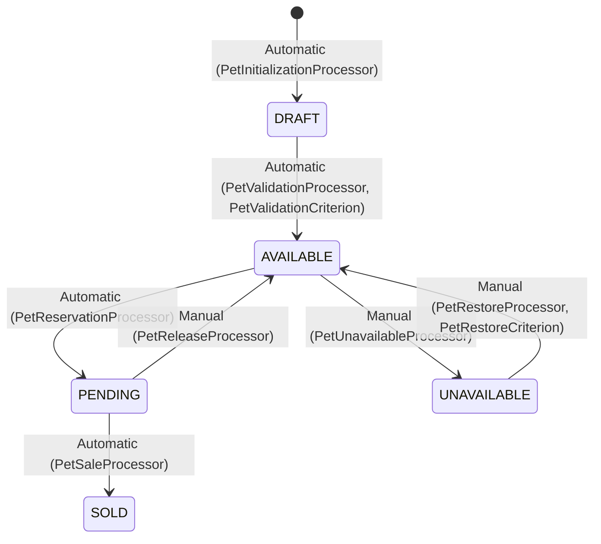
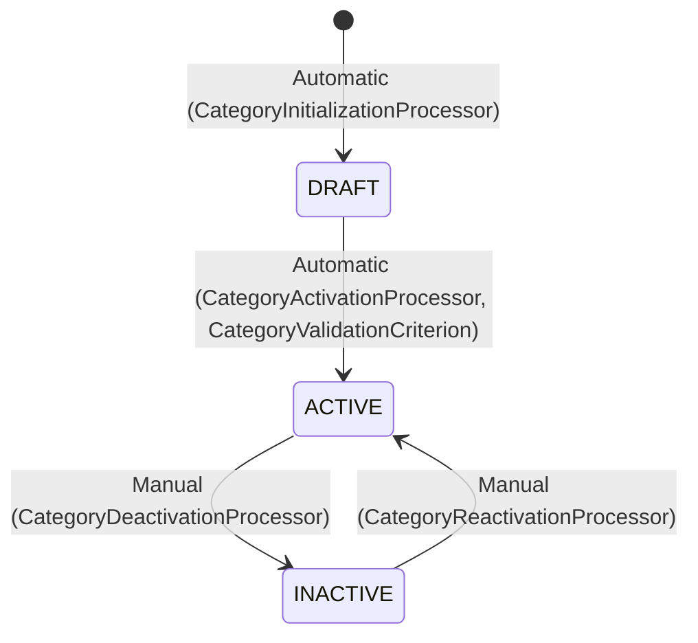
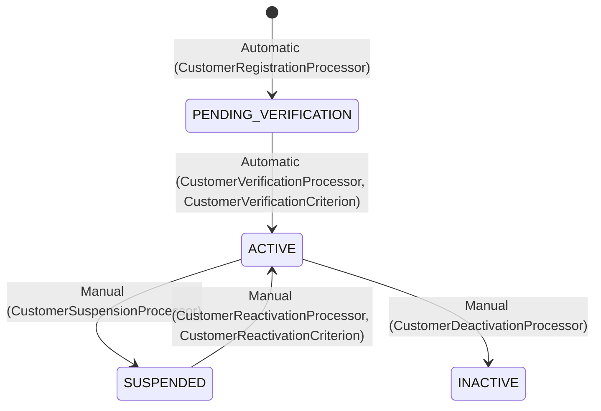
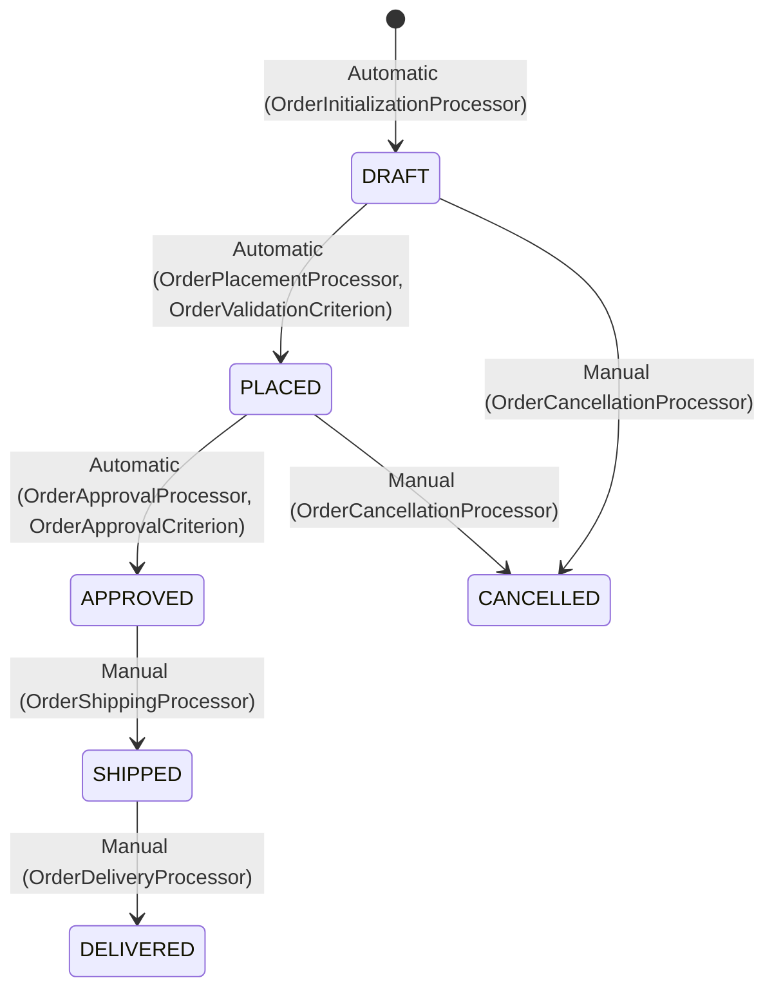
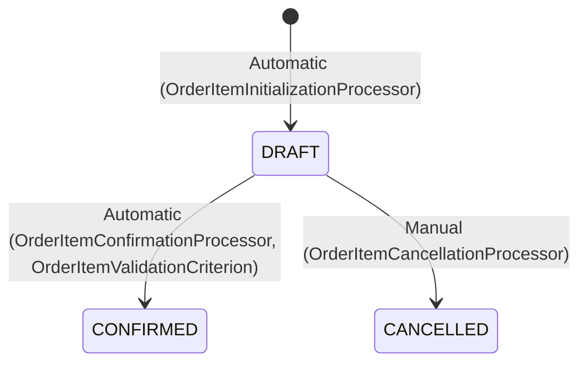

# Workflows for Purrfect Pets API

## Pet Workflow

**States:** DRAFT, AVAILABLE, PENDING, SOLD, UNAVAILABLE

**Transitions:**

1. **INITIAL → DRAFT** (Automatic)
   - Processor: PetInitializationProcessor
   - Criterion: None

2. **DRAFT → AVAILABLE** (Automatic)
   - Processor: PetValidationProcessor
   - Criterion: PetValidationCriterion

3. **AVAILABLE → PENDING** (Automatic)
   - Processor: PetReservationProcessor
   - Criterion: None

4. **PENDING → SOLD** (Automatic)
   - Processor: PetSaleProcessor
   - Criterion: None

5. **PENDING → AVAILABLE** (Manual)
   - Processor: PetReleaseProcessor
   - Criterion: None

6. **AVAILABLE → UNAVAILABLE** (Manual)
   - Processor: PetUnavailableProcessor
   - Criterion: None

7. **UNAVAILABLE → AVAILABLE** (Manual)
   - Processor: PetRestoreProcessor
   - Criterion: PetRestoreCriterion

```mermaid
stateDiagram-v2
    [*] --> DRAFT : Automatic (PetInitializationProcessor)
    DRAFT --> AVAILABLE : Automatic (PetValidationProcessor, PetValidationCriterion)
    AVAILABLE --> PENDING : Automatic (PetReservationProcessor)
    PENDING --> SOLD : Automatic (PetSaleProcessor)
    PENDING --> AVAILABLE : Manual (PetReleaseProcessor)
    AVAILABLE --> UNAVAILABLE : Manual (PetUnavailableProcessor)
    UNAVAILABLE --> AVAILABLE : Manual (PetRestoreProcessor, PetRestoreCriterion)
```

## Category Workflow

**States:** DRAFT, ACTIVE, INACTIVE

**Transitions:**

1. **INITIAL → DRAFT** (Automatic)
   - Processor: CategoryInitializationProcessor
   - Criterion: None

2. **DRAFT → ACTIVE** (Automatic)
   - Processor: CategoryActivationProcessor
   - Criterion: CategoryValidationCriterion

3. **ACTIVE → INACTIVE** (Manual)
   - Processor: CategoryDeactivationProcessor
   - Criterion: None

4. **INACTIVE → ACTIVE** (Manual)
   - Processor: CategoryReactivationProcessor
   - Criterion: None

```mermaid
stateDiagram-v2
    [*] --> DRAFT : Automatic (CategoryInitializationProcessor)
    DRAFT --> ACTIVE : Automatic (CategoryActivationProcessor, CategoryValidationCriterion)
    ACTIVE --> INACTIVE : Manual (CategoryDeactivationProcessor)
    INACTIVE --> ACTIVE : Manual (CategoryReactivationProcessor)
```

## Customer Workflow

**States:** PENDING_VERIFICATION, ACTIVE, SUSPENDED, INACTIVE

**Transitions:**

1. **INITIAL → PENDING_VERIFICATION** (Automatic)
   - Processor: CustomerRegistrationProcessor
   - Criterion: None

2. **PENDING_VERIFICATION → ACTIVE** (Automatic)
   - Processor: CustomerVerificationProcessor
   - Criterion: CustomerVerificationCriterion

3. **ACTIVE → SUSPENDED** (Manual)
   - Processor: CustomerSuspensionProcessor
   - Criterion: None

4. **SUSPENDED → ACTIVE** (Manual)
   - Processor: CustomerReactivationProcessor
   - Criterion: CustomerReactivationCriterion

5. **ACTIVE → INACTIVE** (Manual)
   - Processor: CustomerDeactivationProcessor
   - Criterion: None

```mermaid
stateDiagram-v2
    [*] --> PENDING_VERIFICATION : Automatic (CustomerRegistrationProcessor)
    PENDING_VERIFICATION --> ACTIVE : Automatic (CustomerVerificationProcessor, CustomerVerificationCriterion)
    ACTIVE --> SUSPENDED : Manual (CustomerSuspensionProcessor)
    SUSPENDED --> ACTIVE : Manual (CustomerReactivationProcessor, CustomerReactivationCriterion)
    ACTIVE --> INACTIVE : Manual (CustomerDeactivationProcessor)
```

## Order Workflow

**States:** DRAFT, PLACED, APPROVED, SHIPPED, DELIVERED, CANCELLED

**Transitions:**

1. **INITIAL → DRAFT** (Automatic)
   - Processor: OrderInitializationProcessor
   - Criterion: None

2. **DRAFT → PLACED** (Automatic)
   - Processor: OrderPlacementProcessor
   - Criterion: OrderValidationCriterion

3. **PLACED → APPROVED** (Automatic)
   - Processor: OrderApprovalProcessor
   - Criterion: OrderApprovalCriterion

4. **APPROVED → SHIPPED** (Manual)
   - Processor: OrderShippingProcessor
   - Criterion: None

5. **SHIPPED → DELIVERED** (Manual)
   - Processor: OrderDeliveryProcessor
   - Criterion: None

6. **DRAFT → CANCELLED** (Manual)
   - Processor: OrderCancellationProcessor
   - Criterion: None

7. **PLACED → CANCELLED** (Manual)
   - Processor: OrderCancellationProcessor
   - Criterion: None

```mermaid
stateDiagram-v2
    [*] --> DRAFT : Automatic (OrderInitializationProcessor)
    DRAFT --> PLACED : Automatic (OrderPlacementProcessor, OrderValidationCriterion)
    PLACED --> APPROVED : Automatic (OrderApprovalProcessor, OrderApprovalCriterion)
    APPROVED --> SHIPPED : Manual (OrderShippingProcessor)
    SHIPPED --> DELIVERED : Manual (OrderDeliveryProcessor)
    DRAFT --> CANCELLED : Manual (OrderCancellationProcessor)
    PLACED --> CANCELLED : Manual (OrderCancellationProcessor)
```

## OrderItem Workflow

**States:** DRAFT, CONFIRMED, CANCELLED

**Transitions:**

1. **INITIAL → DRAFT** (Automatic)
   - Processor: OrderItemInitializationProcessor
   - Criterion: None

2. **DRAFT → CONFIRMED** (Automatic)
   - Processor: OrderItemConfirmationProcessor
   - Criterion: OrderItemValidationCriterion

3. **DRAFT → CANCELLED** (Manual)
   - Processor: OrderItemCancellationProcessor
   - Criterion: None

```mermaid
stateDiagram-v2
    [*] --> DRAFT : Automatic (OrderItemInitializationProcessor)
    DRAFT --> CONFIRMED : Automatic (OrderItemConfirmationProcessor, OrderItemValidationCriterion)
    DRAFT --> CANCELLED : Manual (OrderItemCancellationProcessor)
```
