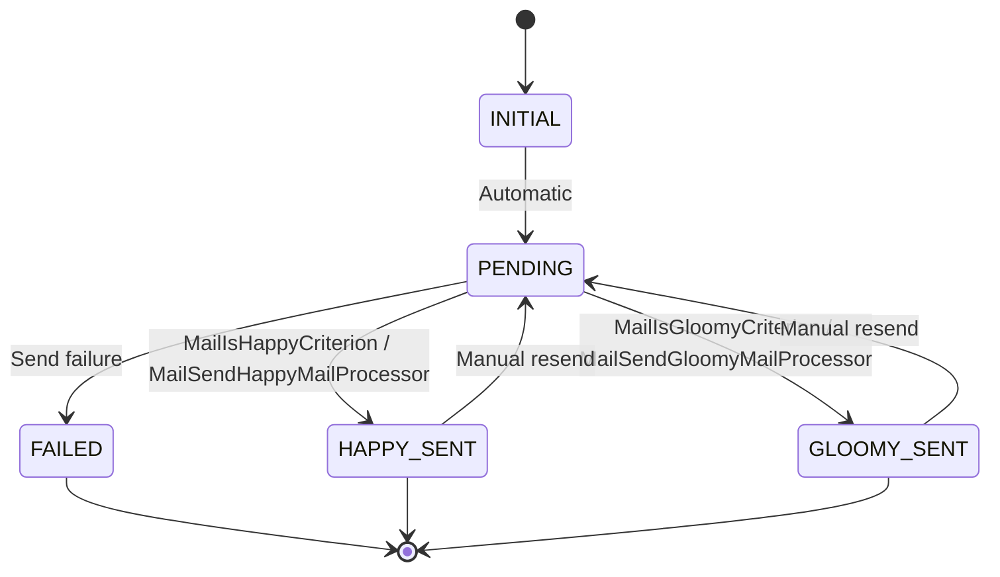

# Workflows

## Mail Workflow

### Description
The Mail workflow manages the lifecycle of mail entities from creation to sending based on whether the mail is happy or gloomy.

### States
- **INITIAL**: Starting state when mail entity is created
- **PENDING**: Mail is ready for processing
- **HAPPY_SENT**: Happy mail has been successfully sent
- **GLOOMY_SENT**: Gloomy mail has been successfully sent
- **FAILED**: Mail sending failed

### Transitions

#### 1. INITIAL → PENDING
- **Type**: Automatic
- **Processor**: None
- **Criterion**: None
- **Description**: Automatically moves new mail entities to pending state

#### 2. PENDING → HAPPY_SENT
- **Type**: Automatic
- **Processor**: MailSendHappyMailProcessor
- **Criterion**: MailIsHappyCriterion
- **Description**: Sends happy mail when isHappy is true

#### 3. PENDING → GLOOMY_SENT
- **Type**: Automatic
- **Processor**: MailSendGloomyMailProcessor
- **Criterion**: MailIsGloomyCriterion
- **Description**: Sends gloomy mail when isHappy is false

#### 4. HAPPY_SENT → PENDING
- **Type**: Manual
- **Processor**: None
- **Criterion**: None
- **Description**: Allows resending happy mail if needed

#### 5. GLOOMY_SENT → PENDING
- **Type**: Manual
- **Processor**: None
- **Criterion**: None
- **Description**: Allows resending gloomy mail if needed

#### 6. PENDING → FAILED
- **Type**: Automatic
- **Processor**: None
- **Criterion**: None
- **Description**: Transition to failed state when sending fails

### Mermaid State Diagram

```mermaid
stateDiagram-v2
    [*] --> INITIAL
    INITIAL --> PENDING : Automatic
    PENDING --> HAPPY_SENT : MailIsHappyCriterion / MailSendHappyMailProcessor
    PENDING --> GLOOMY_SENT : MailIsGloomyCriterion / MailSendGloomyMailProcessor
    PENDING --> FAILED : Send failure
    HAPPY_SENT --> PENDING : Manual resend
    GLOOMY_SENT --> PENDING : Manual resend
    FAILED --> [*]
    HAPPY_SENT --> [*]
    GLOOMY_SENT --> [*]
```
