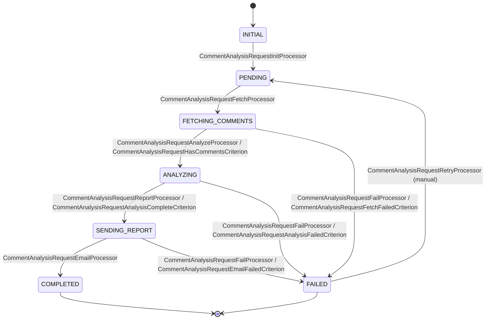
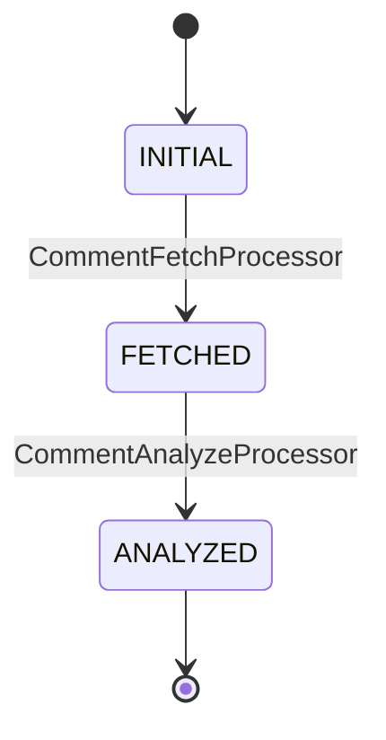
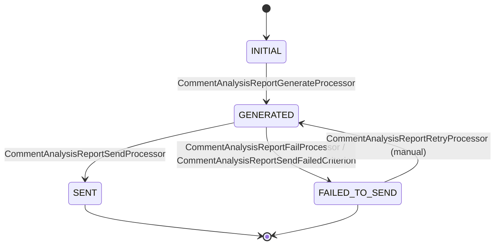

# Workflows

## 1. CommentAnalysisRequest Workflow

**Description**: Manages the lifecycle of a comment analysis request from creation to completion.

**States**:
- `INITIAL`: Starting state (system managed)
- `PENDING`: Request created and waiting to be processed
- `FETCHING_COMMENTS`: Currently fetching comments from API
- `ANALYZING`: Comments fetched, analysis in progress
- `SENDING_REPORT`: Analysis complete, sending email report
- `COMPLETED`: Process completed successfully
- `FAILED`: Process failed at any stage

**Transitions**:
1. `INITIAL` → `PENDING` (automatic)
   - Processor: CommentAnalysisRequestInitProcessor
   - Criterion: None

2. `PENDING` → `FETCHING_COMMENTS` (automatic)
   - Processor: CommentAnalysisRequestFetchProcessor
   - Criterion: None

3. `FETCHING_COMMENTS` → `ANALYZING` (automatic)
   - Processor: CommentAnalysisRequestAnalyzeProcessor
   - Criterion: CommentAnalysisRequestHasCommentsCriterion

4. `ANALYZING` → `SENDING_REPORT` (automatic)
   - Processor: CommentAnalysisRequestReportProcessor
   - Criterion: CommentAnalysisRequestAnalysisCompleteCriterion

5. `SENDING_REPORT` → `COMPLETED` (automatic)
   - Processor: CommentAnalysisRequestEmailProcessor
   - Criterion: None

6. `FETCHING_COMMENTS` → `FAILED` (automatic)
   - Processor: CommentAnalysisRequestFailProcessor
   - Criterion: CommentAnalysisRequestFetchFailedCriterion

7. `ANALYZING` → `FAILED` (automatic)
   - Processor: CommentAnalysisRequestFailProcessor
   - Criterion: CommentAnalysisRequestAnalysisFailedCriterion

8. `SENDING_REPORT` → `FAILED` (automatic)
   - Processor: CommentAnalysisRequestFailProcessor
   - Criterion: CommentAnalysisRequestEmailFailedCriterion

9. `FAILED` → `PENDING` (manual)
   - Processor: CommentAnalysisRequestRetryProcessor
   - Criterion: None

```mermaid
stateDiagram-v2
    [*] --> INITIAL
    INITIAL --> PENDING : CommentAnalysisRequestInitProcessor
    PENDING --> FETCHING_COMMENTS : CommentAnalysisRequestFetchProcessor
    FETCHING_COMMENTS --> ANALYZING : CommentAnalysisRequestAnalyzeProcessor / CommentAnalysisRequestHasCommentsCriterion
    ANALYZING --> SENDING_REPORT : CommentAnalysisRequestReportProcessor / CommentAnalysisRequestAnalysisCompleteCriterion
    SENDING_REPORT --> COMPLETED : CommentAnalysisRequestEmailProcessor
    FETCHING_COMMENTS --> FAILED : CommentAnalysisRequestFailProcessor / CommentAnalysisRequestFetchFailedCriterion
    ANALYZING --> FAILED : CommentAnalysisRequestFailProcessor / CommentAnalysisRequestAnalysisFailedCriterion
    SENDING_REPORT --> FAILED : CommentAnalysisRequestFailProcessor / CommentAnalysisRequestEmailFailedCriterion
    FAILED --> PENDING : CommentAnalysisRequestRetryProcessor (manual)
    COMPLETED --> [*]
    FAILED --> [*]
```

## 2. Comment Workflow

**Description**: Manages the lifecycle of individual comments from fetching to analysis.

**States**:
- `INITIAL`: Starting state (system managed)
- `FETCHED`: Comment fetched from API
- `ANALYZED`: Comment sentiment and metrics analyzed

**Transitions**:
1. `INITIAL` → `FETCHED` (automatic)
   - Processor: CommentFetchProcessor
   - Criterion: None

2. `FETCHED` → `ANALYZED` (automatic)
   - Processor: CommentAnalyzeProcessor
   - Criterion: None

```mermaid
stateDiagram-v2
    [*] --> INITIAL
    INITIAL --> FETCHED : CommentFetchProcessor
    FETCHED --> ANALYZED : CommentAnalyzeProcessor
    ANALYZED --> [*]
```

## 3. CommentAnalysisReport Workflow

**Description**: Manages the lifecycle of analysis reports from generation to email delivery.

**States**:
- `INITIAL`: Starting state (system managed)
- `GENERATED`: Report generated from analyzed comments
- `SENT`: Report successfully sent via email
- `FAILED_TO_SEND`: Failed to send report via email

**Transitions**:
1. `INITIAL` → `GENERATED` (automatic)
   - Processor: CommentAnalysisReportGenerateProcessor
   - Criterion: None

2. `GENERATED` → `SENT` (automatic)
   - Processor: CommentAnalysisReportSendProcessor
   - Criterion: None

3. `GENERATED` → `FAILED_TO_SEND` (automatic)
   - Processor: CommentAnalysisReportFailProcessor
   - Criterion: CommentAnalysisReportSendFailedCriterion

4. `FAILED_TO_SEND` → `GENERATED` (manual)
   - Processor: CommentAnalysisReportRetryProcessor
   - Criterion: None

```mermaid
stateDiagram-v2
    [*] --> INITIAL
    INITIAL --> GENERATED : CommentAnalysisReportGenerateProcessor
    GENERATED --> SENT : CommentAnalysisReportSendProcessor
    GENERATED --> FAILED_TO_SEND : CommentAnalysisReportFailProcessor / CommentAnalysisReportSendFailedCriterion
    FAILED_TO_SEND --> GENERATED : CommentAnalysisReportRetryProcessor (manual)
    SENT --> [*]
    FAILED_TO_SEND --> [*]
```
