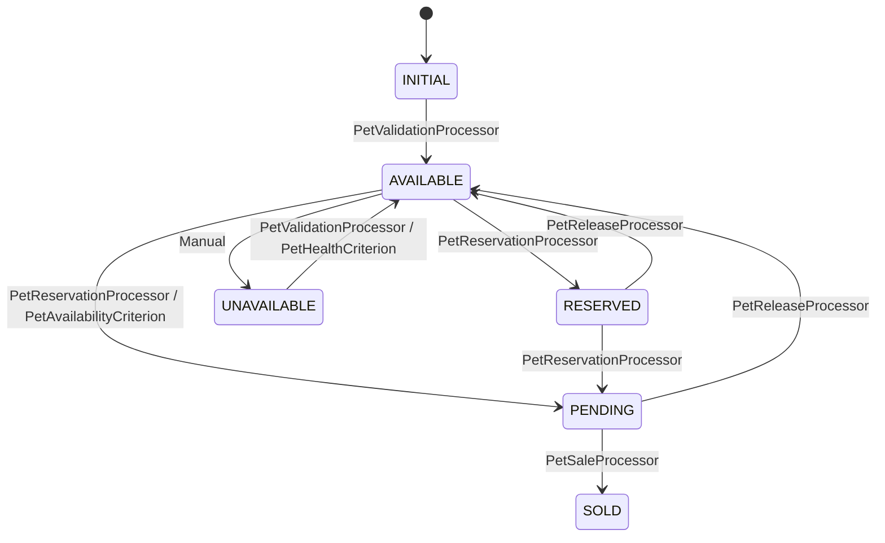
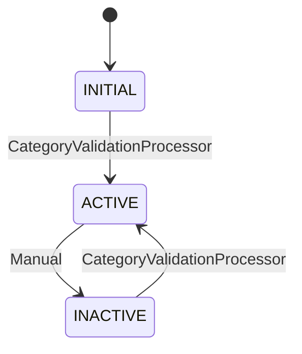
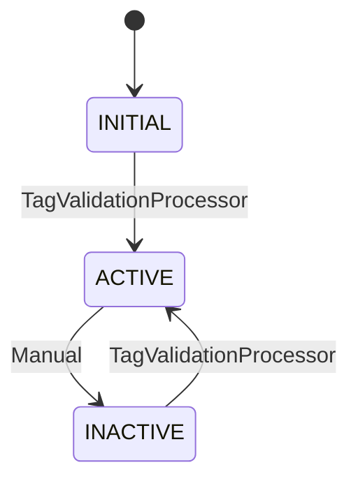
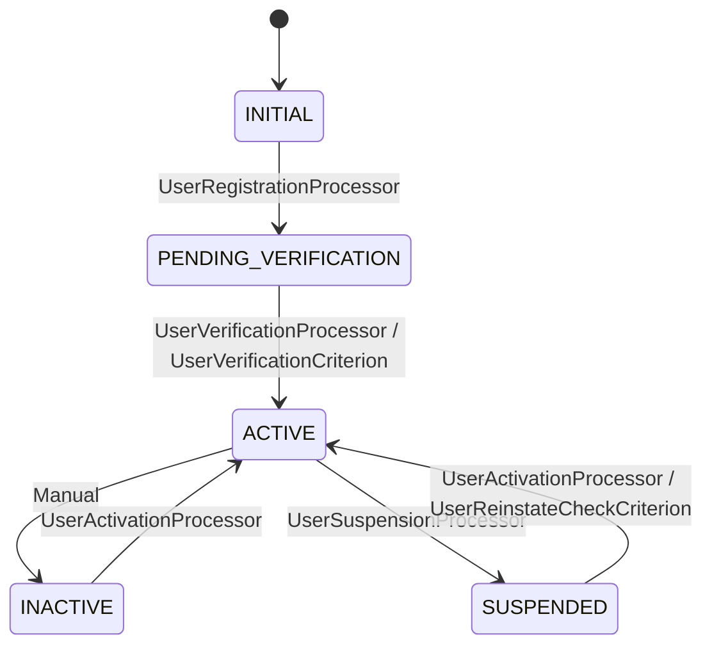
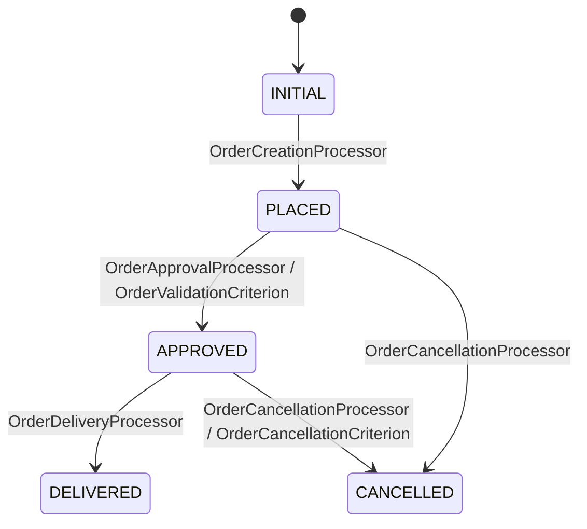
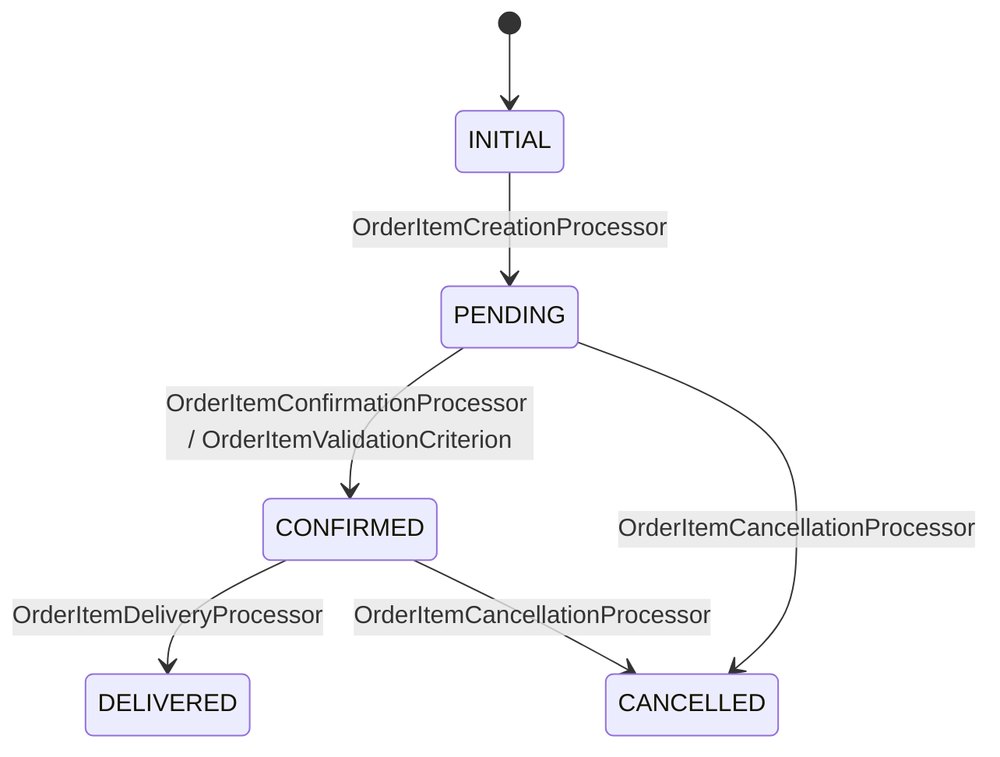
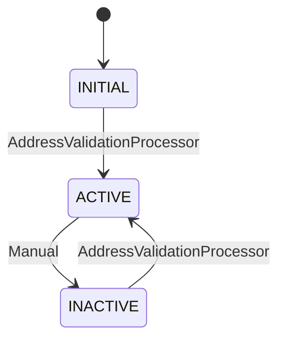

# Workflows Specification for Purrfect Pets API

## Overview
This document defines the workflows for each entity in the Purrfect Pets API, including states, transitions, and state diagrams.

## 1. Pet Workflow

### States
- **INITIAL**: Starting state when pet is first created
- **AVAILABLE**: Pet is available for purchase
- **PENDING**: Pet is being processed for an order
- **RESERVED**: Pet is reserved for a customer
- **SOLD**: Pet has been sold
- **UNAVAILABLE**: Pet is temporarily unavailable

### Transitions

| From | To | Type | Processor | Criterion | Description |
|------|----|----|-----------|-----------|-------------|
| INITIAL | AVAILABLE | Automatic | PetValidationProcessor | null | Initial validation and setup |
| AVAILABLE | PENDING | Manual | PetReservationProcessor | PetAvailabilityCriterion | Reserve pet for order |
| AVAILABLE | RESERVED | Manual | PetReservationProcessor | null | Reserve pet for customer |
| PENDING | SOLD | Automatic | PetSaleProcessor | null | Complete pet sale |
| PENDING | AVAILABLE | Manual | PetReleaseProcessor | null | Release pet back to available |
| RESERVED | PENDING | Manual | PetReservationProcessor | null | Move reserved pet to pending |
| RESERVED | AVAILABLE | Manual | PetReleaseProcessor | null | Release reservation |
| AVAILABLE | UNAVAILABLE | Manual | null | null | Mark pet as unavailable |
| UNAVAILABLE | AVAILABLE | Manual | PetValidationProcessor | PetHealthCriterion | Return pet to available status |

### State Diagram

```mermaid
stateDiagram-v2
    [*] --> INITIAL
    INITIAL --> AVAILABLE : PetValidationProcessor
    AVAILABLE --> PENDING : PetReservationProcessor / PetAvailabilityCriterion
    AVAILABLE --> RESERVED : PetReservationProcessor
    AVAILABLE --> UNAVAILABLE : Manual
    PENDING --> SOLD : PetSaleProcessor
    PENDING --> AVAILABLE : PetReleaseProcessor
    RESERVED --> PENDING : PetReservationProcessor
    RESERVED --> AVAILABLE : PetReleaseProcessor
    UNAVAILABLE --> AVAILABLE : PetValidationProcessor / PetHealthCriterion
```

## 2. Category Workflow

### States
- **INITIAL**: Starting state when category is first created
- **ACTIVE**: Category is active and can be used
- **INACTIVE**: Category is inactive

### Transitions

| From | To | Type | Processor | Criterion | Description |
|------|----|----|-----------|-----------|-------------|
| INITIAL | ACTIVE | Automatic | CategoryValidationProcessor | null | Initial validation |
| ACTIVE | INACTIVE | Manual | null | null | Deactivate category |
| INACTIVE | ACTIVE | Manual | CategoryValidationProcessor | null | Reactivate category |

### State Diagram

```mermaid
stateDiagram-v2
    [*] --> INITIAL
    INITIAL --> ACTIVE : CategoryValidationProcessor
    ACTIVE --> INACTIVE : Manual
    INACTIVE --> ACTIVE : CategoryValidationProcessor
```

## 3. Tag Workflow

### States
- **INITIAL**: Starting state when tag is first created
- **ACTIVE**: Tag is active and can be used
- **INACTIVE**: Tag is inactive

### Transitions

| From | To | Type | Processor | Criterion | Description |
|------|----|----|-----------|-----------|-------------|
| INITIAL | ACTIVE | Automatic | TagValidationProcessor | null | Initial validation |
| ACTIVE | INACTIVE | Manual | null | null | Deactivate tag |
| INACTIVE | ACTIVE | Manual | TagValidationProcessor | null | Reactivate tag |

### State Diagram

```mermaid
stateDiagram-v2
    [*] --> INITIAL
    INITIAL --> ACTIVE : TagValidationProcessor
    ACTIVE --> INACTIVE : Manual
    INACTIVE --> ACTIVE : TagValidationProcessor
```

## 4. User Workflow

### States
- **INITIAL**: Starting state when user is first created
- **PENDING_VERIFICATION**: User account pending email verification
- **ACTIVE**: User account is active
- **INACTIVE**: User account is inactive
- **SUSPENDED**: User account is suspended

### Transitions

| From | To | Type | Processor | Criterion | Description |
|------|----|----|-----------|-----------|-------------|
| INITIAL | PENDING_VERIFICATION | Automatic | UserRegistrationProcessor | null | Initial user registration |
| PENDING_VERIFICATION | ACTIVE | Manual | UserVerificationProcessor | UserVerificationCriterion | Email verification complete |
| ACTIVE | INACTIVE | Manual | null | null | Deactivate user account |
| ACTIVE | SUSPENDED | Manual | UserSuspensionProcessor | null | Suspend user account |
| INACTIVE | ACTIVE | Manual | UserActivationProcessor | null | Reactivate user account |
| SUSPENDED | ACTIVE | Manual | UserActivationProcessor | UserReinstateCheckCriterion | Reinstate suspended user |

### State Diagram

```mermaid
stateDiagram-v2
    [*] --> INITIAL
    INITIAL --> PENDING_VERIFICATION : UserRegistrationProcessor
    PENDING_VERIFICATION --> ACTIVE : UserVerificationProcessor / UserVerificationCriterion
    ACTIVE --> INACTIVE : Manual
    ACTIVE --> SUSPENDED : UserSuspensionProcessor
    INACTIVE --> ACTIVE : UserActivationProcessor
    SUSPENDED --> ACTIVE : UserActivationProcessor / UserReinstateCheckCriterion
```

## 5. Order Workflow

### States
- **INITIAL**: Starting state when order is first created
- **PLACED**: Order has been placed by customer
- **APPROVED**: Order has been approved for processing
- **DELIVERED**: Order has been delivered
- **CANCELLED**: Order has been cancelled

### Transitions

| From | To | Type | Processor | Criterion | Description |
|------|----|----|-----------|-----------|-------------|
| INITIAL | PLACED | Automatic | OrderCreationProcessor | null | Initial order creation |
| PLACED | APPROVED | Manual | OrderApprovalProcessor | OrderValidationCriterion | Approve order for processing |
| PLACED | CANCELLED | Manual | OrderCancellationProcessor | null | Cancel order |
| APPROVED | DELIVERED | Manual | OrderDeliveryProcessor | null | Mark order as delivered |
| APPROVED | CANCELLED | Manual | OrderCancellationProcessor | OrderCancellationCriterion | Cancel approved order |

### State Diagram

```mermaid
stateDiagram-v2
    [*] --> INITIAL
    INITIAL --> PLACED : OrderCreationProcessor
    PLACED --> APPROVED : OrderApprovalProcessor / OrderValidationCriterion
    PLACED --> CANCELLED : OrderCancellationProcessor
    APPROVED --> DELIVERED : OrderDeliveryProcessor
    APPROVED --> CANCELLED : OrderCancellationProcessor / OrderCancellationCriterion
```

## 6. OrderItem Workflow

### States
- **INITIAL**: Starting state when order item is first created
- **PENDING**: Order item is pending processing
- **CONFIRMED**: Order item has been confirmed
- **DELIVERED**: Order item has been delivered
- **CANCELLED**: Order item has been cancelled

### Transitions

| From | To | Type | Processor | Criterion | Description |
|------|----|----|-----------|-----------|-------------|
| INITIAL | PENDING | Automatic | OrderItemCreationProcessor | null | Initial order item creation |
| PENDING | CONFIRMED | Automatic | OrderItemConfirmationProcessor | OrderItemValidationCriterion | Confirm order item |
| PENDING | CANCELLED | Manual | OrderItemCancellationProcessor | null | Cancel order item |
| CONFIRMED | DELIVERED | Automatic | OrderItemDeliveryProcessor | null | Mark item as delivered |
| CONFIRMED | CANCELLED | Manual | OrderItemCancellationProcessor | null | Cancel confirmed item |

### State Diagram

```mermaid
stateDiagram-v2
    [*] --> INITIAL
    INITIAL --> PENDING : OrderItemCreationProcessor
    PENDING --> CONFIRMED : OrderItemConfirmationProcessor / OrderItemValidationCriterion
    PENDING --> CANCELLED : OrderItemCancellationProcessor
    CONFIRMED --> DELIVERED : OrderItemDeliveryProcessor
    CONFIRMED --> CANCELLED : OrderItemCancellationProcessor
```

## 7. Address Workflow

### States
- **INITIAL**: Starting state when address is first created
- **ACTIVE**: Address is active and can be used
- **INACTIVE**: Address is inactive

### Transitions

| From | To | Type | Processor | Criterion | Description |
|------|----|----|-----------|-----------|-------------|
| INITIAL | ACTIVE | Automatic | AddressValidationProcessor | null | Initial address validation |
| ACTIVE | INACTIVE | Manual | null | null | Deactivate address |
| INACTIVE | ACTIVE | Manual | AddressValidationProcessor | null | Reactivate address |

### State Diagram

```mermaid
stateDiagram-v2
    [*] --> INITIAL
    INITIAL --> ACTIVE : AddressValidationProcessor
    ACTIVE --> INACTIVE : Manual
    INACTIVE --> ACTIVE : AddressValidationProcessor
```

## Workflow Notes

- **Automatic transitions**: Triggered automatically by the system
- **Manual transitions**: Triggered by user actions or external events
- **Processors**: Handle business logic during transitions
- **Criteria**: Validate conditions before allowing transitions
- All workflows start from INITIAL state with automatic transition to first operational state
- Loop transitions (to same or previous states) are marked as manual
- State management is handled internally via `entity.meta.state`
