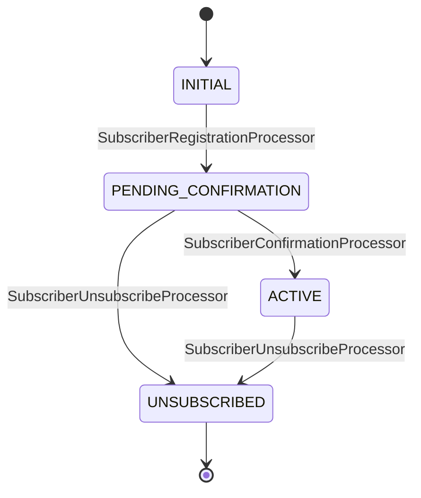
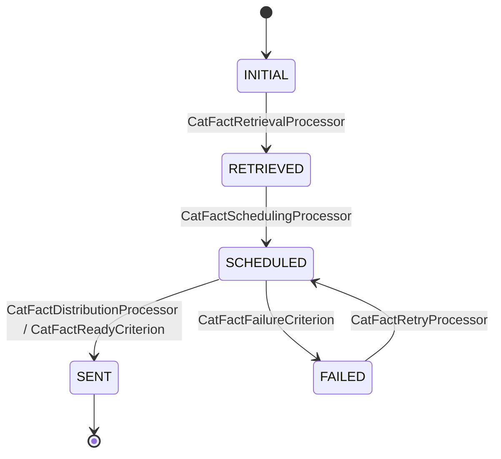
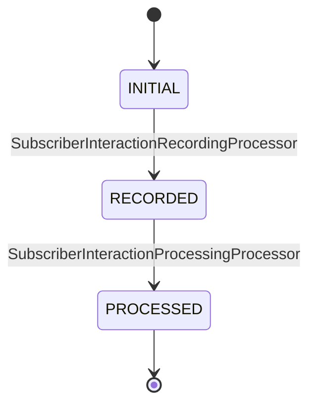
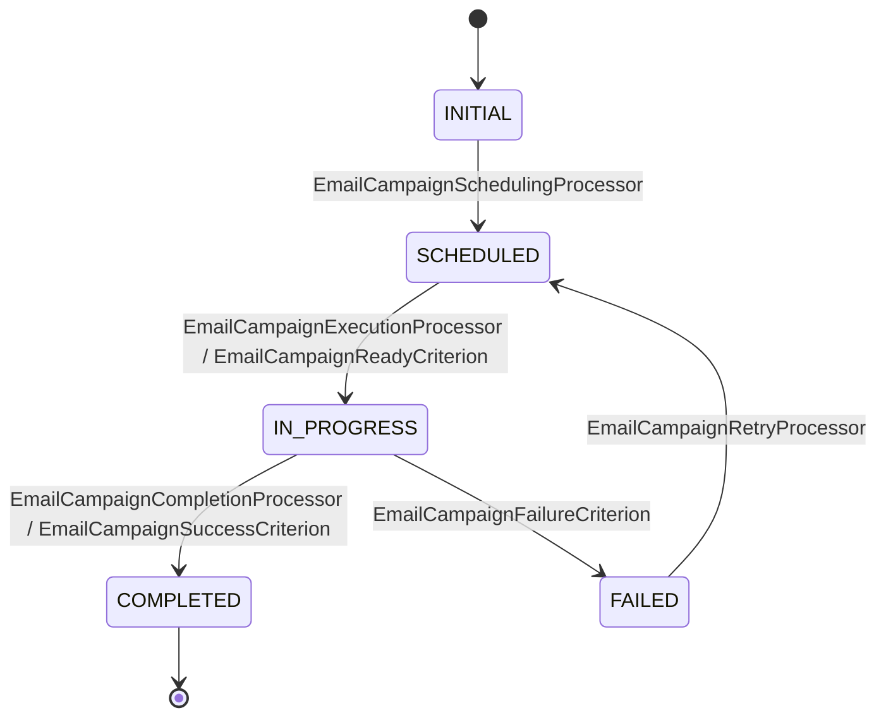

# Workflows

## 1. Subscriber Workflow

**Name:** SubscriberWorkflow

**Description:** Manages the lifecycle of a subscriber from registration to unsubscription.

**States:**
- `INITIAL`: Starting state (system-managed)
- `PENDING_CONFIRMATION`: Subscriber registered but email not confirmed
- `ACTIVE`: Email confirmed and subscription is active
- `UNSUBSCRIBED`: Subscriber has unsubscribed

**Transitions:**

1. **INITIAL → PENDING_CONFIRMATION**
   - **Type:** Automatic
   - **Processor:** SubscriberRegistrationProcessor
   - **Criterion:** None
   - **Description:** User submits subscription form

2. **PENDING_CONFIRMATION → ACTIVE**
   - **Type:** Automatic
   - **Processor:** SubscriberConfirmationProcessor
   - **Criterion:** None
   - **Description:** User clicks confirmation link in email

3. **ACTIVE → UNSUBSCRIBED**
   - **Type:** Manual
   - **Processor:** SubscriberUnsubscribeProcessor
   - **Criterion:** None
   - **Description:** User clicks unsubscribe link

4. **PENDING_CONFIRMATION → UNSUBSCRIBED**
   - **Type:** Manual
   - **Processor:** SubscriberUnsubscribeProcessor
   - **Criterion:** None
   - **Description:** User unsubscribes before confirming

```mermaid
stateDiagram-v2
    [*] --> INITIAL
    INITIAL --> PENDING_CONFIRMATION : SubscriberRegistrationProcessor
    PENDING_CONFIRMATION --> ACTIVE : SubscriberConfirmationProcessor
    PENDING_CONFIRMATION --> UNSUBSCRIBED : SubscriberUnsubscribeProcessor
    ACTIVE --> UNSUBSCRIBED : SubscriberUnsubscribeProcessor
    UNSUBSCRIBED --> [*]
```

---

## 2. CatFact Workflow

**Name:** CatFactWorkflow

**Description:** Manages the lifecycle of cat facts from retrieval to distribution.

**States:**
- `INITIAL`: Starting state (system-managed)
- `RETRIEVED`: Cat fact retrieved from external API
- `SCHEDULED`: Cat fact scheduled for weekly distribution
- `SENT`: Cat fact successfully sent to subscribers
- `FAILED`: Cat fact sending failed

**Transitions:**

1. **INITIAL → RETRIEVED**
   - **Type:** Automatic
   - **Processor:** CatFactRetrievalProcessor
   - **Criterion:** None
   - **Description:** System retrieves cat fact from API

2. **RETRIEVED → SCHEDULED**
   - **Type:** Automatic
   - **Processor:** CatFactSchedulingProcessor
   - **Criterion:** None
   - **Description:** Cat fact is scheduled for next weekly send

3. **SCHEDULED → SENT**
   - **Type:** Automatic
   - **Processor:** CatFactDistributionProcessor
   - **Criterion:** CatFactReadyCriterion
   - **Description:** Cat fact is sent to all active subscribers

4. **SCHEDULED → FAILED**
   - **Type:** Automatic
   - **Processor:** None
   - **Criterion:** CatFactFailureCriterion
   - **Description:** Cat fact sending failed

5. **FAILED → SCHEDULED**
   - **Type:** Manual
   - **Processor:** CatFactRetryProcessor
   - **Criterion:** None
   - **Description:** Retry failed cat fact sending

```mermaid
stateDiagram-v2
    [*] --> INITIAL
    INITIAL --> RETRIEVED : CatFactRetrievalProcessor
    RETRIEVED --> SCHEDULED : CatFactSchedulingProcessor
    SCHEDULED --> SENT : CatFactDistributionProcessor / CatFactReadyCriterion
    SCHEDULED --> FAILED : CatFactFailureCriterion
    FAILED --> SCHEDULED : CatFactRetryProcessor
    SENT --> [*]
```

---

## 3. SubscriberInteraction Workflow

**Name:** SubscriberInteractionWorkflow

**Description:** Manages the lifecycle of subscriber interactions for tracking and reporting.

**States:**
- `INITIAL`: Starting state (system-managed)
- `RECORDED`: Interaction has been recorded
- `PROCESSED`: Interaction has been processed for reporting

**Transitions:**

1. **INITIAL → RECORDED**
   - **Type:** Automatic
   - **Processor:** SubscriberInteractionRecordingProcessor
   - **Criterion:** None
   - **Description:** System records a subscriber interaction

2. **RECORDED → PROCESSED**
   - **Type:** Automatic
   - **Processor:** SubscriberInteractionProcessingProcessor
   - **Criterion:** None
   - **Description:** Interaction is processed for analytics and reporting

```mermaid
stateDiagram-v2
    [*] --> INITIAL
    INITIAL --> RECORDED : SubscriberInteractionRecordingProcessor
    RECORDED --> PROCESSED : SubscriberInteractionProcessingProcessor
    PROCESSED --> [*]
```

---

## 4. EmailCampaign Workflow

**Name:** EmailCampaignWorkflow

**Description:** Manages the lifecycle of weekly email campaigns.

**States:**
- `INITIAL`: Starting state (system-managed)
- `SCHEDULED`: Campaign is scheduled for execution
- `IN_PROGRESS`: Campaign is currently being executed
- `COMPLETED`: Campaign execution completed successfully
- `FAILED`: Campaign execution failed

**Transitions:**

1. **INITIAL → SCHEDULED**
   - **Type:** Automatic
   - **Processor:** EmailCampaignSchedulingProcessor
   - **Criterion:** None
   - **Description:** Weekly campaign is scheduled

2. **SCHEDULED → IN_PROGRESS**
   - **Type:** Automatic
   - **Processor:** EmailCampaignExecutionProcessor
   - **Criterion:** EmailCampaignReadyCriterion
   - **Description:** Campaign execution starts

3. **IN_PROGRESS → COMPLETED**
   - **Type:** Automatic
   - **Processor:** EmailCampaignCompletionProcessor
   - **Criterion:** EmailCampaignSuccessCriterion
   - **Description:** Campaign completed successfully

4. **IN_PROGRESS → FAILED**
   - **Type:** Automatic
   - **Processor:** None
   - **Criterion:** EmailCampaignFailureCriterion
   - **Description:** Campaign execution failed

5. **FAILED → SCHEDULED**
   - **Type:** Manual
   - **Processor:** EmailCampaignRetryProcessor
   - **Criterion:** None
   - **Description:** Retry failed campaign

```mermaid
stateDiagram-v2
    [*] --> INITIAL
    INITIAL --> SCHEDULED : EmailCampaignSchedulingProcessor
    SCHEDULED --> IN_PROGRESS : EmailCampaignExecutionProcessor / EmailCampaignReadyCriterion
    IN_PROGRESS --> COMPLETED : EmailCampaignCompletionProcessor / EmailCampaignSuccessCriterion
    IN_PROGRESS --> FAILED : EmailCampaignFailureCriterion
    FAILED --> SCHEDULED : EmailCampaignRetryProcessor
    COMPLETED --> [*]
```
