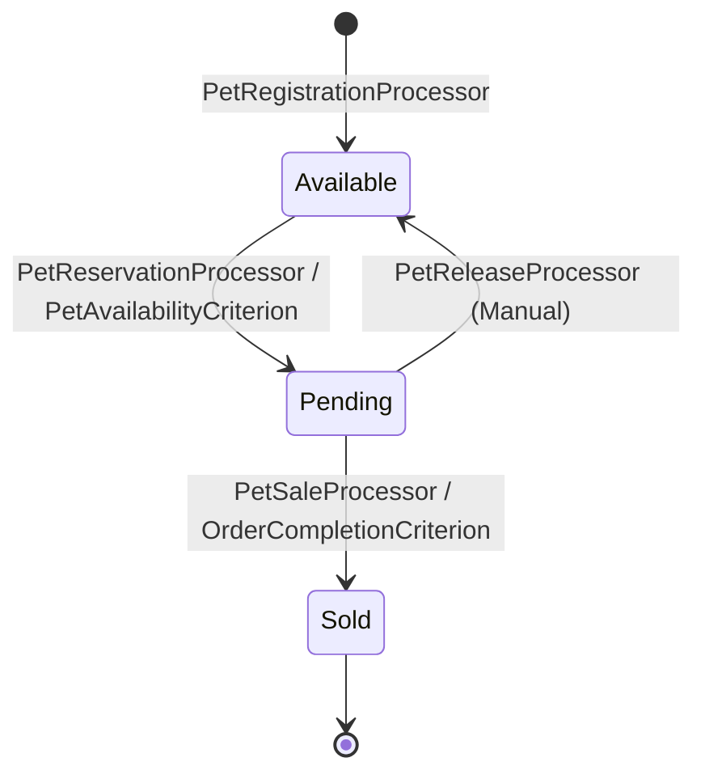
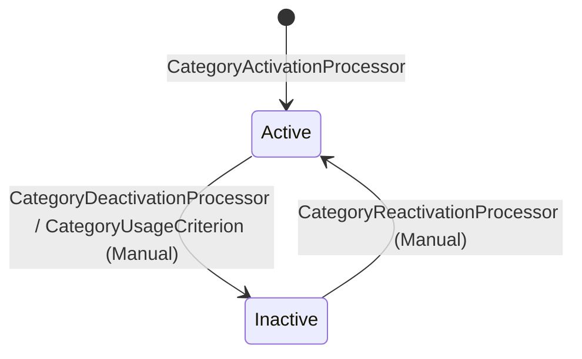
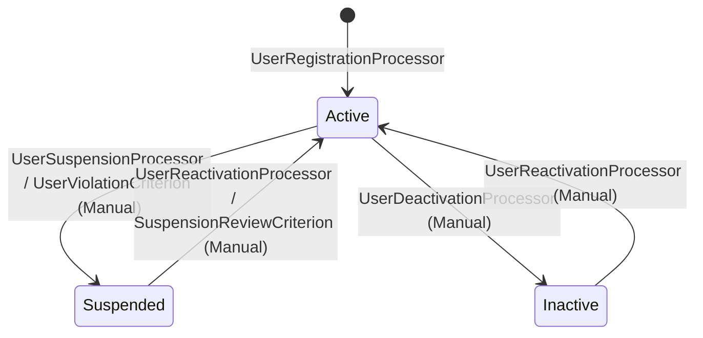
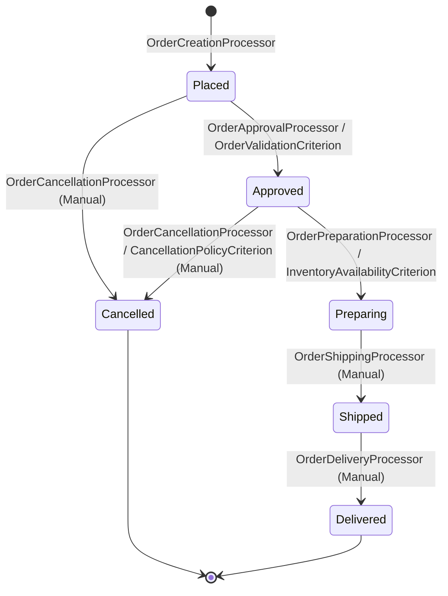
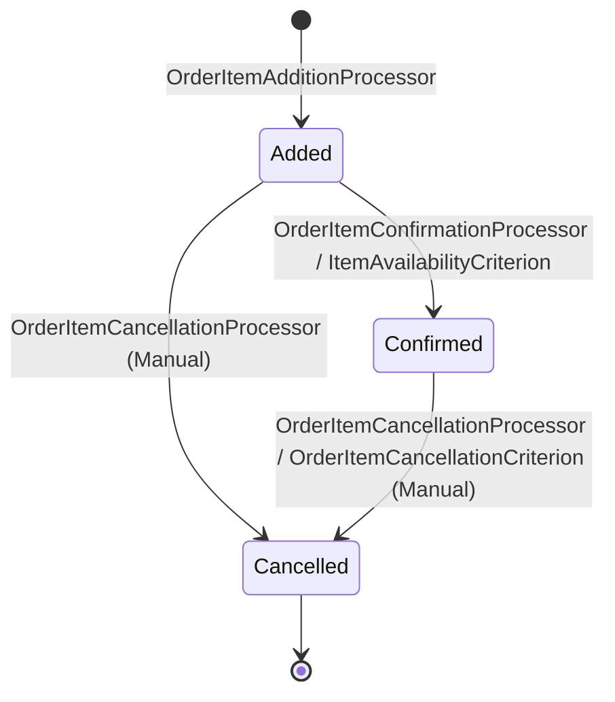
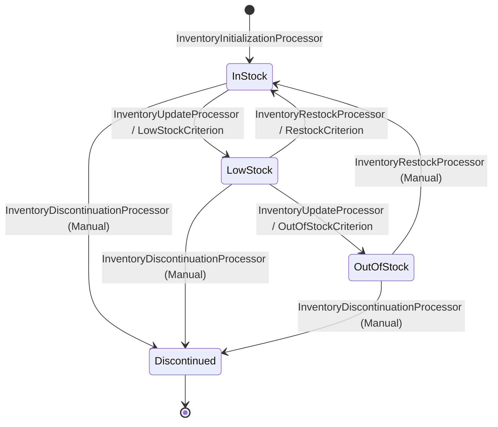
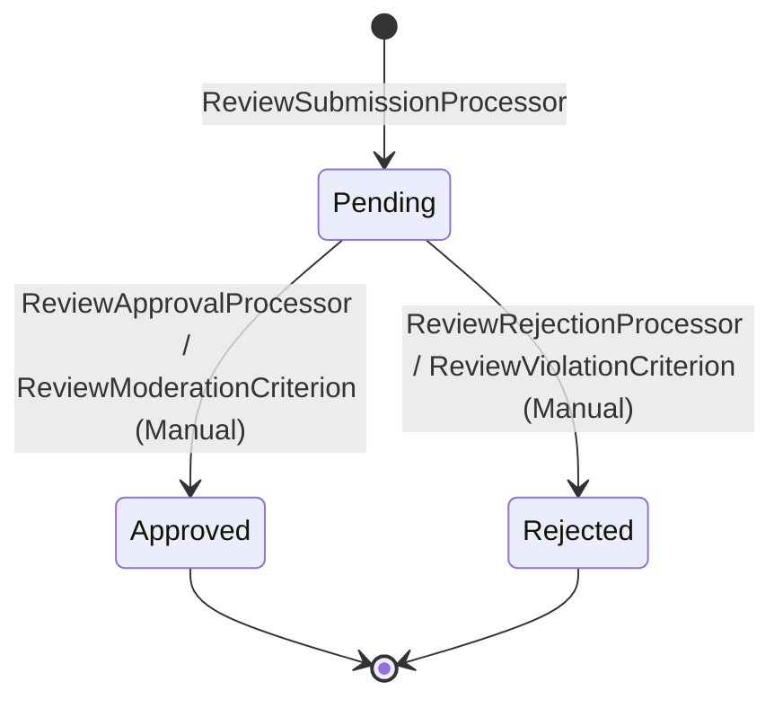

# Workflows for Purrfect Pets API

## Pet Workflow

**Name:** PetWorkflow

**States:** Available, Pending, Sold

**Transitions:**

1. **Initial → Available** (Automatic)
   - Processor: PetRegistrationProcessor
   - Criterion: None
   - Description: Register new pet in the system

2. **Available → Pending** (Automatic)
   - Processor: PetReservationProcessor
   - Criterion: PetAvailabilityCriterion
   - Description: Reserve pet when added to order

3. **Pending → Available** (Manual)
   - Processor: PetReleaseProcessor
   - Criterion: None
   - Description: Release pet reservation if order cancelled

4. **Pending → Sold** (Automatic)
   - Processor: PetSaleProcessor
   - Criterion: OrderCompletionCriterion
   - Description: Mark pet as sold when order is completed

```mermaid
stateDiagram-v2
    [*] --> Available : PetRegistrationProcessor
    Available --> Pending : PetReservationProcessor / PetAvailabilityCriterion
    Pending --> Available : PetReleaseProcessor (Manual)
    Pending --> Sold : PetSaleProcessor / OrderCompletionCriterion
    Sold --> [*]
```

---

## Category Workflow

**Name:** CategoryWorkflow

**States:** Active, Inactive

**Transitions:**

1. **Initial → Active** (Automatic)
   - Processor: CategoryActivationProcessor
   - Criterion: None
   - Description: Activate new category

2. **Active → Inactive** (Manual)
   - Processor: CategoryDeactivationProcessor
   - Criterion: CategoryUsageCriterion
   - Description: Deactivate category if no pets assigned

3. **Inactive → Active** (Manual)
   - Processor: CategoryReactivationProcessor
   - Criterion: None
   - Description: Reactivate category

```mermaid
stateDiagram-v2
    [*] --> Active : CategoryActivationProcessor
    Active --> Inactive : CategoryDeactivationProcessor / CategoryUsageCriterion (Manual)
    Inactive --> Active : CategoryReactivationProcessor (Manual)
```

---

## User Workflow

**Name:** UserWorkflow

**States:** Active, Inactive, Suspended

**Transitions:**

1. **Initial → Active** (Automatic)
   - Processor: UserRegistrationProcessor
   - Criterion: None
   - Description: Register new user

2. **Active → Suspended** (Manual)
   - Processor: UserSuspensionProcessor
   - Criterion: UserViolationCriterion
   - Description: Suspend user for policy violations

3. **Active → Inactive** (Manual)
   - Processor: UserDeactivationProcessor
   - Criterion: None
   - Description: Deactivate user account

4. **Suspended → Active** (Manual)
   - Processor: UserReactivationProcessor
   - Criterion: SuspensionReviewCriterion
   - Description: Reactivate suspended user

5. **Inactive → Active** (Manual)
   - Processor: UserReactivationProcessor
   - Criterion: None
   - Description: Reactivate inactive user

```mermaid
stateDiagram-v2
    [*] --> Active : UserRegistrationProcessor
    Active --> Suspended : UserSuspensionProcessor / UserViolationCriterion (Manual)
    Active --> Inactive : UserDeactivationProcessor (Manual)
    Suspended --> Active : UserReactivationProcessor / SuspensionReviewCriterion (Manual)
    Inactive --> Active : UserReactivationProcessor (Manual)
```

---

## Order Workflow

**Name:** OrderWorkflow

**States:** Placed, Approved, Preparing, Shipped, Delivered, Cancelled

**Transitions:**

1. **Initial → Placed** (Automatic)
   - Processor: OrderCreationProcessor
   - Criterion: None
   - Description: Create new order

2. **Placed → Approved** (Automatic)
   - Processor: OrderApprovalProcessor
   - Criterion: OrderValidationCriterion
   - Description: Approve valid orders

3. **Placed → Cancelled** (Manual)
   - Processor: OrderCancellationProcessor
   - Criterion: None
   - Description: Cancel order before approval

4. **Approved → Preparing** (Automatic)
   - Processor: OrderPreparationProcessor
   - Criterion: InventoryAvailabilityCriterion
   - Description: Start order preparation

5. **Approved → Cancelled** (Manual)
   - Processor: OrderCancellationProcessor
   - Criterion: CancellationPolicyCriterion
   - Description: Cancel approved order

6. **Preparing → Shipped** (Manual)
   - Processor: OrderShippingProcessor
   - Criterion: None
   - Description: Ship prepared order

7. **Shipped → Delivered** (Manual)
   - Processor: OrderDeliveryProcessor
   - Criterion: None
   - Description: Mark order as delivered

```mermaid
stateDiagram-v2
    [*] --> Placed : OrderCreationProcessor
    Placed --> Approved : OrderApprovalProcessor / OrderValidationCriterion
    Placed --> Cancelled : OrderCancellationProcessor (Manual)
    Approved --> Preparing : OrderPreparationProcessor / InventoryAvailabilityCriterion
    Approved --> Cancelled : OrderCancellationProcessor / CancellationPolicyCriterion (Manual)
    Preparing --> Shipped : OrderShippingProcessor (Manual)
    Shipped --> Delivered : OrderDeliveryProcessor (Manual)
    Cancelled --> [*]
    Delivered --> [*]
```

---

## OrderItem Workflow

**Name:** OrderItemWorkflow

**States:** Added, Confirmed, Cancelled

**Transitions:**

1. **Initial → Added** (Automatic)
   - Processor: OrderItemAdditionProcessor
   - Criterion: None
   - Description: Add item to order

2. **Added → Confirmed** (Automatic)
   - Processor: OrderItemConfirmationProcessor
   - Criterion: ItemAvailabilityCriterion
   - Description: Confirm item availability

3. **Added → Cancelled** (Manual)
   - Processor: OrderItemCancellationProcessor
   - Criterion: None
   - Description: Cancel order item

4. **Confirmed → Cancelled** (Manual)
   - Processor: OrderItemCancellationProcessor
   - Criterion: OrderItemCancellationCriterion
   - Description: Cancel confirmed item

```mermaid
stateDiagram-v2
    [*] --> Added : OrderItemAdditionProcessor
    Added --> Confirmed : OrderItemConfirmationProcessor / ItemAvailabilityCriterion
    Added --> Cancelled : OrderItemCancellationProcessor (Manual)
    Confirmed --> Cancelled : OrderItemCancellationProcessor / OrderItemCancellationCriterion (Manual)
    Cancelled --> [*]
```

---

## Inventory Workflow

**Name:** InventoryWorkflow

**States:** InStock, LowStock, OutOfStock, Discontinued

**Transitions:**

1. **Initial → InStock** (Automatic)
   - Processor: InventoryInitializationProcessor
   - Criterion: None
   - Description: Initialize inventory for new pet

2. **InStock → LowStock** (Automatic)
   - Processor: InventoryUpdateProcessor
   - Criterion: LowStockCriterion
   - Description: Mark as low stock when below threshold

3. **LowStock → InStock** (Automatic)
   - Processor: InventoryRestockProcessor
   - Criterion: RestockCriterion
   - Description: Restock inventory

4. **LowStock → OutOfStock** (Automatic)
   - Processor: InventoryUpdateProcessor
   - Criterion: OutOfStockCriterion
   - Description: Mark as out of stock

5. **OutOfStock → InStock** (Manual)
   - Processor: InventoryRestockProcessor
   - Criterion: None
   - Description: Restock from out of stock

6. **InStock → Discontinued** (Manual)
   - Processor: InventoryDiscontinuationProcessor
   - Criterion: None
   - Description: Discontinue pet

7. **LowStock → Discontinued** (Manual)
   - Processor: InventoryDiscontinuationProcessor
   - Criterion: None
   - Description: Discontinue pet

8. **OutOfStock → Discontinued** (Manual)
   - Processor: InventoryDiscontinuationProcessor
   - Criterion: None
   - Description: Discontinue pet

```mermaid
stateDiagram-v2
    [*] --> InStock : InventoryInitializationProcessor
    InStock --> LowStock : InventoryUpdateProcessor / LowStockCriterion
    LowStock --> InStock : InventoryRestockProcessor / RestockCriterion
    LowStock --> OutOfStock : InventoryUpdateProcessor / OutOfStockCriterion
    OutOfStock --> InStock : InventoryRestockProcessor (Manual)
    InStock --> Discontinued : InventoryDiscontinuationProcessor (Manual)
    LowStock --> Discontinued : InventoryDiscontinuationProcessor (Manual)
    OutOfStock --> Discontinued : InventoryDiscontinuationProcessor (Manual)
    Discontinued --> [*]
```

---

## Review Workflow

**Name:** ReviewWorkflow

**States:** Pending, Approved, Rejected

**Transitions:**

1. **Initial → Pending** (Automatic)
   - Processor: ReviewSubmissionProcessor
   - Criterion: None
   - Description: Submit new review

2. **Pending → Approved** (Manual)
   - Processor: ReviewApprovalProcessor
   - Criterion: ReviewModerationCriterion
   - Description: Approve review after moderation

3. **Pending → Rejected** (Manual)
   - Processor: ReviewRejectionProcessor
   - Criterion: ReviewViolationCriterion
   - Description: Reject inappropriate review

```mermaid
stateDiagram-v2
    [*] --> Pending : ReviewSubmissionProcessor
    Pending --> Approved : ReviewApprovalProcessor / ReviewModerationCriterion (Manual)
    Pending --> Rejected : ReviewRejectionProcessor / ReviewViolationCriterion (Manual)
    Approved --> [*]
    Rejected --> [*]
```
