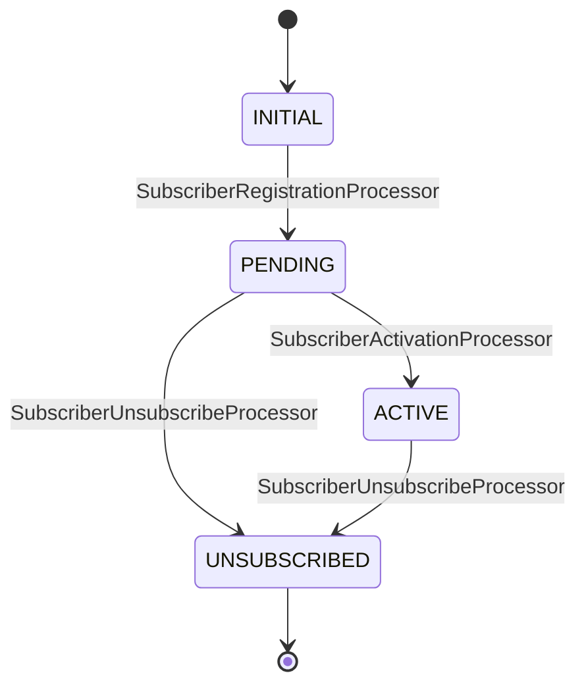
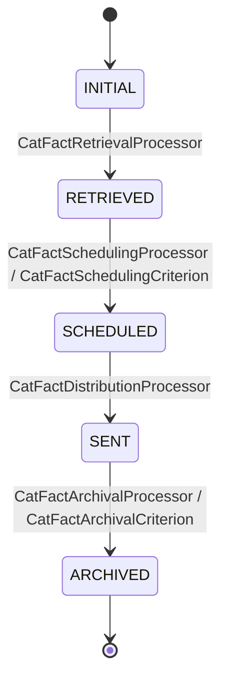
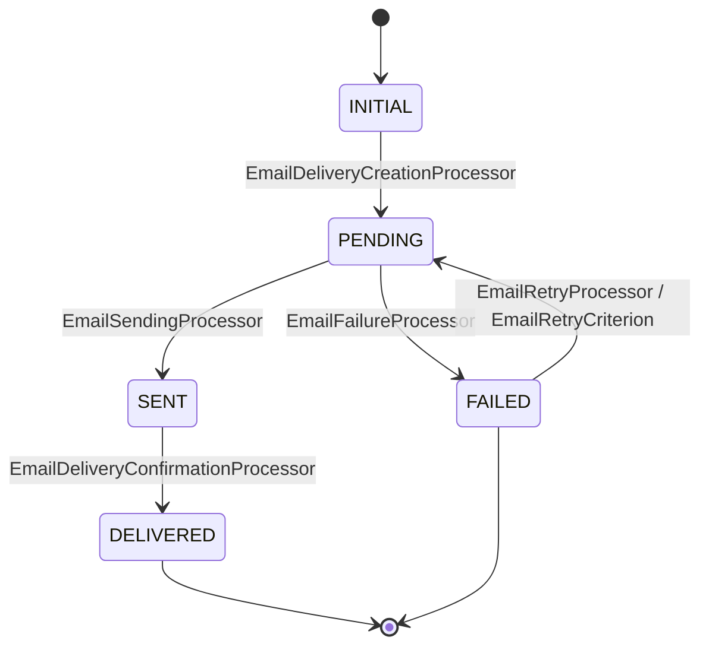
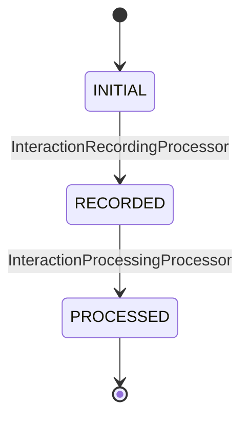
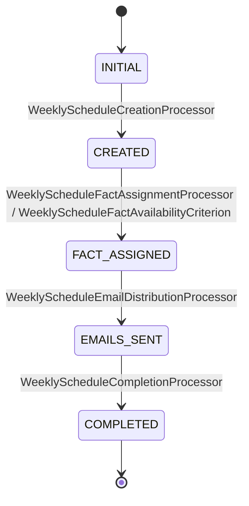

# Workflows

## 1. Subscriber Workflow

**Name**: SubscriberWorkflow

**Description**: Manages the lifecycle of a subscriber from registration to unsubscription.

**States**:
- `INITIAL`: Starting state (system managed)
- `PENDING`: Subscriber registered but email not yet verified
- `ACTIVE`: Subscriber is active and receiving emails
- `UNSUBSCRIBED`: Subscriber has unsubscribed

**Transitions**:

1. `INITIAL` → `PENDING` (automatic)
   - **Processor**: SubscriberRegistrationProcessor
   - **Criterion**: None
   - **Description**: Process new subscriber registration

2. `PENDING` → `ACTIVE` (manual)
   - **Processor**: SubscriberActivationProcessor
   - **Criterion**: None
   - **Description**: Activate subscriber after email verification

3. `ACTIVE` → `UNSUBSCRIBED` (manual)
   - **Processor**: SubscriberUnsubscribeProcessor
   - **Criterion**: None
   - **Description**: Process unsubscription request

4. `PENDING` → `UNSUBSCRIBED` (manual)
   - **Processor**: SubscriberUnsubscribeProcessor
   - **Criterion**: None
   - **Description**: Unsubscribe before activation

```mermaid
stateDiagram-v2
    [*] --> INITIAL
    INITIAL --> PENDING : SubscriberRegistrationProcessor
    PENDING --> ACTIVE : SubscriberActivationProcessor
    PENDING --> UNSUBSCRIBED : SubscriberUnsubscribeProcessor
    ACTIVE --> UNSUBSCRIBED : SubscriberUnsubscribeProcessor
    UNSUBSCRIBED --> [*]
```

---

## 2. CatFact Workflow

**Name**: CatFactWorkflow

**Description**: Manages the lifecycle of cat facts from retrieval to archival.

**States**:
- `INITIAL`: Starting state (system managed)
- `RETRIEVED`: Cat fact retrieved from external API
- `SCHEDULED`: Cat fact scheduled for weekly distribution
- `SENT`: Cat fact has been sent to subscribers
- `ARCHIVED`: Cat fact archived after distribution

**Transitions**:

1. `INITIAL` → `RETRIEVED` (automatic)
   - **Processor**: CatFactRetrievalProcessor
   - **Criterion**: None
   - **Description**: Retrieve cat fact from external API

2. `RETRIEVED` → `SCHEDULED` (automatic)
   - **Processor**: CatFactSchedulingProcessor
   - **Criterion**: CatFactSchedulingCriterion
   - **Description**: Schedule cat fact for weekly distribution

3. `SCHEDULED` → `SENT` (automatic)
   - **Processor**: CatFactDistributionProcessor
   - **Criterion**: None
   - **Description**: Mark cat fact as sent after email distribution

4. `SENT` → `ARCHIVED` (automatic)
   - **Processor**: CatFactArchivalProcessor
   - **Criterion**: CatFactArchivalCriterion
   - **Description**: Archive cat fact after successful distribution

```mermaid
stateDiagram-v2
    [*] --> INITIAL
    INITIAL --> RETRIEVED : CatFactRetrievalProcessor
    RETRIEVED --> SCHEDULED : CatFactSchedulingProcessor / CatFactSchedulingCriterion
    SCHEDULED --> SENT : CatFactDistributionProcessor
    SENT --> ARCHIVED : CatFactArchivalProcessor / CatFactArchivalCriterion
    ARCHIVED --> [*]
```

---

## 3. EmailDelivery Workflow

**Name**: EmailDeliveryWorkflow

**Description**: Manages the lifecycle of individual email deliveries to subscribers.

**States**:
- `INITIAL`: Starting state (system managed)
- `PENDING`: Email delivery queued for sending
- `SENT`: Email successfully sent
- `FAILED`: Email delivery failed
- `DELIVERED`: Email confirmed delivered (optional tracking)

**Transitions**:

1. `INITIAL` → `PENDING` (automatic)
   - **Processor**: EmailDeliveryCreationProcessor
   - **Criterion**: None
   - **Description**: Create email delivery record

2. `PENDING` → `SENT` (automatic)
   - **Processor**: EmailSendingProcessor
   - **Criterion**: None
   - **Description**: Send email to subscriber

3. `PENDING` → `FAILED` (automatic)
   - **Processor**: EmailFailureProcessor
   - **Criterion**: None
   - **Description**: Handle email sending failure

4. `FAILED` → `PENDING` (manual)
   - **Processor**: EmailRetryProcessor
   - **Criterion**: EmailRetryCriterion
   - **Description**: Retry failed email delivery

5. `SENT` → `DELIVERED` (automatic)
   - **Processor**: EmailDeliveryConfirmationProcessor
   - **Criterion**: None
   - **Description**: Confirm email delivery (tracking)

```mermaid
stateDiagram-v2
    [*] --> INITIAL
    INITIAL --> PENDING : EmailDeliveryCreationProcessor
    PENDING --> SENT : EmailSendingProcessor
    PENDING --> FAILED : EmailFailureProcessor
    FAILED --> PENDING : EmailRetryProcessor / EmailRetryCriterion
    SENT --> DELIVERED : EmailDeliveryConfirmationProcessor
    DELIVERED --> [*]
    FAILED --> [*]
```

---

## 4. Interaction Workflow

**Name**: InteractionWorkflow

**Description**: Manages the lifecycle of user interactions with cat fact emails.

**States**:
- `INITIAL`: Starting state (system managed)
- `RECORDED`: Interaction recorded in the system
- `PROCESSED`: Interaction data processed for analytics

**Transitions**:

1. `INITIAL` → `RECORDED` (automatic)
   - **Processor**: InteractionRecordingProcessor
   - **Criterion**: None
   - **Description**: Record user interaction

2. `RECORDED` → `PROCESSED` (automatic)
   - **Processor**: InteractionProcessingProcessor
   - **Criterion**: None
   - **Description**: Process interaction for analytics and reporting

```mermaid
stateDiagram-v2
    [*] --> INITIAL
    INITIAL --> RECORDED : InteractionRecordingProcessor
    RECORDED --> PROCESSED : InteractionProcessingProcessor
    PROCESSED --> [*]
```

---

## 5. WeeklySchedule Workflow

**Name**: WeeklyScheduleWorkflow

**Description**: Manages the weekly schedule for cat fact distribution.

**States**:
- `INITIAL`: Starting state (system managed)
- `CREATED`: Weekly schedule created
- `FACT_ASSIGNED`: Cat fact assigned to the week
- `EMAILS_SENT`: Emails sent to all subscribers
- `COMPLETED`: Weekly cycle completed

**Transitions**:

1. `INITIAL` → `CREATED` (automatic)
   - **Processor**: WeeklyScheduleCreationProcessor
   - **Criterion**: None
   - **Description**: Create new weekly schedule

2. `CREATED` → `FACT_ASSIGNED` (automatic)
   - **Processor**: WeeklyScheduleFactAssignmentProcessor
   - **Criterion**: WeeklyScheduleFactAvailabilityCriterion
   - **Description**: Assign cat fact to weekly schedule

3. `FACT_ASSIGNED` → `EMAILS_SENT` (automatic)
   - **Processor**: WeeklyScheduleEmailDistributionProcessor
   - **Criterion**: None
   - **Description**: Distribute emails to all active subscribers

4. `EMAILS_SENT` → `COMPLETED` (automatic)
   - **Processor**: WeeklyScheduleCompletionProcessor
   - **Criterion**: None
   - **Description**: Complete weekly cycle and generate reports

```mermaid
stateDiagram-v2
    [*] --> INITIAL
    INITIAL --> CREATED : WeeklyScheduleCreationProcessor
    CREATED --> FACT_ASSIGNED : WeeklyScheduleFactAssignmentProcessor / WeeklyScheduleFactAvailabilityCriterion
    FACT_ASSIGNED --> EMAILS_SENT : WeeklyScheduleEmailDistributionProcessor
    EMAILS_SENT --> COMPLETED : WeeklyScheduleCompletionProcessor
    COMPLETED --> [*]
```
