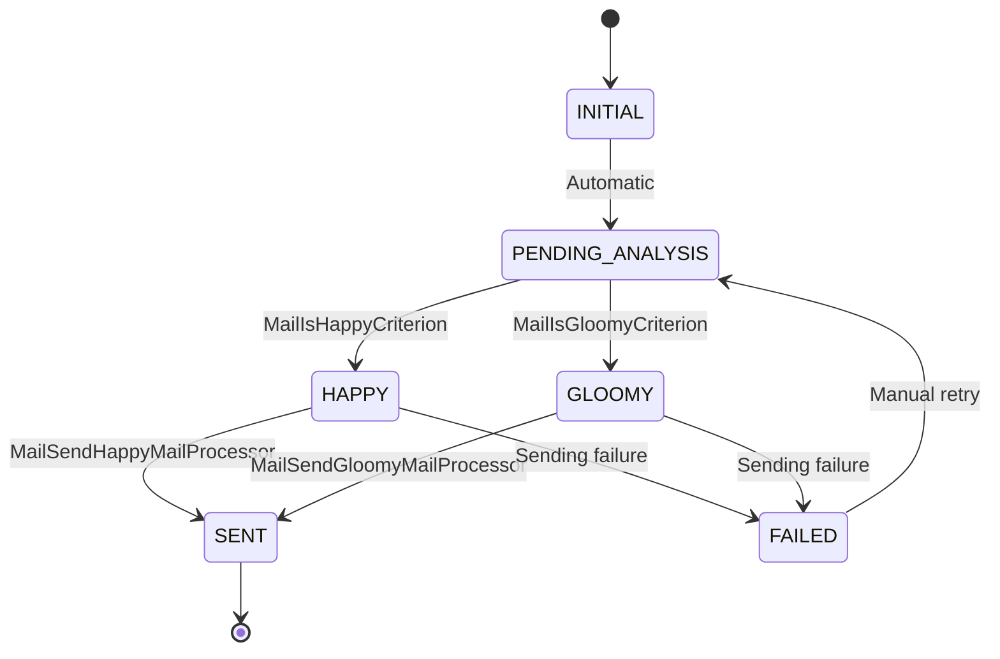

# Workflows

## Mail Workflow

### Description
The Mail workflow manages the lifecycle of email messages from creation through processing and sending. The workflow determines whether a mail is happy or gloomy and processes it accordingly.

### States
- **INITIAL**: Starting state when a mail entity is first created
- **PENDING_ANALYSIS**: Mail is waiting to be analyzed for emotional content
- **HAPPY**: Mail has been identified as having happy content
- **GLOOMY**: Mail has been identified as having gloomy content
- **SENT**: Mail has been successfully sent to recipients
- **FAILED**: Mail processing or sending has failed

### Transitions

#### 1. INITIAL → PENDING_ANALYSIS
- **Type**: Automatic
- **Trigger**: Mail entity creation
- **Processor**: None
- **Criterion**: None
- **Description**: Automatically moves newly created mail to analysis state

#### 2. PENDING_ANALYSIS → HAPPY
- **Type**: Automatic
- **Trigger**: Content analysis completion
- **Processor**: None
- **Criterion**: MailIsHappyCriterion
- **Description**: Moves mail to happy state if content is determined to be positive

#### 3. PENDING_ANALYSIS → GLOOMY
- **Type**: Automatic
- **Trigger**: Content analysis completion
- **Processor**: None
- **Criterion**: MailIsGloomyCriterion
- **Description**: Moves mail to gloomy state if content is determined to be negative

#### 4. HAPPY → SENT
- **Type**: Automatic
- **Trigger**: Happy mail processing
- **Processor**: MailSendHappyMailProcessor
- **Criterion**: None
- **Description**: Processes and sends happy mail to recipients

#### 5. GLOOMY → SENT
- **Type**: Automatic
- **Trigger**: Gloomy mail processing
- **Processor**: MailSendGloomyMailProcessor
- **Criterion**: None
- **Description**: Processes and sends gloomy mail to recipients

#### 6. HAPPY → FAILED
- **Type**: Automatic
- **Trigger**: Sending failure
- **Processor**: None
- **Criterion**: None
- **Description**: Moves to failed state if happy mail sending fails

#### 7. GLOOMY → FAILED
- **Type**: Automatic
- **Trigger**: Sending failure
- **Processor**: None
- **Criterion**: None
- **Description**: Moves to failed state if gloomy mail sending fails

#### 8. FAILED → PENDING_ANALYSIS
- **Type**: Manual
- **Trigger**: Retry request
- **Processor**: None
- **Criterion**: None
- **Description**: Allows manual retry of failed mail processing

### Workflow Diagram

```mermaid
stateDiagram-v2
    [*] --> INITIAL
    INITIAL --> PENDING_ANALYSIS : Automatic
    PENDING_ANALYSIS --> HAPPY : MailIsHappyCriterion
    PENDING_ANALYSIS --> GLOOMY : MailIsGloomyCriterion
    HAPPY --> SENT : MailSendHappyMailProcessor
    GLOOMY --> SENT : MailSendGloomyMailProcessor
    HAPPY --> FAILED : Sending failure
    GLOOMY --> FAILED : Sending failure
    FAILED --> PENDING_ANALYSIS : Manual retry
    SENT --> [*]
```
