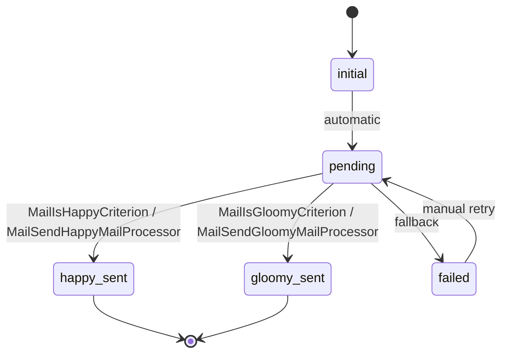

# Workflows

## Mail Workflow

### Description
The Mail workflow manages the lifecycle of mail entities from creation to sending based on their happiness state.

### States
1. **initial** - Starting state when mail entity is created
2. **pending** - Mail is ready for processing
3. **happy_sent** - Happy mail has been successfully sent
4. **gloomy_sent** - Gloomy mail has been successfully sent
5. **failed** - Mail sending failed

### Transitions

#### 1. initial → pending
- **Type**: Automatic
- **Processor**: None
- **Criterion**: None
- **Description**: Automatically moves mail from initial state to pending for processing

#### 2. pending → happy_sent
- **Type**: Automatic
- **Processor**: MailSendHappyMailProcessor
- **Criterion**: MailIsHappyCriterion
- **Description**: Sends happy mail if the mail is determined to be happy

#### 3. pending → gloomy_sent
- **Type**: Automatic
- **Processor**: MailSendGloomyMailProcessor
- **Criterion**: MailIsGloomyCriterion
- **Description**: Sends gloomy mail if the mail is determined to be gloomy

#### 4. pending → failed
- **Type**: Automatic
- **Processor**: None
- **Criterion**: None
- **Description**: Fallback transition if mail cannot be processed

#### 5. failed → pending
- **Type**: Manual
- **Processor**: None
- **Criterion**: None
- **Description**: Manual retry transition to reprocess failed mails

### Workflow Diagram

```mermaid
stateDiagram-v2
    [*] --> initial
    initial --> pending : automatic
    pending --> happy_sent : MailIsHappyCriterion / MailSendHappyMailProcessor
    pending --> gloomy_sent : MailIsGloomyCriterion / MailSendGloomyMailProcessor
    pending --> failed : fallback
    failed --> pending : manual retry
    happy_sent --> [*]
    gloomy_sent --> [*]
```

### Notes
- The first transition from initial to pending is always automatic
- The workflow uses criteria to determine which path to take (happy or gloomy)
- Failed mails can be manually retried by transitioning back to pending state
- The workflow ensures that each mail is processed according to its happiness state
