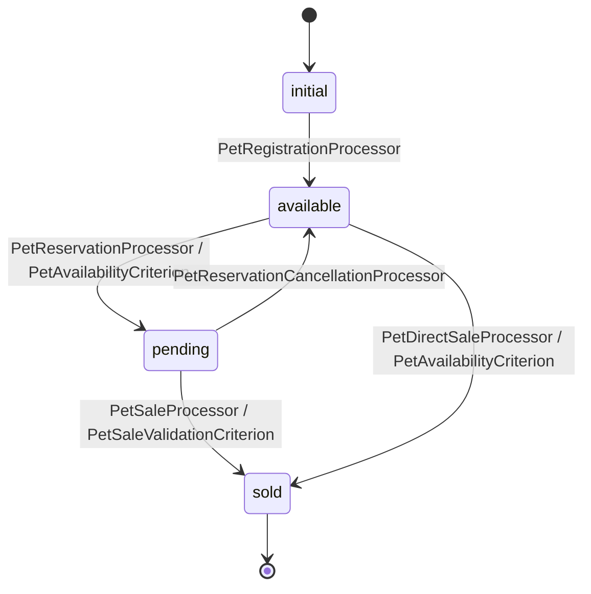
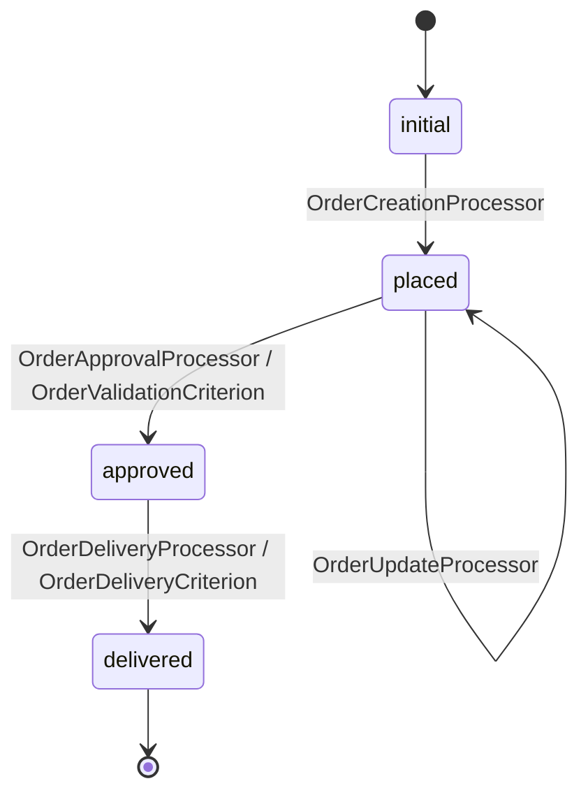
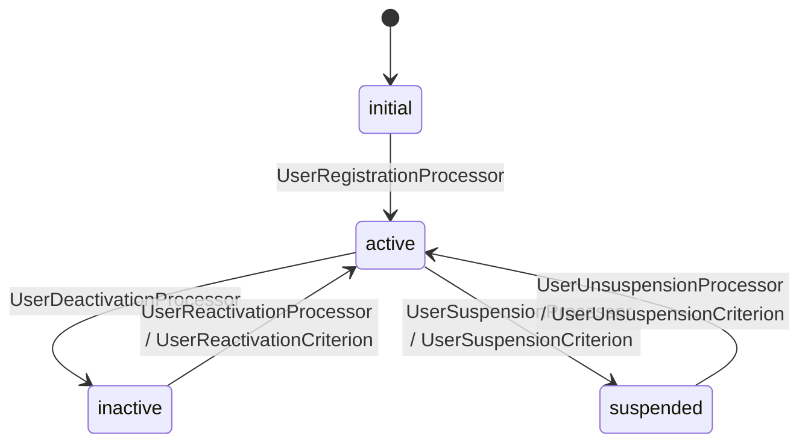

# Workflows for Purrfect Pets API

## Pet Workflow

**Name:** PetWorkflow

**Description:** Manages the lifecycle of pets in the store from being available to being sold.

**States:**
- `initial`: Starting state (system managed)
- `available`: Pet is available for purchase
- `pending`: Pet is reserved/pending adoption
- `sold`: Pet has been sold/adopted

**Transitions:**

1. **initial → available**
   - Type: Automatic
   - Processor: PetRegistrationProcessor
   - Criterion: None
   - Description: Automatically moves new pets to available state after registration

2. **available → pending**
   - Type: Manual
   - Processor: PetReservationProcessor
   - Criterion: PetAvailabilityCriterion
   - Description: Reserves a pet when a customer shows interest

3. **pending → available**
   - Type: Manual
   - Processor: PetReservationCancellationProcessor
   - Criterion: None
   - Description: Cancels reservation and makes pet available again

4. **pending → sold**
   - Type: Manual
   - Processor: PetSaleProcessor
   - Criterion: PetSaleValidationCriterion
   - Description: Completes the sale of a reserved pet

5. **available → sold**
   - Type: Manual
   - Processor: PetDirectSaleProcessor
   - Criterion: PetAvailabilityCriterion
   - Description: Direct sale without reservation

```mermaid
stateDiagram-v2
    [*] --> initial
    initial --> available : PetRegistrationProcessor
    available --> pending : PetReservationProcessor / PetAvailabilityCriterion
    pending --> available : PetReservationCancellationProcessor
    pending --> sold : PetSaleProcessor / PetSaleValidationCriterion
    available --> sold : PetDirectSaleProcessor / PetAvailabilityCriterion
    sold --> [*]
```

## Order Workflow

**Name:** OrderWorkflow

**Description:** Manages the lifecycle of orders from placement to delivery.

**States:**
- `initial`: Starting state (system managed)
- `placed`: Order has been placed
- `approved`: Order has been approved
- `delivered`: Pet has been delivered/picked up

**Transitions:**

1. **initial → placed**
   - Type: Automatic
   - Processor: OrderCreationProcessor
   - Criterion: None
   - Description: Automatically moves new orders to placed state

2. **placed → approved**
   - Type: Manual
   - Processor: OrderApprovalProcessor
   - Criterion: OrderValidationCriterion
   - Description: Approves the order after validation

3. **placed → placed**
   - Type: Manual
   - Processor: OrderUpdateProcessor
   - Criterion: None
   - Description: Updates order details while in placed state

4. **approved → delivered**
   - Type: Manual
   - Processor: OrderDeliveryProcessor
   - Criterion: OrderDeliveryCriterion
   - Description: Marks order as delivered when pet is handed over

```mermaid
stateDiagram-v2
    [*] --> initial
    initial --> placed : OrderCreationProcessor
    placed --> approved : OrderApprovalProcessor / OrderValidationCriterion
    placed --> placed : OrderUpdateProcessor
    approved --> delivered : OrderDeliveryProcessor / OrderDeliveryCriterion
    delivered --> [*]
```

## User Workflow

**Name:** UserWorkflow

**Description:** Manages user account lifecycle and status.

**States:**
- `initial`: Starting state (system managed)
- `active`: User account is active
- `inactive`: User account is inactive
- `suspended`: User account is suspended

**Transitions:**

1. **initial → active**
   - Type: Automatic
   - Processor: UserRegistrationProcessor
   - Criterion: None
   - Description: Automatically activates new user accounts

2. **active → inactive**
   - Type: Manual
   - Processor: UserDeactivationProcessor
   - Criterion: None
   - Description: Deactivates user account

3. **inactive → active**
   - Type: Manual
   - Processor: UserReactivationProcessor
   - Criterion: UserReactivationCriterion
   - Description: Reactivates inactive user account

4. **active → suspended**
   - Type: Manual
   - Processor: UserSuspensionProcessor
   - Criterion: UserSuspensionCriterion
   - Description: Suspends user account for violations

5. **suspended → active**
   - Type: Manual
   - Processor: UserUnsuspensionProcessor
   - Criterion: UserUnsuspensionCriterion
   - Description: Removes suspension and reactivates account

```mermaid
stateDiagram-v2
    [*] --> initial
    initial --> active : UserRegistrationProcessor
    active --> inactive : UserDeactivationProcessor
    inactive --> active : UserReactivationProcessor / UserReactivationCriterion
    active --> suspended : UserSuspensionProcessor / UserSuspensionCriterion
    suspended --> active : UserUnsuspensionProcessor / UserUnsuspensionCriterion
```
