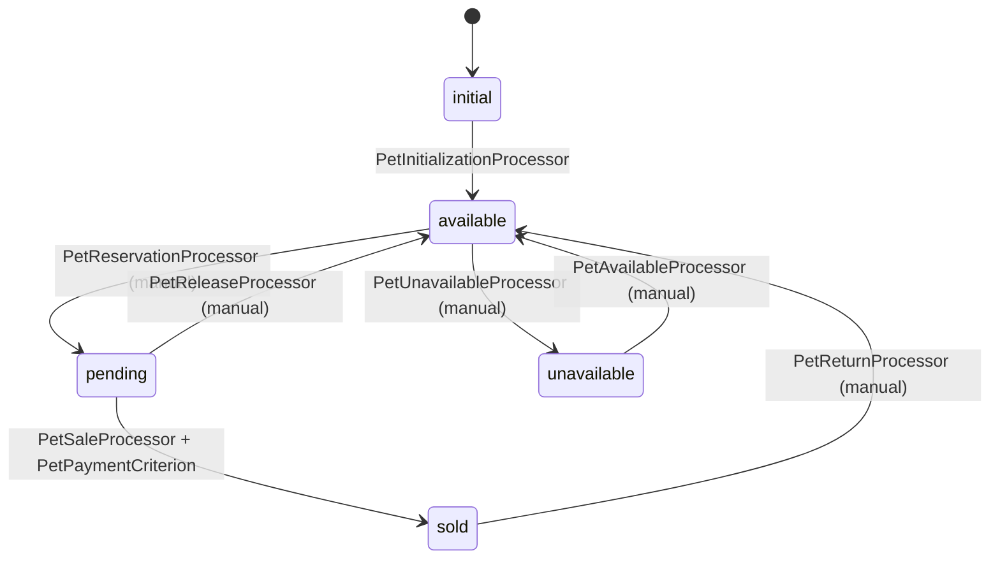
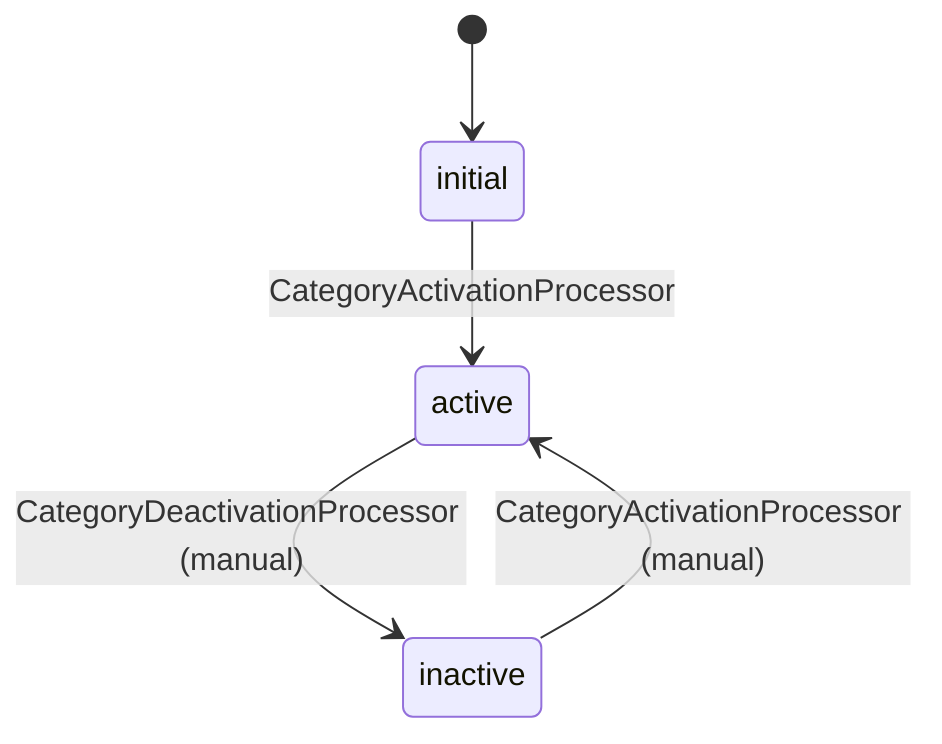
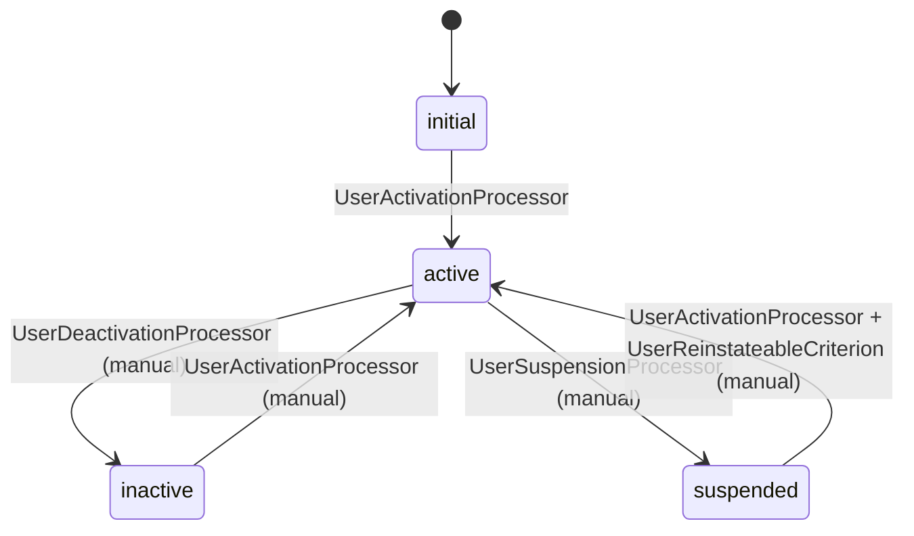
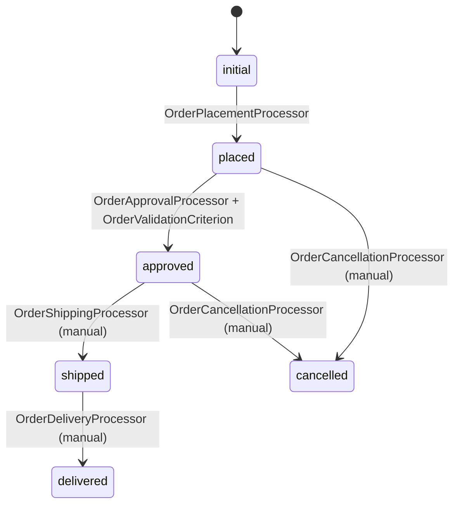
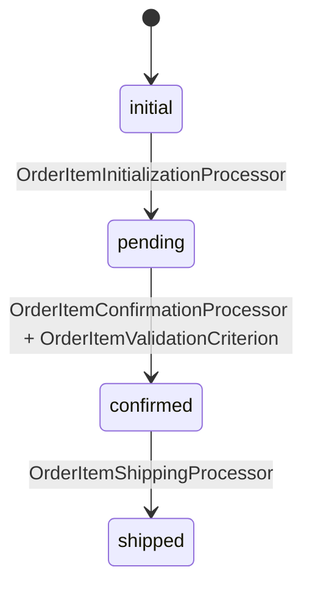

# Workflows for Purrfect Pets API

## Pet Workflow

**Name:** PetWorkflow

**States:**
- initial: Initial state when pet is created
- available: Pet is available for purchase
- pending: Pet is reserved/pending purchase
- sold: Pet has been sold
- unavailable: Pet is temporarily unavailable

**Transitions:**
1. initial → available (automatic, processor: PetInitializationProcessor)
2. available → pending (manual, processor: PetReservationProcessor)
3. pending → available (manual, processor: PetReleaseProcessor)
4. pending → sold (automatic, processor: PetSaleProcessor, criterion: PetPaymentCriterion)
5. available → unavailable (manual, processor: PetUnavailableProcessor)
6. unavailable → available (manual, processor: PetAvailableProcessor)
7. sold → available (manual, processor: PetReturnProcessor)

```mermaid
stateDiagram-v2
    [*] --> initial
    initial --> available : PetInitializationProcessor
    available --> pending : PetReservationProcessor (manual)
    pending --> available : PetReleaseProcessor (manual)
    pending --> sold : PetSaleProcessor + PetPaymentCriterion
    available --> unavailable : PetUnavailableProcessor (manual)
    unavailable --> available : PetAvailableProcessor (manual)
    sold --> available : PetReturnProcessor (manual)
```

## Category Workflow

**Name:** CategoryWorkflow

**States:**
- initial: Initial state when category is created
- active: Category is active and can be used
- inactive: Category is inactive

**Transitions:**
1. initial → active (automatic, processor: CategoryActivationProcessor)
2. active → inactive (manual, processor: CategoryDeactivationProcessor)
3. inactive → active (manual, processor: CategoryActivationProcessor)

```mermaid
stateDiagram-v2
    [*] --> initial
    initial --> active : CategoryActivationProcessor
    active --> inactive : CategoryDeactivationProcessor (manual)
    inactive --> active : CategoryActivationProcessor (manual)
```

## User Workflow

**Name:** UserWorkflow

**States:**
- initial: Initial state when user is created
- active: User account is active
- inactive: User account is inactive
- suspended: User account is suspended

**Transitions:**
1. initial → active (automatic, processor: UserActivationProcessor)
2. active → inactive (manual, processor: UserDeactivationProcessor)
3. inactive → active (manual, processor: UserActivationProcessor)
4. active → suspended (manual, processor: UserSuspensionProcessor)
5. suspended → active (manual, processor: UserActivationProcessor, criterion: UserReinstateableCriterion)

```mermaid
stateDiagram-v2
    [*] --> initial
    initial --> active : UserActivationProcessor
    active --> inactive : UserDeactivationProcessor (manual)
    inactive --> active : UserActivationProcessor (manual)
    active --> suspended : UserSuspensionProcessor (manual)
    suspended --> active : UserActivationProcessor + UserReinstateableCriterion (manual)
```

## Order Workflow

**Name:** OrderWorkflow

**States:**
- initial: Initial state when order is created
- placed: Order has been placed
- approved: Order has been approved
- shipped: Order has been shipped
- delivered: Order has been delivered
- cancelled: Order has been cancelled

**Transitions:**
1. initial → placed (automatic, processor: OrderPlacementProcessor)
2. placed → approved (automatic, processor: OrderApprovalProcessor, criterion: OrderValidationCriterion)
3. approved → shipped (manual, processor: OrderShippingProcessor)
4. shipped → delivered (manual, processor: OrderDeliveryProcessor)
5. placed → cancelled (manual, processor: OrderCancellationProcessor)
6. approved → cancelled (manual, processor: OrderCancellationProcessor)

```mermaid
stateDiagram-v2
    [*] --> initial
    initial --> placed : OrderPlacementProcessor
    placed --> approved : OrderApprovalProcessor + OrderValidationCriterion
    approved --> shipped : OrderShippingProcessor (manual)
    shipped --> delivered : OrderDeliveryProcessor (manual)
    placed --> cancelled : OrderCancellationProcessor (manual)
    approved --> cancelled : OrderCancellationProcessor (manual)
```

## OrderItem Workflow

**Name:** OrderItemWorkflow

**States:**
- initial: Initial state when order item is created
- pending: Order item is pending
- confirmed: Order item is confirmed
- shipped: Order item has been shipped

**Transitions:**
1. initial → pending (automatic, processor: OrderItemInitializationProcessor)
2. pending → confirmed (automatic, processor: OrderItemConfirmationProcessor, criterion: OrderItemValidationCriterion)
3. confirmed → shipped (automatic, processor: OrderItemShippingProcessor)

```mermaid
stateDiagram-v2
    [*] --> initial
    initial --> pending : OrderItemInitializationProcessor
    pending --> confirmed : OrderItemConfirmationProcessor + OrderItemValidationCriterion
    confirmed --> shipped : OrderItemShippingProcessor
```
