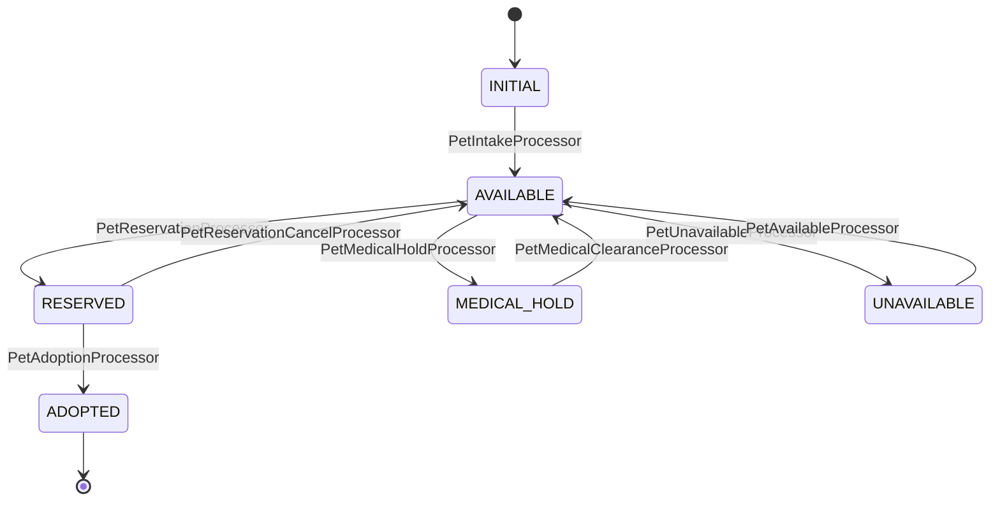
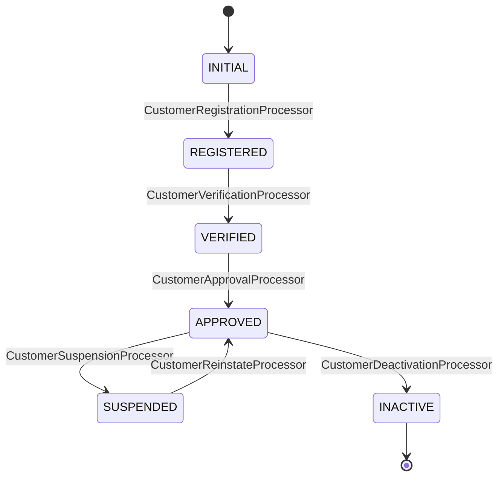
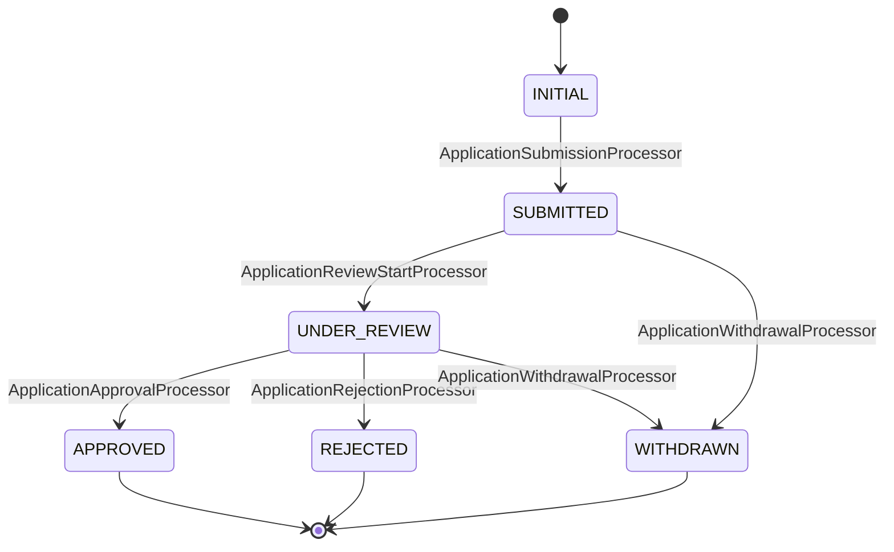
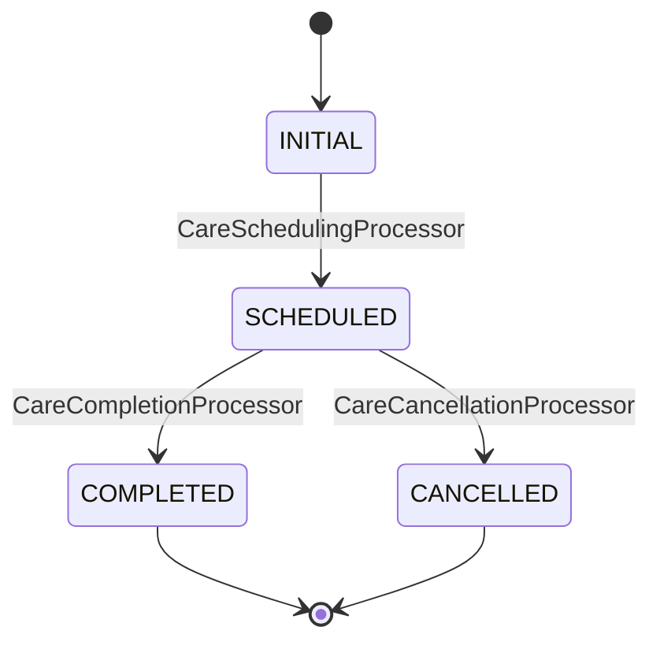
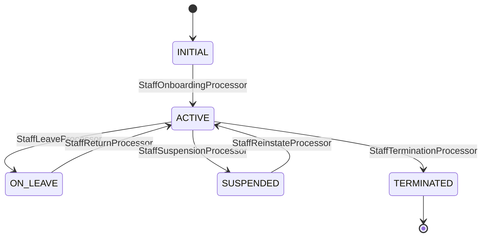

# Workflows for Purrfect Pets API

## Pet Workflow

**Name:** PetWorkflow

**States:** INITIAL, AVAILABLE, RESERVED, ADOPTED, MEDICAL_HOLD, UNAVAILABLE

**Transitions:**

1. **INITIAL → AVAILABLE**
   - Type: Automatic
   - Processor: PetIntakeProcessor
   - Criterion: None
   - Description: Pet is processed and made available for adoption

2. **AVAILABLE → RESERVED**
   - Type: Manual
   - Processor: PetReservationProcessor
   - Criterion: PetAvailabilityCriterion
   - Description: Pet is reserved for a potential adopter

3. **RESERVED → AVAILABLE**
   - Type: Manual
   - Processor: PetReservationCancelProcessor
   - Criterion: None
   - Description: Reservation is cancelled, pet becomes available again

4. **RESERVED → ADOPTED**
   - Type: Manual
   - Processor: PetAdoptionProcessor
   - Criterion: AdoptionApprovalCriterion
   - Description: Pet is officially adopted

5. **AVAILABLE → MEDICAL_HOLD**
   - Type: Manual
   - Processor: PetMedicalHoldProcessor
   - Criterion: None
   - Description: Pet needs medical attention

6. **MEDICAL_HOLD → AVAILABLE**
   - Type: Manual
   - Processor: PetMedicalClearanceProcessor
   - Criterion: MedicalClearanceCriterion
   - Description: Pet is cleared for adoption after medical care

7. **AVAILABLE → UNAVAILABLE**
   - Type: Manual
   - Processor: PetUnavailableProcessor
   - Criterion: None
   - Description: Pet is temporarily unavailable

8. **UNAVAILABLE → AVAILABLE**
   - Type: Manual
   - Processor: PetAvailableProcessor
   - Criterion: None
   - Description: Pet becomes available again

```mermaid
stateDiagram-v2
    [*] --> INITIAL
    INITIAL --> AVAILABLE : PetIntakeProcessor
    AVAILABLE --> RESERVED : PetReservationProcessor
    RESERVED --> AVAILABLE : PetReservationCancelProcessor
    RESERVED --> ADOPTED : PetAdoptionProcessor
    AVAILABLE --> MEDICAL_HOLD : PetMedicalHoldProcessor
    MEDICAL_HOLD --> AVAILABLE : PetMedicalClearanceProcessor
    AVAILABLE --> UNAVAILABLE : PetUnavailableProcessor
    UNAVAILABLE --> AVAILABLE : PetAvailableProcessor
    ADOPTED --> [*]
```

---

## Customer Workflow

**Name:** CustomerWorkflow

**States:** INITIAL, REGISTERED, VERIFIED, APPROVED, SUSPENDED, INACTIVE

**Transitions:**

1. **INITIAL → REGISTERED**
   - Type: Automatic
   - Processor: CustomerRegistrationProcessor
   - Criterion: None
   - Description: Customer completes registration

2. **REGISTERED → VERIFIED**
   - Type: Manual
   - Processor: CustomerVerificationProcessor
   - Criterion: CustomerDataValidationCriterion
   - Description: Customer information is verified

3. **VERIFIED → APPROVED**
   - Type: Manual
   - Processor: CustomerApprovalProcessor
   - Criterion: CustomerEligibilityCriterion
   - Description: Customer is approved for adoptions

4. **APPROVED → SUSPENDED**
   - Type: Manual
   - Processor: CustomerSuspensionProcessor
   - Criterion: None
   - Description: Customer account is suspended

5. **SUSPENDED → APPROVED**
   - Type: Manual
   - Processor: CustomerReinstateProcessor
   - Criterion: SuspensionReviewCriterion
   - Description: Customer account is reinstated

6. **APPROVED → INACTIVE**
   - Type: Manual
   - Processor: CustomerDeactivationProcessor
   - Criterion: None
   - Description: Customer account becomes inactive

```mermaid
stateDiagram-v2
    [*] --> INITIAL
    INITIAL --> REGISTERED : CustomerRegistrationProcessor
    REGISTERED --> VERIFIED : CustomerVerificationProcessor
    VERIFIED --> APPROVED : CustomerApprovalProcessor
    APPROVED --> SUSPENDED : CustomerSuspensionProcessor
    SUSPENDED --> APPROVED : CustomerReinstateProcessor
    APPROVED --> INACTIVE : CustomerDeactivationProcessor
    INACTIVE --> [*]
```

---

## AdoptionApplication Workflow

**Name:** AdoptionApplicationWorkflow

**States:** INITIAL, SUBMITTED, UNDER_REVIEW, APPROVED, REJECTED, WITHDRAWN

**Transitions:**

1. **INITIAL → SUBMITTED**
   - Type: Automatic
   - Processor: ApplicationSubmissionProcessor
   - Criterion: None
   - Description: Application is submitted by customer

2. **SUBMITTED → UNDER_REVIEW**
   - Type: Manual
   - Processor: ApplicationReviewStartProcessor
   - Criterion: ApplicationCompletenessCriterion
   - Description: Application review begins

3. **UNDER_REVIEW → APPROVED**
   - Type: Manual
   - Processor: ApplicationApprovalProcessor
   - Criterion: ApplicationApprovalCriterion
   - Description: Application is approved

4. **UNDER_REVIEW → REJECTED**
   - Type: Manual
   - Processor: ApplicationRejectionProcessor
   - Criterion: None
   - Description: Application is rejected

5. **SUBMITTED → WITHDRAWN**
   - Type: Manual
   - Processor: ApplicationWithdrawalProcessor
   - Criterion: None
   - Description: Customer withdraws application

6. **UNDER_REVIEW → WITHDRAWN**
   - Type: Manual
   - Processor: ApplicationWithdrawalProcessor
   - Criterion: None
   - Description: Customer withdraws application during review

```mermaid
stateDiagram-v2
    [*] --> INITIAL
    INITIAL --> SUBMITTED : ApplicationSubmissionProcessor
    SUBMITTED --> UNDER_REVIEW : ApplicationReviewStartProcessor
    UNDER_REVIEW --> APPROVED : ApplicationApprovalProcessor
    UNDER_REVIEW --> REJECTED : ApplicationRejectionProcessor
    SUBMITTED --> WITHDRAWN : ApplicationWithdrawalProcessor
    UNDER_REVIEW --> WITHDRAWN : ApplicationWithdrawalProcessor
    APPROVED --> [*]
    REJECTED --> [*]
    WITHDRAWN --> [*]
```

---

## PetCareRecord Workflow

**Name:** PetCareRecordWorkflow

**States:** INITIAL, SCHEDULED, COMPLETED, CANCELLED

**Transitions:**

1. **INITIAL → SCHEDULED**
   - Type: Automatic
   - Processor: CareSchedulingProcessor
   - Criterion: None
   - Description: Care appointment is scheduled

2. **SCHEDULED → COMPLETED**
   - Type: Manual
   - Processor: CareCompletionProcessor
   - Criterion: None
   - Description: Care is completed and recorded

3. **SCHEDULED → CANCELLED**
   - Type: Manual
   - Processor: CareCancellationProcessor
   - Criterion: None
   - Description: Scheduled care is cancelled

```mermaid
stateDiagram-v2
    [*] --> INITIAL
    INITIAL --> SCHEDULED : CareSchedulingProcessor
    SCHEDULED --> COMPLETED : CareCompletionProcessor
    SCHEDULED --> CANCELLED : CareCancellationProcessor
    COMPLETED --> [*]
    CANCELLED --> [*]
```

---

## Staff Workflow

**Name:** StaffWorkflow

**States:** INITIAL, ACTIVE, ON_LEAVE, SUSPENDED, TERMINATED

**Transitions:**

1. **INITIAL → ACTIVE**
   - Type: Automatic
   - Processor: StaffOnboardingProcessor
   - Criterion: None
   - Description: Staff member is onboarded and becomes active

2. **ACTIVE → ON_LEAVE**
   - Type: Manual
   - Processor: StaffLeaveProcessor
   - Criterion: None
   - Description: Staff member goes on leave

3. **ON_LEAVE → ACTIVE**
   - Type: Manual
   - Processor: StaffReturnProcessor
   - Criterion: None
   - Description: Staff member returns from leave

4. **ACTIVE → SUSPENDED**
   - Type: Manual
   - Processor: StaffSuspensionProcessor
   - Criterion: None
   - Description: Staff member is suspended

5. **SUSPENDED → ACTIVE**
   - Type: Manual
   - Processor: StaffReinstateProcessor
   - Criterion: SuspensionReviewCriterion
   - Description: Staff member is reinstated

6. **ACTIVE → TERMINATED**
   - Type: Manual
   - Processor: StaffTerminationProcessor
   - Criterion: None
   - Description: Staff member is terminated

```mermaid
stateDiagram-v2
    [*] --> INITIAL
    INITIAL --> ACTIVE : StaffOnboardingProcessor
    ACTIVE --> ON_LEAVE : StaffLeaveProcessor
    ON_LEAVE --> ACTIVE : StaffReturnProcessor
    ACTIVE --> SUSPENDED : StaffSuspensionProcessor
    SUSPENDED --> ACTIVE : StaffReinstateProcessor
    ACTIVE --> TERMINATED : StaffTerminationProcessor
    TERMINATED --> [*]
```
