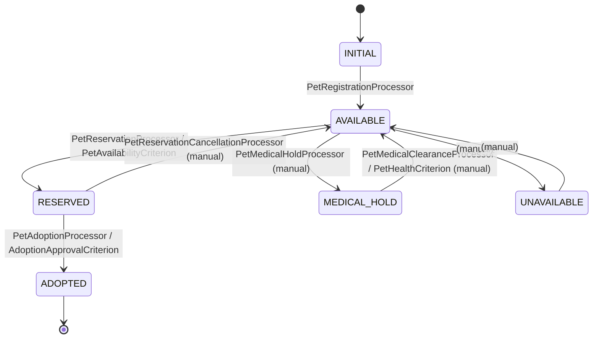
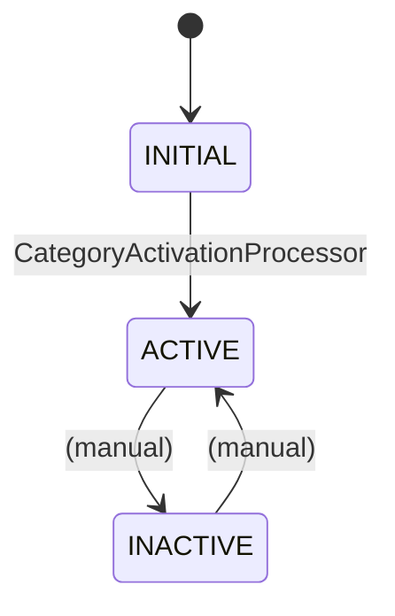
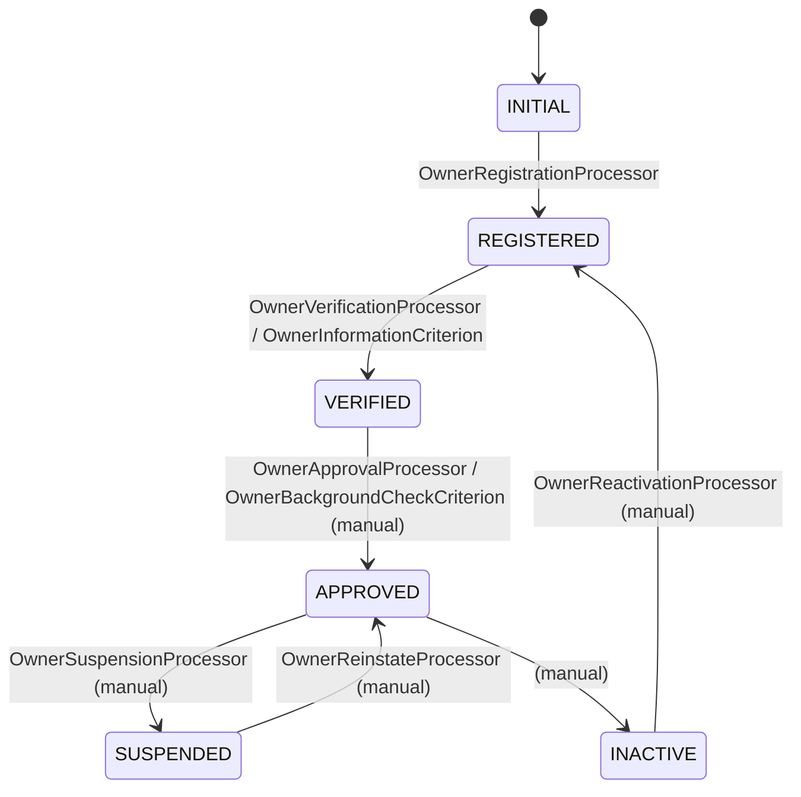
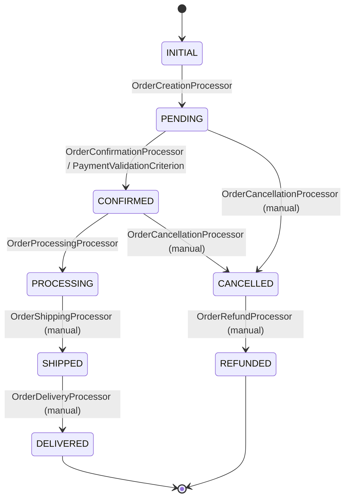
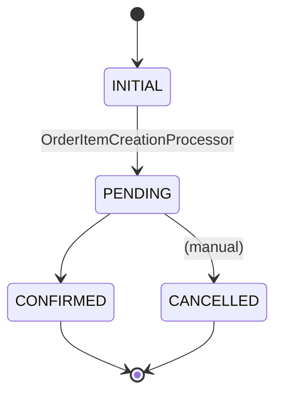
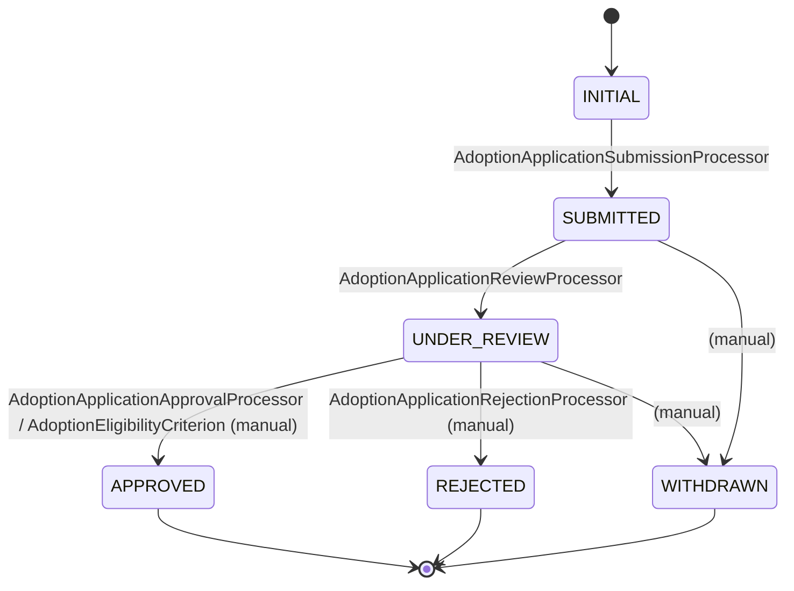

# Purrfect Pets API - Workflow Requirements

## Overview
This document defines the workflows for each entity in the Purrfect Pets API system, including states, transitions, processors, and criteria.

## 1. Pet Workflow

### States
- `INITIAL` - Starting state (system managed)
- `AVAILABLE` - Pet is available for adoption
- `RESERVED` - Pet is reserved by a potential adopter
- `ADOPTED` - Pet has been adopted
- `MEDICAL_HOLD` - Pet is on medical hold
- `UNAVAILABLE` - Pet is temporarily unavailable

### Transitions
1. `INITIAL` → `AVAILABLE` (automatic)
   - Processor: `PetRegistrationProcessor`
   - Criterion: None

2. `AVAILABLE` → `RESERVED` (automatic)
   - Processor: `PetReservationProcessor`
   - Criterion: `PetAvailabilityCriterion`

3. `RESERVED` → `ADOPTED` (automatic)
   - Processor: `PetAdoptionProcessor`
   - Criterion: `AdoptionApprovalCriterion`

4. `RESERVED` → `AVAILABLE` (manual)
   - Processor: `PetReservationCancellationProcessor`
   - Criterion: None

5. `AVAILABLE` → `MEDICAL_HOLD` (manual)
   - Processor: `PetMedicalHoldProcessor`
   - Criterion: None

6. `MEDICAL_HOLD` → `AVAILABLE` (manual)
   - Processor: `PetMedicalClearanceProcessor`
   - Criterion: `PetHealthCriterion`

7. `AVAILABLE` → `UNAVAILABLE` (manual)
   - Processor: None
   - Criterion: None

8. `UNAVAILABLE` → `AVAILABLE` (manual)
   - Processor: None
   - Criterion: None

### Mermaid Diagram

```mermaid
stateDiagram-v2
    [*] --> INITIAL
    INITIAL --> AVAILABLE : PetRegistrationProcessor
    AVAILABLE --> RESERVED : PetReservationProcessor / PetAvailabilityCriterion
    RESERVED --> ADOPTED : PetAdoptionProcessor / AdoptionApprovalCriterion
    RESERVED --> AVAILABLE : PetReservationCancellationProcessor (manual)
    AVAILABLE --> MEDICAL_HOLD : PetMedicalHoldProcessor (manual)
    MEDICAL_HOLD --> AVAILABLE : PetMedicalClearanceProcessor / PetHealthCriterion (manual)
    AVAILABLE --> UNAVAILABLE : (manual)
    UNAVAILABLE --> AVAILABLE : (manual)
    ADOPTED --> [*]
```

## 2. Category Workflow

### States
- `INITIAL` - Starting state (system managed)
- `ACTIVE` - Category is active and visible
- `INACTIVE` - Category is inactive

### Transitions
1. `INITIAL` → `ACTIVE` (automatic)
   - Processor: `CategoryActivationProcessor`
   - Criterion: None

2. `ACTIVE` → `INACTIVE` (manual)
   - Processor: None
   - Criterion: None

3. `INACTIVE` → `ACTIVE` (manual)
   - Processor: None
   - Criterion: None

### Mermaid Diagram

```mermaid
stateDiagram-v2
    [*] --> INITIAL
    INITIAL --> ACTIVE : CategoryActivationProcessor
    ACTIVE --> INACTIVE : (manual)
    INACTIVE --> ACTIVE : (manual)
```

## 3. Owner Workflow

### States
- `INITIAL` - Starting state (system managed)
- `REGISTERED` - Owner has registered
- `VERIFIED` - Owner's information has been verified
- `APPROVED` - Owner is approved for adoptions
- `SUSPENDED` - Owner account is suspended
- `INACTIVE` - Owner account is inactive

### Transitions
1. `INITIAL` → `REGISTERED` (automatic)
   - Processor: `OwnerRegistrationProcessor`
   - Criterion: None

2. `REGISTERED` → `VERIFIED` (automatic)
   - Processor: `OwnerVerificationProcessor`
   - Criterion: `OwnerInformationCriterion`

3. `VERIFIED` → `APPROVED` (manual)
   - Processor: `OwnerApprovalProcessor`
   - Criterion: `OwnerBackgroundCheckCriterion`

4. `APPROVED` → `SUSPENDED` (manual)
   - Processor: `OwnerSuspensionProcessor`
   - Criterion: None

5. `SUSPENDED` → `APPROVED` (manual)
   - Processor: `OwnerReinstateProcessor`
   - Criterion: None

6. `APPROVED` → `INACTIVE` (manual)
   - Processor: None
   - Criterion: None

7. `INACTIVE` → `REGISTERED` (manual)
   - Processor: `OwnerReactivationProcessor`
   - Criterion: None

### Mermaid Diagram

```mermaid
stateDiagram-v2
    [*] --> INITIAL
    INITIAL --> REGISTERED : OwnerRegistrationProcessor
    REGISTERED --> VERIFIED : OwnerVerificationProcessor / OwnerInformationCriterion
    VERIFIED --> APPROVED : OwnerApprovalProcessor / OwnerBackgroundCheckCriterion (manual)
    APPROVED --> SUSPENDED : OwnerSuspensionProcessor (manual)
    SUSPENDED --> APPROVED : OwnerReinstateProcessor (manual)
    APPROVED --> INACTIVE : (manual)
    INACTIVE --> REGISTERED : OwnerReactivationProcessor (manual)
```

## 4. Order Workflow

### States
- `INITIAL` - Starting state (system managed)
- `PENDING` - Order has been placed
- `CONFIRMED` - Order has been confirmed
- `PROCESSING` - Order is being processed
- `SHIPPED` - Order has been shipped
- `DELIVERED` - Order has been delivered
- `CANCELLED` - Order has been cancelled
- `REFUNDED` - Order has been refunded

### Transitions
1. `INITIAL` → `PENDING` (automatic)
   - Processor: `OrderCreationProcessor`
   - Criterion: None

2. `PENDING` → `CONFIRMED` (automatic)
   - Processor: `OrderConfirmationProcessor`
   - Criterion: `PaymentValidationCriterion`

3. `CONFIRMED` → `PROCESSING` (automatic)
   - Processor: `OrderProcessingProcessor`
   - Criterion: None

4. `PROCESSING` → `SHIPPED` (manual)
   - Processor: `OrderShippingProcessor`
   - Criterion: None

5. `SHIPPED` → `DELIVERED` (manual)
   - Processor: `OrderDeliveryProcessor`
   - Criterion: None

6. `PENDING` → `CANCELLED` (manual)
   - Processor: `OrderCancellationProcessor`
   - Criterion: None

7. `CONFIRMED` → `CANCELLED` (manual)
   - Processor: `OrderCancellationProcessor`
   - Criterion: None

8. `CANCELLED` → `REFUNDED` (manual)
   - Processor: `OrderRefundProcessor`
   - Criterion: None

### Mermaid Diagram

```mermaid
stateDiagram-v2
    [*] --> INITIAL
    INITIAL --> PENDING : OrderCreationProcessor
    PENDING --> CONFIRMED : OrderConfirmationProcessor / PaymentValidationCriterion
    CONFIRMED --> PROCESSING : OrderProcessingProcessor
    PROCESSING --> SHIPPED : OrderShippingProcessor (manual)
    SHIPPED --> DELIVERED : OrderDeliveryProcessor (manual)
    PENDING --> CANCELLED : OrderCancellationProcessor (manual)
    CONFIRMED --> CANCELLED : OrderCancellationProcessor (manual)
    CANCELLED --> REFUNDED : OrderRefundProcessor (manual)
    DELIVERED --> [*]
    REFUNDED --> [*]
```

## 5. OrderItem Workflow

### States
- `INITIAL` - Starting state (system managed)
- `PENDING` - Item is pending
- `CONFIRMED` - Item is confirmed
- `CANCELLED` - Item is cancelled

### Transitions
1. `INITIAL` → `PENDING` (automatic)
   - Processor: `OrderItemCreationProcessor`
   - Criterion: None

2. `PENDING` → `CONFIRMED` (automatic)
   - Processor: None
   - Criterion: None

3. `PENDING` → `CANCELLED` (manual)
   - Processor: None
   - Criterion: None

### Mermaid Diagram

```mermaid
stateDiagram-v2
    [*] --> INITIAL
    INITIAL --> PENDING : OrderItemCreationProcessor
    PENDING --> CONFIRMED
    PENDING --> CANCELLED : (manual)
    CONFIRMED --> [*]
    CANCELLED --> [*]
```

## 6. AdoptionApplication Workflow

### States
- `INITIAL` - Starting state (system managed)
- `SUBMITTED` - Application has been submitted
- `UNDER_REVIEW` - Application is being reviewed
- `APPROVED` - Application has been approved
- `REJECTED` - Application has been rejected
- `WITHDRAWN` - Application has been withdrawn

### Transitions
1. `INITIAL` → `SUBMITTED` (automatic)
   - Processor: `AdoptionApplicationSubmissionProcessor`
   - Criterion: None

2. `SUBMITTED` → `UNDER_REVIEW` (automatic)
   - Processor: `AdoptionApplicationReviewProcessor`
   - Criterion: None

3. `UNDER_REVIEW` → `APPROVED` (manual)
   - Processor: `AdoptionApplicationApprovalProcessor`
   - Criterion: `AdoptionEligibilityCriterion`

4. `UNDER_REVIEW` → `REJECTED` (manual)
   - Processor: `AdoptionApplicationRejectionProcessor`
   - Criterion: None

5. `SUBMITTED` → `WITHDRAWN` (manual)
   - Processor: None
   - Criterion: None

6. `UNDER_REVIEW` → `WITHDRAWN` (manual)
   - Processor: None
   - Criterion: None

### Mermaid Diagram

```mermaid
stateDiagram-v2
    [*] --> INITIAL
    INITIAL --> SUBMITTED : AdoptionApplicationSubmissionProcessor
    SUBMITTED --> UNDER_REVIEW : AdoptionApplicationReviewProcessor
    UNDER_REVIEW --> APPROVED : AdoptionApplicationApprovalProcessor / AdoptionEligibilityCriterion (manual)
    UNDER_REVIEW --> REJECTED : AdoptionApplicationRejectionProcessor (manual)
    SUBMITTED --> WITHDRAWN : (manual)
    UNDER_REVIEW --> WITHDRAWN : (manual)
    APPROVED --> [*]
    REJECTED --> [*]
    WITHDRAWN --> [*]
```
