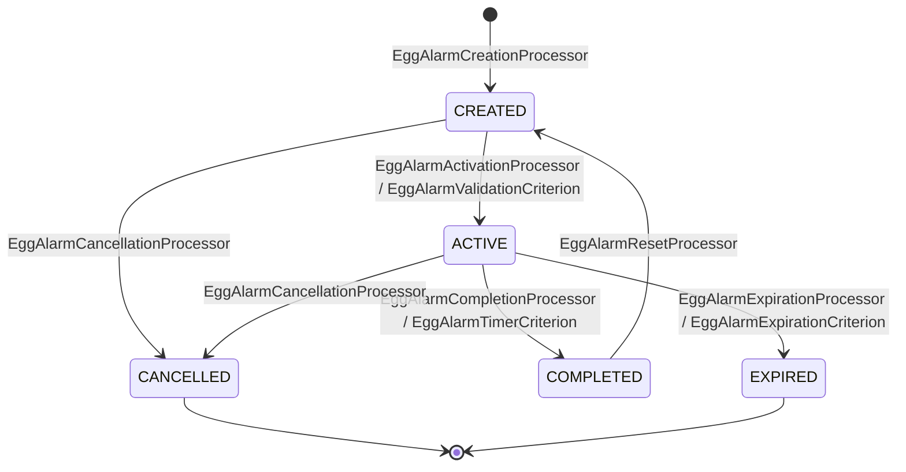
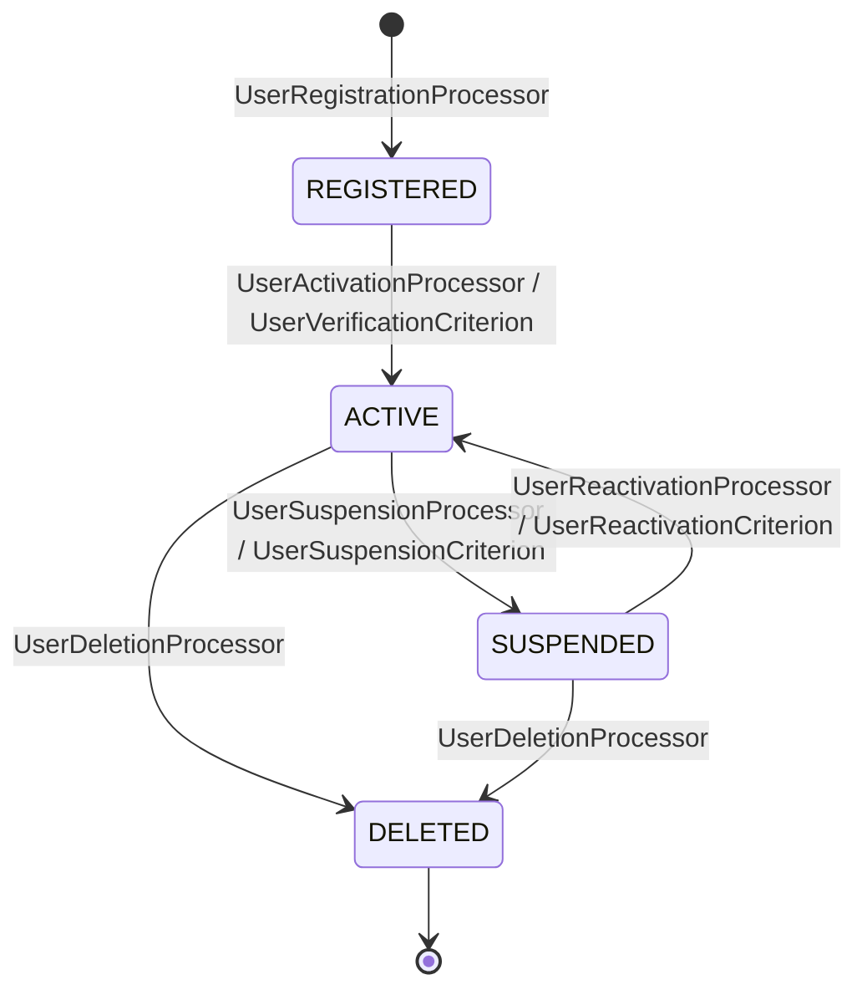

# Workflows

## EggAlarm Workflow

The EggAlarm workflow manages the lifecycle of egg cooking alarms.

### States

- **CREATED**: Alarm has been created but not yet started
- **ACTIVE**: Alarm is currently running/counting down
- **COMPLETED**: Alarm has finished and notification was sent
- **CANCELLED**: Alarm was cancelled by the user
- **EXPIRED**: Alarm time has passed without being acknowledged

### Transitions

1. **INITIAL → CREATED**
   - Type: Automatic
   - Processor: EggAlarmCreationProcessor
   - Criterion: None
   - Description: Creates a new egg alarm with specified parameters

2. **CREATED → ACTIVE**
   - Type: Manual
   - Processor: EggAlarmActivationProcessor
   - Criterion: EggAlarmValidationCriterion
   - Description: Starts the alarm countdown

3. **ACTIVE → COMPLETED**
   - Type: Automatic
   - Processor: EggAlarmCompletionProcessor
   - Criterion: EggAlarmTimerCriterion
   - Description: Alarm time has elapsed, send notification

4. **ACTIVE → CANCELLED**
   - Type: Manual
   - Processor: EggAlarmCancellationProcessor
   - Criterion: None
   - Description: User cancels the active alarm

5. **CREATED → CANCELLED**
   - Type: Manual
   - Processor: EggAlarmCancellationProcessor
   - Criterion: None
   - Description: User cancels the alarm before starting

6. **COMPLETED → CREATED**
   - Type: Manual
   - Processor: EggAlarmResetProcessor
   - Criterion: None
   - Description: User wants to create a new alarm with same settings

7. **ACTIVE → EXPIRED**
   - Type: Automatic
   - Processor: EggAlarmExpirationProcessor
   - Criterion: EggAlarmExpirationCriterion
   - Description: Alarm notification was not acknowledged within timeout period

### Mermaid State Diagram

```mermaid
stateDiagram-v2
    [*] --> CREATED : EggAlarmCreationProcessor
    CREATED --> ACTIVE : EggAlarmActivationProcessor / EggAlarmValidationCriterion
    CREATED --> CANCELLED : EggAlarmCancellationProcessor
    ACTIVE --> COMPLETED : EggAlarmCompletionProcessor / EggAlarmTimerCriterion
    ACTIVE --> CANCELLED : EggAlarmCancellationProcessor
    ACTIVE --> EXPIRED : EggAlarmExpirationProcessor / EggAlarmExpirationCriterion
    COMPLETED --> CREATED : EggAlarmResetProcessor
    CANCELLED --> [*]
    EXPIRED --> [*]
```

## User Workflow

The User workflow manages the lifecycle of user accounts.

### States

- **REGISTERED**: User has been registered but not yet verified
- **ACTIVE**: User account is active and can use the application
- **SUSPENDED**: User account has been temporarily suspended
- **DELETED**: User account has been marked for deletion

### Transitions

1. **INITIAL → REGISTERED**
   - Type: Automatic
   - Processor: UserRegistrationProcessor
   - Criterion: None
   - Description: Creates a new user account

2. **REGISTERED → ACTIVE**
   - Type: Manual
   - Processor: UserActivationProcessor
   - Criterion: UserVerificationCriterion
   - Description: Activates user account after verification

3. **ACTIVE → SUSPENDED**
   - Type: Manual
   - Processor: UserSuspensionProcessor
   - Criterion: UserSuspensionCriterion
   - Description: Suspends user account for policy violations

4. **SUSPENDED → ACTIVE**
   - Type: Manual
   - Processor: UserReactivationProcessor
   - Criterion: UserReactivationCriterion
   - Description: Reactivates suspended user account

5. **ACTIVE → DELETED**
   - Type: Manual
   - Processor: UserDeletionProcessor
   - Criterion: None
   - Description: Marks user account for deletion

6. **SUSPENDED → DELETED**
   - Type: Manual
   - Processor: UserDeletionProcessor
   - Criterion: None
   - Description: Deletes suspended user account

### Mermaid State Diagram

```mermaid
stateDiagram-v2
    [*] --> REGISTERED : UserRegistrationProcessor
    REGISTERED --> ACTIVE : UserActivationProcessor / UserVerificationCriterion
    ACTIVE --> SUSPENDED : UserSuspensionProcessor / UserSuspensionCriterion
    SUSPENDED --> ACTIVE : UserReactivationProcessor / UserReactivationCriterion
    ACTIVE --> DELETED : UserDeletionProcessor
    SUSPENDED --> DELETED : UserDeletionProcessor
    DELETED --> [*]
```
