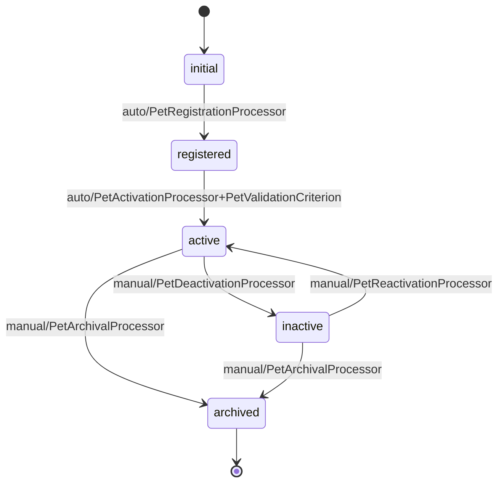
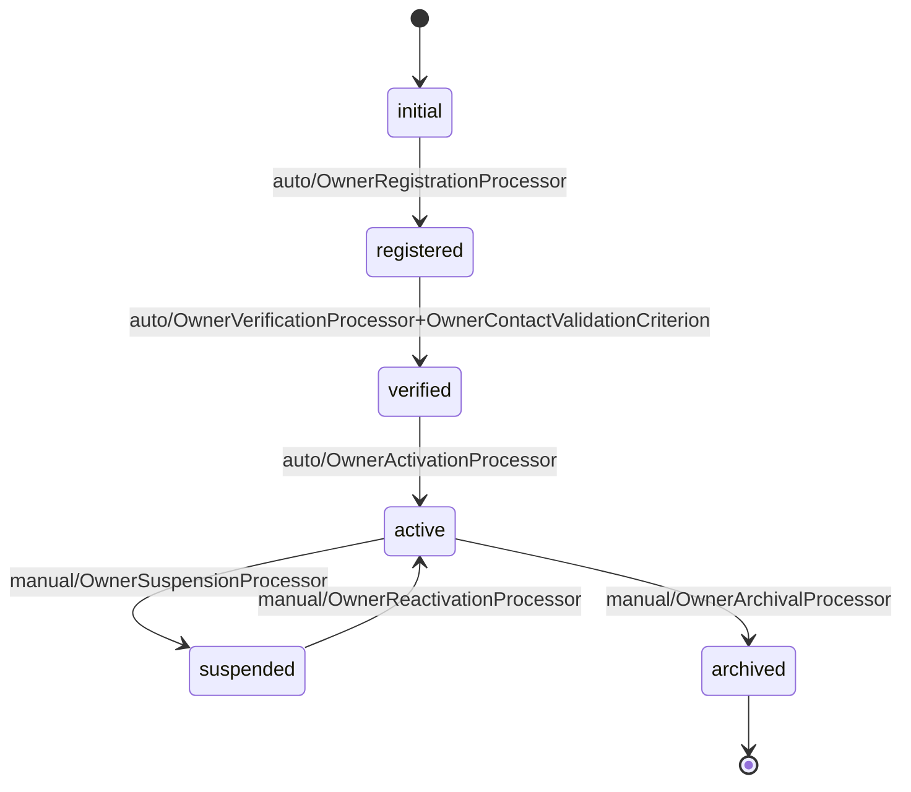
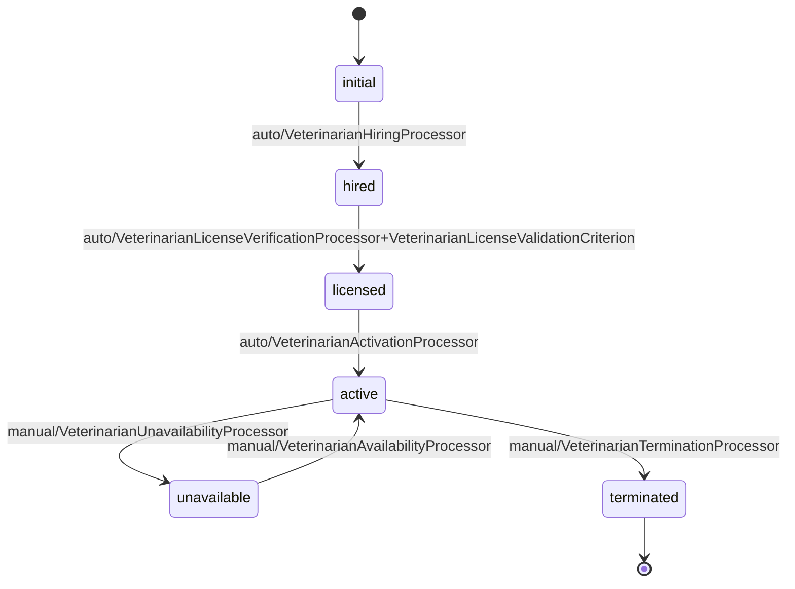
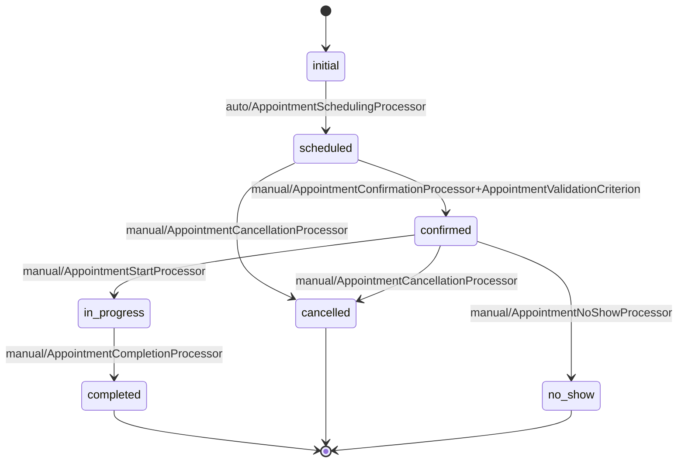
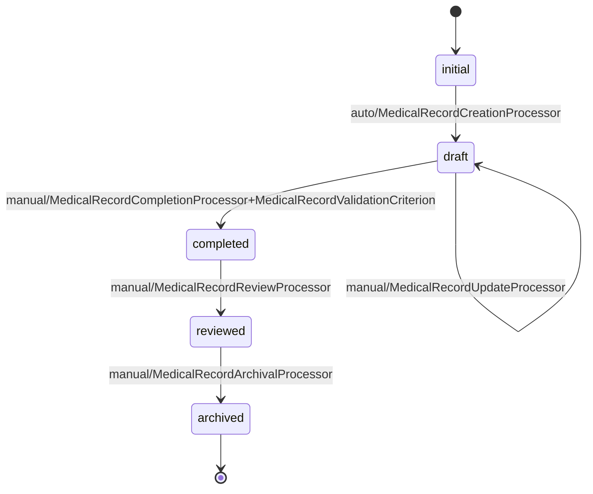

# Workflows for Purrfect Pets API

## Overview
Each entity in the Purrfect Pets system has its own workflow that manages state transitions and business logic.

## 1. Pet Workflow

**States**:
- `initial` - Starting state
- `registered` - Pet is registered in the system
- `active` - Pet is active and can have appointments
- `inactive` - Pet is temporarily inactive
- `archived` - Pet is permanently archived

**Transitions**:
1. `initial` → `registered` (automatic)
   - Processor: PetRegistrationProcessor
   - Criterion: None

2. `registered` → `active` (automatic)
   - Processor: PetActivationProcessor
   - Criterion: PetValidationCriterion

3. `active` → `inactive` (manual)
   - Processor: PetDeactivationProcessor
   - Criterion: None

4. `inactive` → `active` (manual)
   - Processor: PetReactivationProcessor
   - Criterion: None

5. `active` → `archived` (manual)
   - Processor: PetArchivalProcessor
   - Criterion: None

6. `inactive` → `archived` (manual)
   - Processor: PetArchivalProcessor
   - Criterion: None

```mermaid
stateDiagram-v2
    [*] --> initial
    initial --> registered : auto/PetRegistrationProcessor
    registered --> active : auto/PetActivationProcessor+PetValidationCriterion
    active --> inactive : manual/PetDeactivationProcessor
    inactive --> active : manual/PetReactivationProcessor
    active --> archived : manual/PetArchivalProcessor
    inactive --> archived : manual/PetArchivalProcessor
    archived --> [*]
```

## 2. Owner Workflow

**States**:
- `initial` - Starting state
- `registered` - Owner is registered
- `verified` - Owner's information is verified
- `active` - Owner can schedule appointments
- `suspended` - Owner is temporarily suspended
- `archived` - Owner is permanently archived

**Transitions**:
1. `initial` → `registered` (automatic)
   - Processor: OwnerRegistrationProcessor
   - Criterion: None

2. `registered` → `verified` (automatic)
   - Processor: OwnerVerificationProcessor
   - Criterion: OwnerContactValidationCriterion

3. `verified` → `active` (automatic)
   - Processor: OwnerActivationProcessor
   - Criterion: None

4. `active` → `suspended` (manual)
   - Processor: OwnerSuspensionProcessor
   - Criterion: None

5. `suspended` → `active` (manual)
   - Processor: OwnerReactivationProcessor
   - Criterion: None

6. `active` → `archived` (manual)
   - Processor: OwnerArchivalProcessor
   - Criterion: None

```mermaid
stateDiagram-v2
    [*] --> initial
    initial --> registered : auto/OwnerRegistrationProcessor
    registered --> verified : auto/OwnerVerificationProcessor+OwnerContactValidationCriterion
    verified --> active : auto/OwnerActivationProcessor
    active --> suspended : manual/OwnerSuspensionProcessor
    suspended --> active : manual/OwnerReactivationProcessor
    active --> archived : manual/OwnerArchivalProcessor
    archived --> [*]
```

## 3. Veterinarian Workflow

**States**:
- `initial` - Starting state
- `hired` - Veterinarian is hired
- `licensed` - License is verified
- `active` - Available for appointments
- `unavailable` - Temporarily unavailable
- `terminated` - Employment terminated

**Transitions**:
1. `initial` → `hired` (automatic)
   - Processor: VeterinarianHiringProcessor
   - Criterion: None

2. `hired` → `licensed` (automatic)
   - Processor: VeterinarianLicenseVerificationProcessor
   - Criterion: VeterinarianLicenseValidationCriterion

3. `licensed` → `active` (automatic)
   - Processor: VeterinarianActivationProcessor
   - Criterion: None

4. `active` → `unavailable` (manual)
   - Processor: VeterinarianUnavailabilityProcessor
   - Criterion: None

5. `unavailable` → `active` (manual)
   - Processor: VeterinarianAvailabilityProcessor
   - Criterion: None

6. `active` → `terminated` (manual)
   - Processor: VeterinarianTerminationProcessor
   - Criterion: None

```mermaid
stateDiagram-v2
    [*] --> initial
    initial --> hired : auto/VeterinarianHiringProcessor
    hired --> licensed : auto/VeterinarianLicenseVerificationProcessor+VeterinarianLicenseValidationCriterion
    licensed --> active : auto/VeterinarianActivationProcessor
    active --> unavailable : manual/VeterinarianUnavailabilityProcessor
    unavailable --> active : manual/VeterinarianAvailabilityProcessor
    active --> terminated : manual/VeterinarianTerminationProcessor
    terminated --> [*]
```

## 4. Appointment Workflow

**States**:
- `initial` - Starting state
- `scheduled` - Appointment is scheduled
- `confirmed` - Appointment is confirmed
- `in_progress` - Appointment is currently happening
- `completed` - Appointment is finished
- `cancelled` - Appointment was cancelled
- `no_show` - Owner/pet didn't show up

**Transitions**:
1. `initial` → `scheduled` (automatic)
   - Processor: AppointmentSchedulingProcessor
   - Criterion: None

2. `scheduled` → `confirmed` (manual)
   - Processor: AppointmentConfirmationProcessor
   - Criterion: AppointmentValidationCriterion

3. `confirmed` → `in_progress` (manual)
   - Processor: AppointmentStartProcessor
   - Criterion: None

4. `in_progress` → `completed` (manual)
   - Processor: AppointmentCompletionProcessor
   - Criterion: None

5. `scheduled` → `cancelled` (manual)
   - Processor: AppointmentCancellationProcessor
   - Criterion: None

6. `confirmed` → `cancelled` (manual)
   - Processor: AppointmentCancellationProcessor
   - Criterion: None

7. `confirmed` → `no_show` (manual)
   - Processor: AppointmentNoShowProcessor
   - Criterion: None

```mermaid
stateDiagram-v2
    [*] --> initial
    initial --> scheduled : auto/AppointmentSchedulingProcessor
    scheduled --> confirmed : manual/AppointmentConfirmationProcessor+AppointmentValidationCriterion
    confirmed --> in_progress : manual/AppointmentStartProcessor
    in_progress --> completed : manual/AppointmentCompletionProcessor
    scheduled --> cancelled : manual/AppointmentCancellationProcessor
    confirmed --> cancelled : manual/AppointmentCancellationProcessor
    confirmed --> no_show : manual/AppointmentNoShowProcessor
    completed --> [*]
    cancelled --> [*]
    no_show --> [*]
```

## 5. MedicalRecord Workflow

**States**:
- `initial` - Starting state
- `draft` - Record is being created
- `completed` - Record is complete
- `reviewed` - Record has been reviewed
- `archived` - Record is archived

**Transitions**:
1. `initial` → `draft` (automatic)
   - Processor: MedicalRecordCreationProcessor
   - Criterion: None

2. `draft` → `completed` (manual)
   - Processor: MedicalRecordCompletionProcessor
   - Criterion: MedicalRecordValidationCriterion

3. `completed` → `reviewed` (manual)
   - Processor: MedicalRecordReviewProcessor
   - Criterion: None

4. `reviewed` → `archived` (manual)
   - Processor: MedicalRecordArchivalProcessor
   - Criterion: None

5. `draft` → `draft` (manual)
   - Processor: MedicalRecordUpdateProcessor
   - Criterion: None

```mermaid
stateDiagram-v2
    [*] --> initial
    initial --> draft : auto/MedicalRecordCreationProcessor
    draft --> completed : manual/MedicalRecordCompletionProcessor+MedicalRecordValidationCriterion
    completed --> reviewed : manual/MedicalRecordReviewProcessor
    reviewed --> archived : manual/MedicalRecordArchivalProcessor
    draft --> draft : manual/MedicalRecordUpdateProcessor
    archived --> [*]
```
