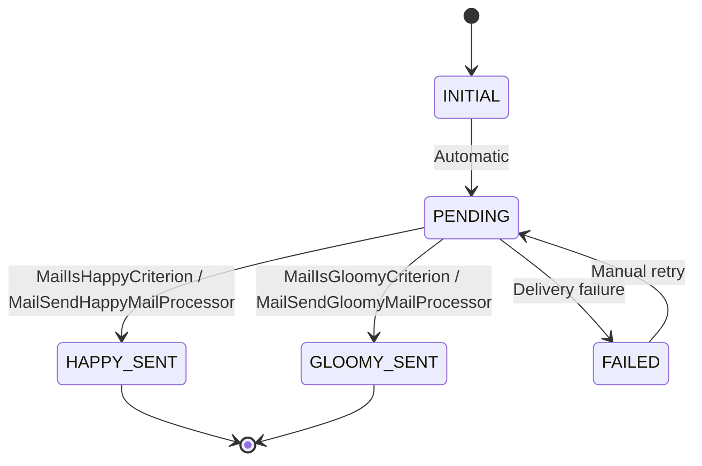

# Workflows

## Mail Workflow

### Description
The Mail workflow manages the lifecycle of mail entities from creation to delivery based on their happiness state.

### States
- **INITIAL**: Starting state when a mail entity is created
- **PENDING**: Mail is ready for processing and delivery
- **HAPPY_SENT**: Happy mail has been successfully sent
- **GLOOMY_SENT**: Gloomy mail has been successfully sent
- **FAILED**: Mail delivery failed

### Transitions

#### 1. Initial to Pending
- **From**: INITIAL
- **To**: PENDING
- **Type**: Automatic
- **Processor**: None
- **Criterion**: None
- **Description**: Automatically moves new mail entities to pending state

#### 2. Pending to Happy Sent
- **From**: PENDING
- **To**: HAPPY_SENT
- **Type**: Automatic
- **Processor**: MailSendHappyMailProcessor
- **Criterion**: MailIsHappyCriterion
- **Description**: Sends happy mail when isHappy is true

#### 3. Pending to Gloomy Sent
- **From**: PENDING
- **To**: GLOOMY_SENT
- **Type**: Automatic
- **Processor**: MailSendGloomyMailProcessor
- **Criterion**: MailIsGloomyCriterion
- **Description**: Sends gloomy mail when isHappy is false

#### 4. Pending to Failed
- **From**: PENDING
- **To**: FAILED
- **Type**: Automatic
- **Processor**: None
- **Criterion**: None
- **Description**: Fallback transition when mail delivery fails

#### 5. Failed to Pending (Retry)
- **From**: FAILED
- **To**: PENDING
- **Type**: Manual
- **Processor**: None
- **Criterion**: None
- **Description**: Manual retry of failed mail delivery

### State Diagram

```mermaid
stateDiagram-v2
    [*] --> INITIAL
    INITIAL --> PENDING : Automatic
    PENDING --> HAPPY_SENT : MailIsHappyCriterion / MailSendHappyMailProcessor
    PENDING --> GLOOMY_SENT : MailIsGloomyCriterion / MailSendGloomyMailProcessor
    PENDING --> FAILED : Delivery failure
    FAILED --> PENDING : Manual retry
    HAPPY_SENT --> [*]
    GLOOMY_SENT --> [*]
```
