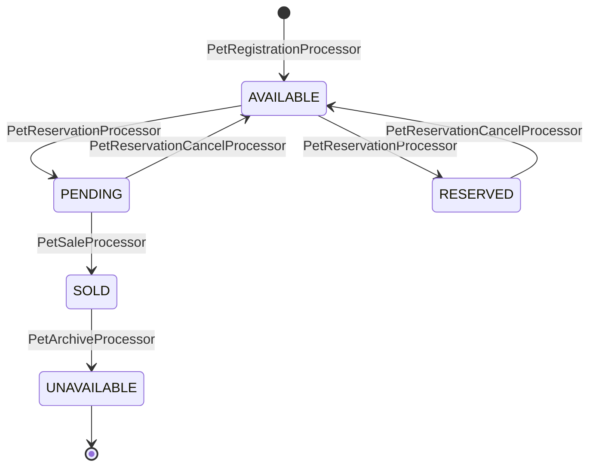
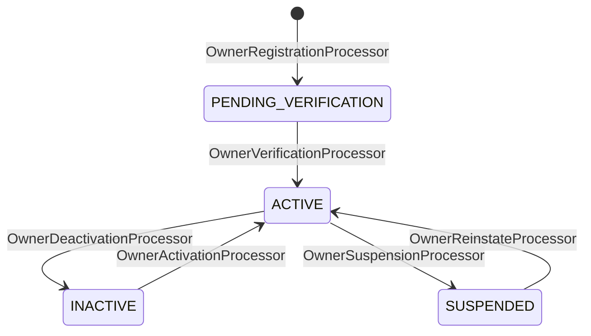
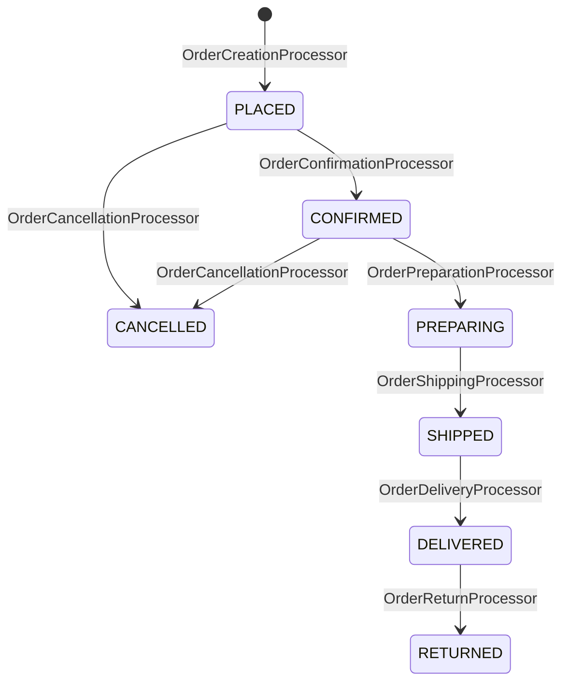
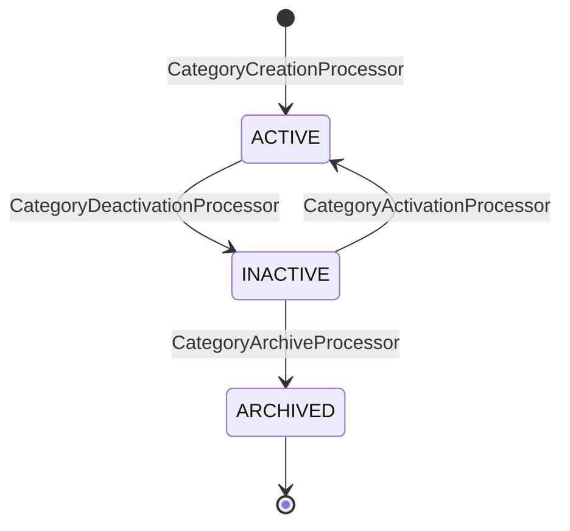

# Workflows for Purrfect Pets API

## Pet Workflow

**Name:** PetWorkflow

**States:** INITIAL → AVAILABLE → PENDING → SOLD | RESERVED → UNAVAILABLE

**Transitions:**

1. **INITIAL → AVAILABLE**
   - Type: Automatic
   - Processor: PetRegistrationProcessor
   - Criterion: None
   - Description: Pet is registered and becomes available for adoption

2. **AVAILABLE → PENDING**
   - Type: Manual
   - Processor: PetReservationProcessor
   - Criterion: PetAvailabilityCriterion
   - Description: Pet is reserved by a potential owner

3. **PENDING → SOLD**
   - Type: Manual
   - Processor: PetSaleProcessor
   - Criterion: PetSaleValidationCriterion
   - Description: Pet adoption is completed

4. **PENDING → AVAILABLE**
   - Type: Manual
   - Processor: PetReservationCancelProcessor
   - Criterion: None
   - Description: Reservation is cancelled, pet becomes available again

5. **AVAILABLE → RESERVED**
   - Type: Manual
   - Processor: PetReservationProcessor
   - Criterion: PetAvailabilityCriterion
   - Description: Pet is temporarily reserved

6. **RESERVED → AVAILABLE**
   - Type: Manual
   - Processor: PetReservationCancelProcessor
   - Criterion: None
   - Description: Reservation expires or is cancelled

7. **SOLD → UNAVAILABLE**
   - Type: Automatic
   - Processor: PetArchiveProcessor
   - Criterion: None
   - Description: Sold pet is archived

```mermaid
stateDiagram-v2
    [*] --> AVAILABLE : PetRegistrationProcessor
    AVAILABLE --> PENDING : PetReservationProcessor
    AVAILABLE --> RESERVED : PetReservationProcessor
    PENDING --> SOLD : PetSaleProcessor
    PENDING --> AVAILABLE : PetReservationCancelProcessor
    RESERVED --> AVAILABLE : PetReservationCancelProcessor
    SOLD --> UNAVAILABLE : PetArchiveProcessor
    UNAVAILABLE --> [*]
```

## Owner Workflow

**Name:** OwnerWorkflow

**States:** INITIAL → PENDING_VERIFICATION → ACTIVE → INACTIVE | SUSPENDED

**Transitions:**

1. **INITIAL → PENDING_VERIFICATION**
   - Type: Automatic
   - Processor: OwnerRegistrationProcessor
   - Criterion: None
   - Description: Owner registers and awaits verification

2. **PENDING_VERIFICATION → ACTIVE**
   - Type: Manual
   - Processor: OwnerVerificationProcessor
   - Criterion: OwnerVerificationCriterion
   - Description: Owner verification is completed

3. **ACTIVE → INACTIVE**
   - Type: Manual
   - Processor: OwnerDeactivationProcessor
   - Criterion: None
   - Description: Owner account is deactivated

4. **INACTIVE → ACTIVE**
   - Type: Manual
   - Processor: OwnerActivationProcessor
   - Criterion: OwnerActivationCriterion
   - Description: Owner account is reactivated

5. **ACTIVE → SUSPENDED**
   - Type: Manual
   - Processor: OwnerSuspensionProcessor
   - Criterion: OwnerSuspensionCriterion
   - Description: Owner account is suspended

6. **SUSPENDED → ACTIVE**
   - Type: Manual
   - Processor: OwnerReinstateProcessor
   - Criterion: OwnerReinstateCriterion
   - Description: Owner account is reinstated

```mermaid
stateDiagram-v2
    [*] --> PENDING_VERIFICATION : OwnerRegistrationProcessor
    PENDING_VERIFICATION --> ACTIVE : OwnerVerificationProcessor
    ACTIVE --> INACTIVE : OwnerDeactivationProcessor
    INACTIVE --> ACTIVE : OwnerActivationProcessor
    ACTIVE --> SUSPENDED : OwnerSuspensionProcessor
    SUSPENDED --> ACTIVE : OwnerReinstateProcessor
```

## Order Workflow

**Name:** OrderWorkflow

**States:** INITIAL → PLACED → CONFIRMED → PREPARING → SHIPPED → DELIVERED | CANCELLED | RETURNED

**Transitions:**

1. **INITIAL → PLACED**
   - Type: Automatic
   - Processor: OrderCreationProcessor
   - Criterion: None
   - Description: Order is created and placed

2. **PLACED → CONFIRMED**
   - Type: Manual
   - Processor: OrderConfirmationProcessor
   - Criterion: OrderValidationCriterion
   - Description: Order is confirmed by staff

3. **CONFIRMED → PREPARING**
   - Type: Manual
   - Processor: OrderPreparationProcessor
   - Criterion: None
   - Description: Order preparation begins

4. **PREPARING → SHIPPED**
   - Type: Manual
   - Processor: OrderShippingProcessor
   - Criterion: OrderShippingCriterion
   - Description: Order is shipped

5. **SHIPPED → DELIVERED**
   - Type: Manual
   - Processor: OrderDeliveryProcessor
   - Criterion: None
   - Description: Order is delivered

6. **PLACED → CANCELLED**
   - Type: Manual
   - Processor: OrderCancellationProcessor
   - Criterion: OrderCancellationCriterion
   - Description: Order is cancelled

7. **CONFIRMED → CANCELLED**
   - Type: Manual
   - Processor: OrderCancellationProcessor
   - Criterion: OrderCancellationCriterion
   - Description: Order is cancelled after confirmation

8. **DELIVERED → RETURNED**
   - Type: Manual
   - Processor: OrderReturnProcessor
   - Criterion: OrderReturnCriterion
   - Description: Order is returned

```mermaid
stateDiagram-v2
    [*] --> PLACED : OrderCreationProcessor
    PLACED --> CONFIRMED : OrderConfirmationProcessor
    PLACED --> CANCELLED : OrderCancellationProcessor
    CONFIRMED --> PREPARING : OrderPreparationProcessor
    CONFIRMED --> CANCELLED : OrderCancellationProcessor
    PREPARING --> SHIPPED : OrderShippingProcessor
    SHIPPED --> DELIVERED : OrderDeliveryProcessor
    DELIVERED --> RETURNED : OrderReturnProcessor
```

## Category Workflow

**Name:** CategoryWorkflow

**States:** INITIAL → ACTIVE → INACTIVE | ARCHIVED

**Transitions:**

1. **INITIAL → ACTIVE**
   - Type: Automatic
   - Processor: CategoryCreationProcessor
   - Criterion: None
   - Description: Category is created and activated

2. **ACTIVE → INACTIVE**
   - Type: Manual
   - Processor: CategoryDeactivationProcessor
   - Criterion: None
   - Description: Category is deactivated

3. **INACTIVE → ACTIVE**
   - Type: Manual
   - Processor: CategoryActivationProcessor
   - Criterion: None
   - Description: Category is reactivated

4. **INACTIVE → ARCHIVED**
   - Type: Manual
   - Processor: CategoryArchiveProcessor
   - Criterion: CategoryArchiveCriterion
   - Description: Category is archived

```mermaid
stateDiagram-v2
    [*] --> ACTIVE : CategoryCreationProcessor
    ACTIVE --> INACTIVE : CategoryDeactivationProcessor
    INACTIVE --> ACTIVE : CategoryActivationProcessor
    INACTIVE --> ARCHIVED : CategoryArchiveProcessor
    ARCHIVED --> [*]
```
