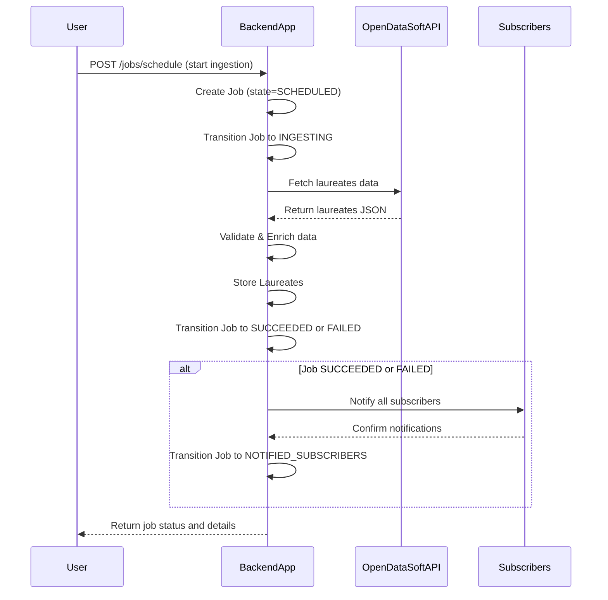
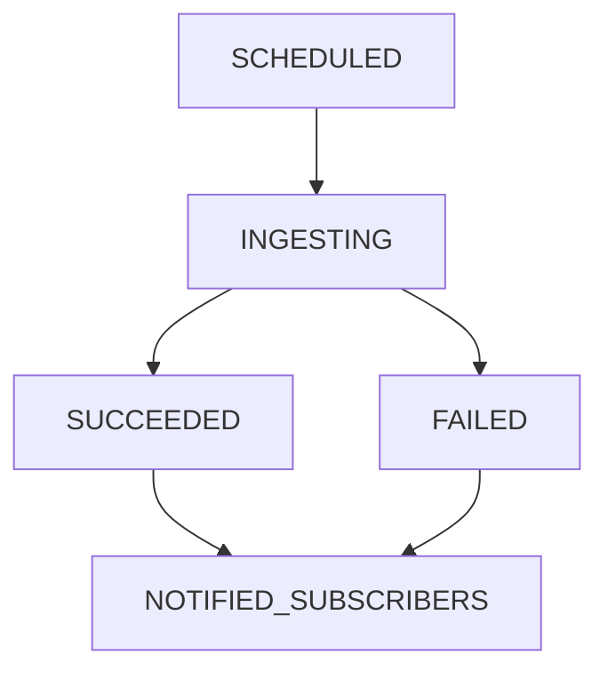

```markdown
# Functional Requirements for Nobel Laureates Data Ingestion Application

## Core API Endpoints

### 1. Schedule a Job to Ingest Data  
**POST /jobs/schedule**  
- **Description:** Trigger a new ingestion job that fetches Nobel laureates data from the OpenDataSoft API, processes it, and notifies subscribers.  
- **Request Body:**  
```json
{}
```  
- **Response:**  
```json
{
  "job_id": "string",
  "status": "SCHEDULED"
}
```  

---

### 2. Get Job Status and Details  
**GET /jobs/{job_id}**  
- **Description:** Retrieve the current state and details of a specific ingestion job.  
- **Response:**  
```json
{
  "job_id": "string",
  "state": "SCHEDULED | INGESTING | SUCCEEDED | FAILED | NOTIFIED_SUBSCRIBERS",
  "created_at": "ISO8601 timestamp",
  "completed_at": "ISO8601 timestamp or null",
  "error_message": "string or null"
}
```  

---

### 3. Retrieve Laureates Data  
**GET /laureates**  
- **Description:** Retrieve a list of stored laureates with optional filters (e.g., year, category).  
- **Query Parameters (optional):**  
  - `year` (string or int)  
  - `category` (string)  
- **Response:**  
```json
[
  {
    "id": 853,
    "firstname": "Akira",
    "surname": "Suzuki",
    "gender": "male",
    "born": "1930-09-12",
    "died": null,
    "borncountry": "Japan",
    "borncountrycode": "JP",
    "borncity": "Mukawa",
    "year": "2010",
    "category": "Chemistry",
    "motivation": "\"for palladium-catalyzed cross couplings in organic synthesis\"",
    "name": "Hokkaido University",
    "city": "Sapporo",
    "country": "Japan"
  }
]
```  

---

### 4. Manage Subscribers  
#### a) Add Subscriber  
**POST /subscribers**  
- **Description:** Register a new subscriber for notifications.  
- **Request Body:**  
```json
{
  "email": "string (optional)",
  "webhook_url": "string (optional)"
}
```  
- **Response:**  
```json
{
  "subscriber_id": "string",
  "status": "active"
}
```  

#### b) List Subscribers  
**GET /subscribers**  
- **Description:** Retrieve all active subscribers.  
- **Response:**  
```json
[
  {
    "subscriber_id": "string",
    "email": "string or null",
    "webhook_url": "string or null",
    "status": "active"
  }
]
```  

---

## Business Logic Rules  
- The **POST /jobs/schedule** endpoint triggers:  
  - Fetching data from the external OpenDataSoft API.  
  - Validation and enrichment of laureate data.  
  - State transitions in the Job entity workflow.  
  - Notification to all active subscribers via email or webhook.  
- All retrieval endpoints use **GET** and serve data only from the internal system.  
- Validation includes required field checks and format normalization (e.g., date parsing, country codes).  
- Notification failures do not affect job success but should be logged.  

---

## User-App Interaction Sequence Diagram



---

## Job State Workflow Diagram


```