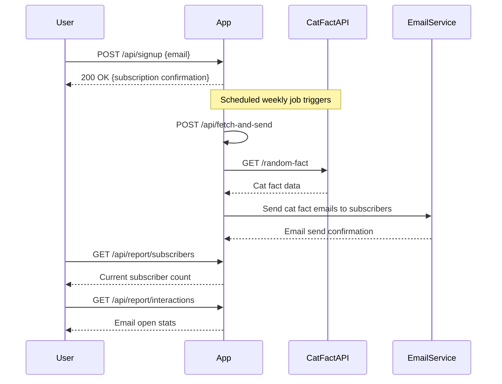

```markdown
# Functional Requirements for Weekly Cat Fact Subscription Application

## API Endpoints

### 1. User Signup
- **POST** `/api/signup`
- **Description:** Register a new subscriber with their email.
- **Request Body:**
  ```json
  {
    "email": "user@example.com"
  }
  ```
- **Response:**
  ```json
  {
    "message": "Subscription successful",
    "subscriberId": "uuid"
  }
  ```

### 2. Trigger Weekly Cat Fact Ingestion & Email Send-out
- **POST** `/api/fetch-and-send`
- **Description:** Retrieves a new cat fact from the Cat Fact API and sends it via email to all subscribers. Scheduled to run once a week.
- **Request Body:** *(empty or optional scheduling metadata)*
- **Response:**
  ```json
  {
    "message": "Cat fact sent to subscribers",
    "catFact": "Cats have five toes on their front paws, but only four toes on their back paws."
  }
  ```

### 3. Get Subscriber Count
- **GET** `/api/report/subscribers`
- **Description:** Retrieves the current number of subscribers.
- **Response:**
  ```json
  {
    "subscriberCount": 1234
  }
  ```

### 4. Get Interaction Stats (Email Opens)
- **GET** `/api/report/interactions`
- **Description:** Retrieves aggregated email open statistics.
- **Response:**
  ```json
  {
    "totalEmailsSent": 1200,
    "totalOpens": 850,
    "openRate": 0.708
  }
  ```

---

## User-App Interaction Sequence



---

## Summary

- POST endpoints handle all data ingestion, processing, and email sending.
- GET endpoints provide reporting data only.
- Users sign up with email only.
- Email opens are tracked and reported.
- Weekly cat fact retrieval and email send-out is triggered by a scheduled POST request.
```
