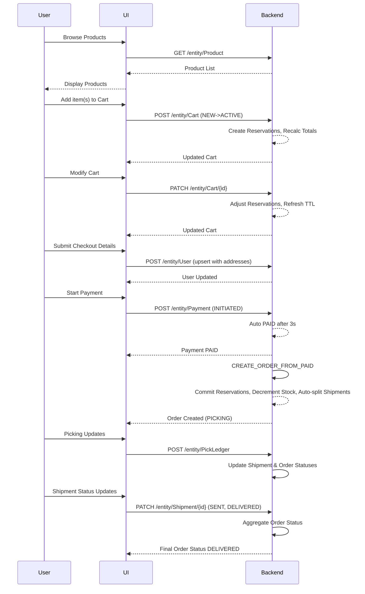

```markdown
# Functional Requirements & API Design for E-commerce Order Management (Cyoda Backend)

---

## 1. API Endpoints

### **Product**

- `GET /entity/Product`
  - Retrieve product list or single product by SKU.
  - **Response:** List of products with fields: `sku`, `name`, `description`, `price`, `quantityAvailable`, `category`.

- `POST /entity/Product`
  - Create a new product.
  - **Request:** JSON with product fields.
  - **Response:** Created product entity.

- `PATCH /entity/Product/{sku}`
  - Update product details or stock.
  - **Request:** JSON partial fields.
  - **Response:** Updated product entity.

---

### **Cart**

- `POST /entity/Cart`
  - Create a new cart or modify cart by adding/removing items.
  - **Request:** 
    ```json
    {
      "cartId": "string (optional for new)",
      "userId": "string (optional)",
      "status": "NEW" | "ACTIVE" | "CHECKING_OUT" | "CONVERTED",
      "lines": [
        {"sku": "string", "name": "string", "price": number, "qty": number}
      ]
    }
    ```
  - **Business logic:** On add/remove, refresh reservation TTL, recalc totals, create/release reservations.
  - **Response:** Updated cart with totals.

- `PATCH /entity/Cart/{cartId}`
  - Modify cart status or lines.
  - **Request:** Partial cart update.
  - **Response:** Updated cart.

- `GET /entity/Cart/{cartId}`
  - Retrieve current cart content and status.

---

### **User**

- `POST /entity/User`
  - Upsert user with multiple inline addresses of fixed types.
  - **Request:**
    ```json
    {
      "userId": "string (optional)",
      "name": "string",
      "email": "string",
      "phone": "string (optional)",
      "addresses": {
        "billing": { "line1": "string", "city": "string", "postcode": "string", "country": "string", "updatedAt": "datetime" },
        "default": { "line1": "string", "city": "string", "postcode": "string", "country": "string", "updatedAt": "datetime" },
        "delivery": { "line1": "string", "city": "string", "postcode": "string", "country": "string", "updatedAt": "datetime" }
      }
    }
    ```
  - **Response:** Created or updated user.

- `PATCH /entity/User/{userId}`
  - Update user or addresses partially.

---

### **Payment**

- `POST /entity/Payment`
  - Create a payment with `INITIATED` status.
  - **Request:**
    ```json
    {
      "paymentId": "string (optional)",
      "cartId": "string",
      "amount": number,
      "provider": "DUMMY",
      "status": "INITIATED"
    }
    ```
  - **Business logic:** Auto transition to `PAID` after 3 seconds.
  - **Response:** Payment entity.

---

### **Order**

- `POST /entity/Order`
  - Create order from paid payment/cart.
  - **Request:** 
    ```json
    {
      "orderId": "string (optional)",
      "orderNumber": "ULID string",
      "userId": "string",
      "shippingAddress": { ...snapshot from User.delivery address... },
      "lines": [ { "sku": "string", "name": "string", "unitPrice": number, "qty": number, "lineTotal": number } ],
      "totals": { "items": number, "grand": number },
      "status": "WAITING_TO_FULFILL"
    }
    ```
  - **Business logic:** Commit reservations, decrement stock, auto-split shipments.
  - **Response:** Created order.

- `PATCH /entity/Order/{orderId}`
  - Update order status or details.

- `GET /entity/Order/{orderId}`
  - Retrieve order details.

---

### **Shipment**

- `POST /entity/Shipment`
  - Created automatically on order creation by auto-split logic.

- `PATCH /entity/Shipment/{shipmentId}`
  - Update shipment status (`PICKING`, `WAITING_TO_SEND`, `SENT`, `DELIVERED`) and tracking info.

- `GET /entity/Shipment/{shipmentId}`
  - Retrieve shipment details.

---

### **Reservation**

- Reservation entities managed internally on cart modifications and order creation.

---

### **PickLedger**

- `POST /entity/PickLedger`
  - Log picking activity during fulfillment.
  - **Request:**
    ```json
    {
      "pickId": "string (optional)",
      "orderId": "string",
      "shipmentId": "string",
      "sku": "string",
      "delta": number,
      "at": "datetime",
      "actor": "string (optional)",
      "note": "string (optional)"
    }
    ```

---

## 2. User-App Interaction Sequence (Happy Path)



---

## 3. Additional Notes

- Multiple inline addresses per User with fixed keys: `billing`, `default`, `delivery`.
- Reserved stock is released immediately on order cancellation or payment failure.
- Shipments are auto-split purely based on item quantities, no additional rules.
- All POST endpoints handle business logic and external data retrieval/calculations.
- GET endpoints are read-only for stored data.
- Order numbers use ULID format.
- Reservations expire 4 hours after last cart action unless renewed.

```
If you want me to proceed with backend generation or need further details, just let me know!
```