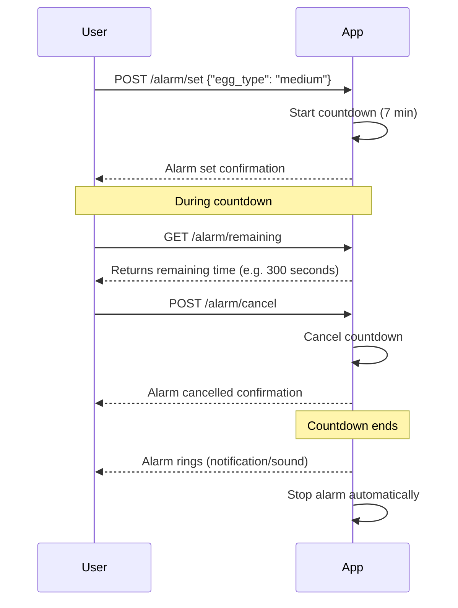

```markdown
# Egg Alarm App - Final Functional Requirements

## Overview
An app that allows users to set a single alarm for boiling eggs with three preset options: soft-boiled, medium-boiled, and hard-boiled. The app manages the countdown, informs users of remaining time, and supports alarm cancellation.

## Functional Requirements

- **Alarm Setting**
  - Users can set one alarm at a time.
  - Alarm options correspond to egg types with default boiling times:
    - Soft-boiled: 4 minutes
    - Medium-boiled: 7 minutes
    - Hard-boiled: 10 minutes
  - Setting an alarm starts a countdown timer.

- **Alarm Notification**
  - Alarm rings with a simple default sound once the timer ends.
  - Alarm automatically stops after ringing once.

- **Alarm Status**
  - Users can request the remaining time on the active alarm.
  - Users can cancel the alarm before it goes off.
  - Users receive simple confirmations after setting, canceling, or when the alarm rings.

- **Access**
  - No user authentication; open to any user.

## API Endpoints

### 1. Set Alarm  
- **Method:** POST  
- **Endpoint:** `/alarm/set`  
- **Request Body:**  
  ```json
  {
    "egg_type": "soft" | "medium" | "hard"
  }
  ```  
- **Response:**  
  ```json
  {
    "status": "success",
    "message": "Alarm set for medium-boiled egg, 7 minutes"
  }
  ```  

### 2. Get Remaining Time  
- **Method:** GET  
- **Endpoint:** `/alarm/remaining`  
- **Response:**  
  ```json
  {
    "remaining_seconds": 180
  }
  ```  
  or if no alarm active:  
  ```json
  {
    "remaining_seconds": 0,
    "message": "No active alarm"
  }
  ```  

### 3. Cancel Alarm  
- **Method:** POST  
- **Endpoint:** `/alarm/cancel`  
- **Response:**  
  ```json
  {
    "status": "success",
    "message": "Alarm cancelled"
  }
  ```  

---

## User-App Interaction Sequence


```