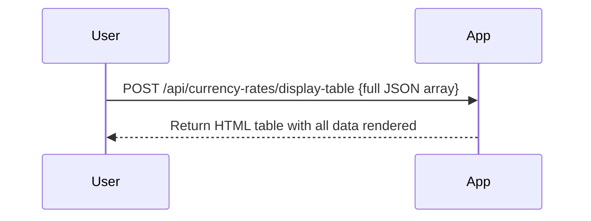
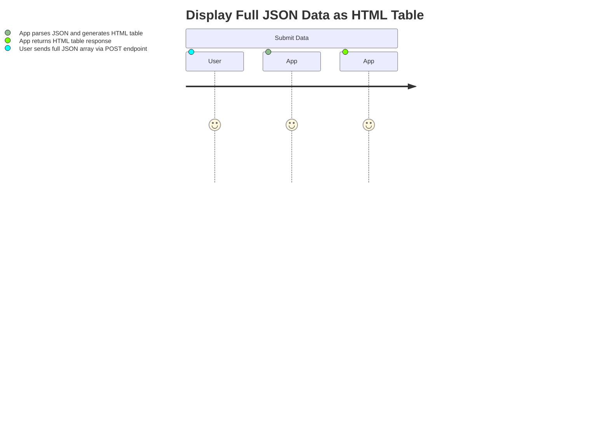

```markdown
# Functional Requirements for Currency Rates Application (Full JSON Data as HTML Table)

## API Endpoints

### 1. POST `/api/currency-rates/display-table`
- **Purpose:** Accept a JSON array of currency rate objects and return the full data as a formatted HTML table including all columns and rows.
- **Request Body (JSON):**  
  Accepts the full JSON array with objects containing multiple columns, e.g.:
  ```json
  [
    {
      "Column_1": "D70ON",
      "Column_2": 973,
      "Column_3": "AKB0H",
      "Column_4": 840,
      "Column_5": "5L0XY",
      "Column_6": 42,
      "Column_7": "3VTN2",
      "Column_8": 554,
      "Column_9": "1UCOX",
      "Column_10": 754,
      "Column_11": "HRRLJ",
      "Column_12": 600,
      "Column_13": "C22II",
      "Column_14": 112,
      "Column_15": "9PNQC",
      "Column_16": 688,
      "Column_17": "ZMKXA",
      "Column_18": 858,
      "Column_19": "XJSCC",
      "Column_20": 189
    },
    {
      "Column_1": "4O1ZZ",
      "Column_2": 19,
      "Column_3": "3A1TA",
      "Column_4": 812,
      "Column_5": "77OZ0",
      "Column_6": 552,
      "Column_7": "I59M7",
      "Column_8": 189,
      "Column_9": "VZJ2S",
      "Column_10": 472,
      "Column_11": "V5MHL",
      "Column_12": 985,
      "Column_13": "UZKHD",
      "Column_14": 646,
      "Column_15": "QFR5E",
      "Column_16": 211,
      "Column_17": "T0RO2",
      "Column_18": 155,
      "Column_19": "3Z2EO",
      "Column_20": 714
    }
  ]
  ```
- **Response (HTML):**  
  Returns an HTML table string with the full data rendered, e.g.:
  ```html
  <table border="1" cellspacing="0" cellpadding="5">
    <thead>
      <tr>
        <th>Column_1</th><th>Column_2</th><th>Column_3</th> ... <th>Column_20</th>
      </tr>
    </thead>
    <tbody>
      <tr>
        <td>D70ON</td><td>973</td><td>AKB0H</td> ... <td>189</td>
      </tr>
      <tr>
        <td>4O1ZZ</td><td>19</td><td>3A1TA</td> ... <td>714</td>
      </tr>
    </tbody>
  </table>
  ```
- **Business Logic:**  
  - Parses the input JSON array.
  - Dynamically extracts all column headers from the first object.
  - Constructs an HTML table with all columns and rows.
  - Returns the HTML table string as the response.

---

## User-App Interaction Sequence Diagram



---

## User Journey Diagram


```

If everything looks good, I can proceed with implementation or assist further!