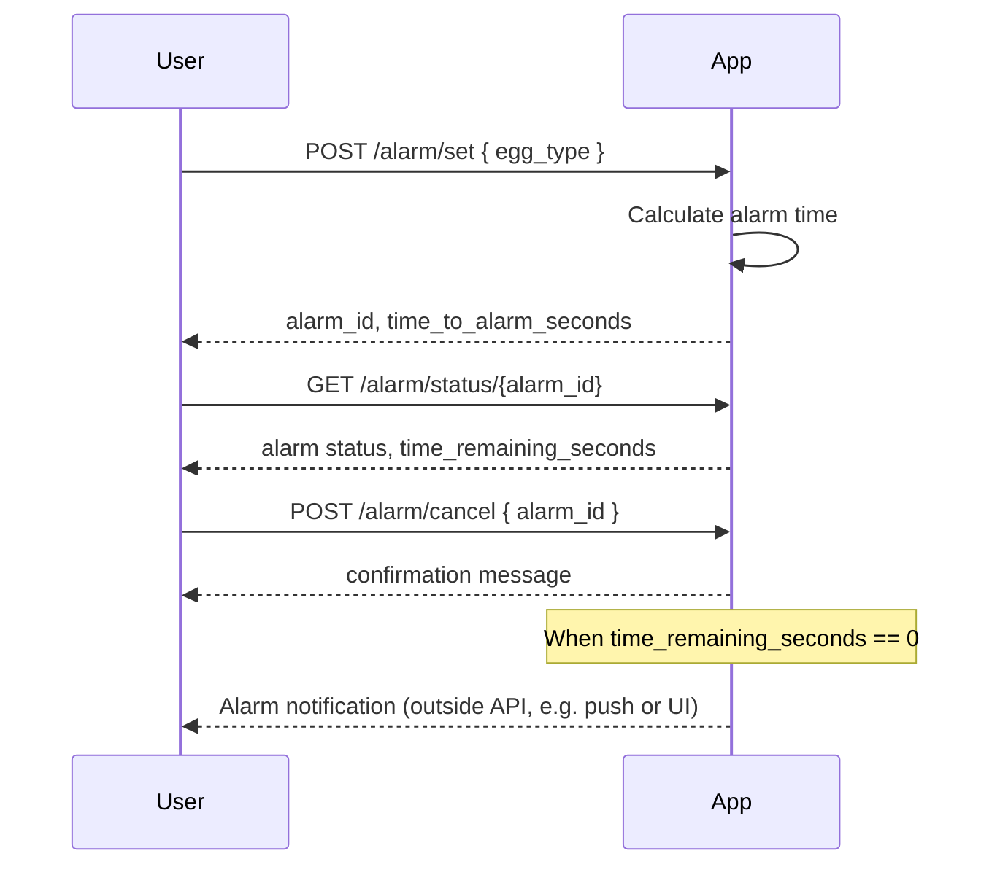

```markdown
# Egg Alarm App - Functional Requirements and API Design

## Functional Requirements
- User selects egg type: soft-boiled, medium-boiled, or hard-boiled.
- User sets an alarm based on the selected egg type.
- Alarm triggers after the predefined cooking time for the chosen egg type.
- User can retrieve the current alarm status.
- User can cancel or reset the alarm.

## Cooking Times (fixed)
- Soft-boiled: 4 minutes
- Medium-boiled: 7 minutes
- Hard-boiled: 10 minutes

---

## API Endpoints

### 1. Set Alarm  
**POST** `/alarm/set`  
Request:
```json
{
  "egg_type": "soft" | "medium" | "hard"
}
```
Response:
```json
{
  "status": "success",
  "alarm_id": "string",
  "time_to_alarm_seconds": 240
}
```
- Business logic: calculates alarm time based on egg type and starts countdown.

---

### 2. Get Alarm Status  
**GET** `/alarm/status/{alarm_id}`  
Response:
```json
{
  "alarm_id": "string",
  "egg_type": "soft" | "medium" | "hard",
  "time_remaining_seconds": 120,
  "status": "running" | "finished" | "cancelled"
}
```

---

### 3. Cancel Alarm  
**POST** `/alarm/cancel`  
Request:
```json
{
  "alarm_id": "string"
}
```
Response:
```json
{
  "status": "success",
  "message": "Alarm cancelled"
}
```

---

## User-App Interaction Sequence


```
