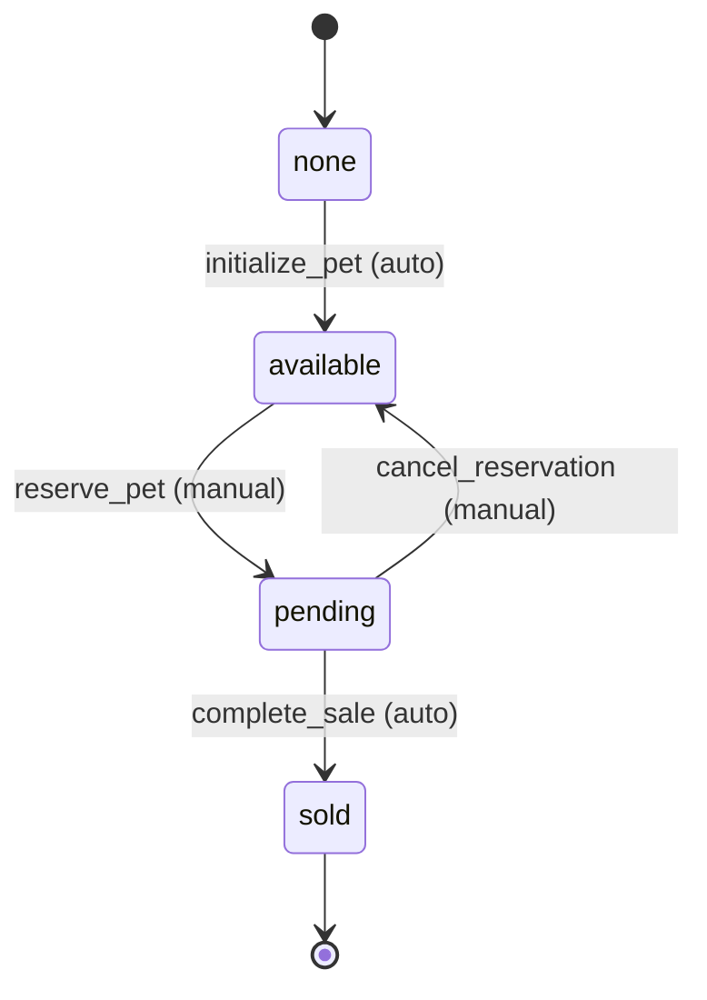
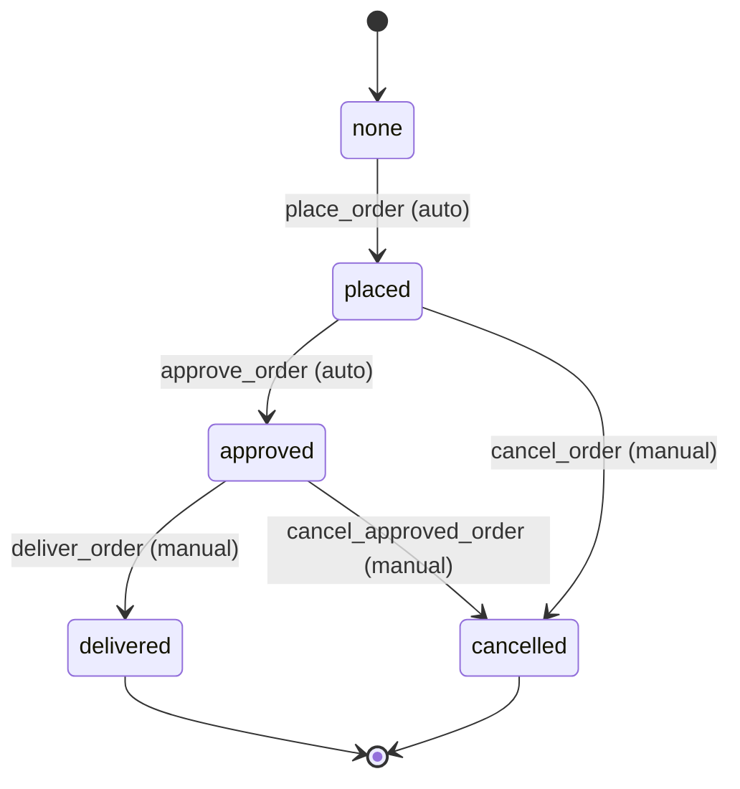
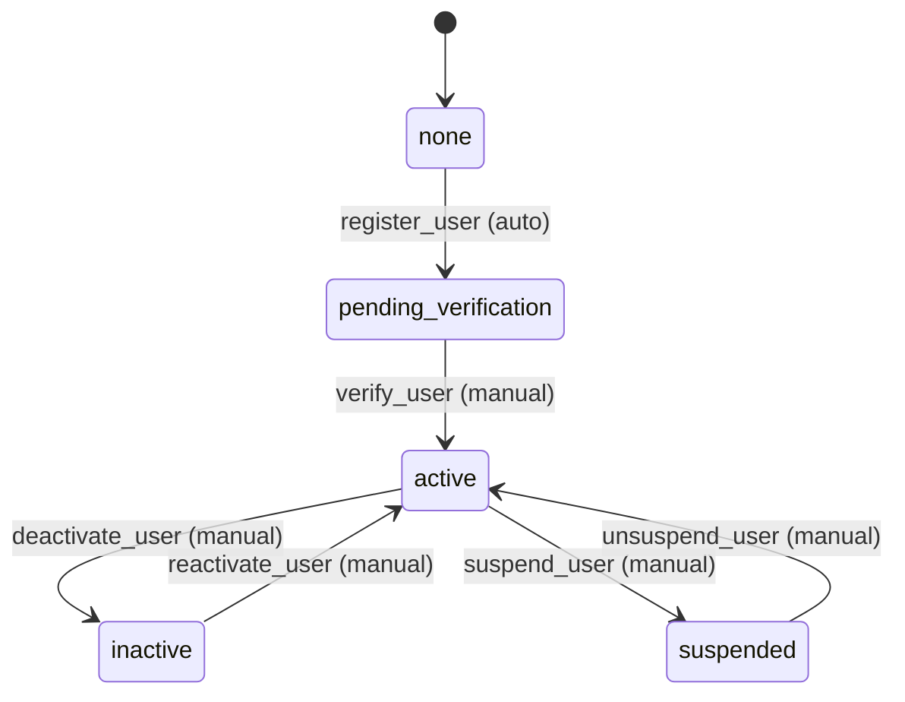
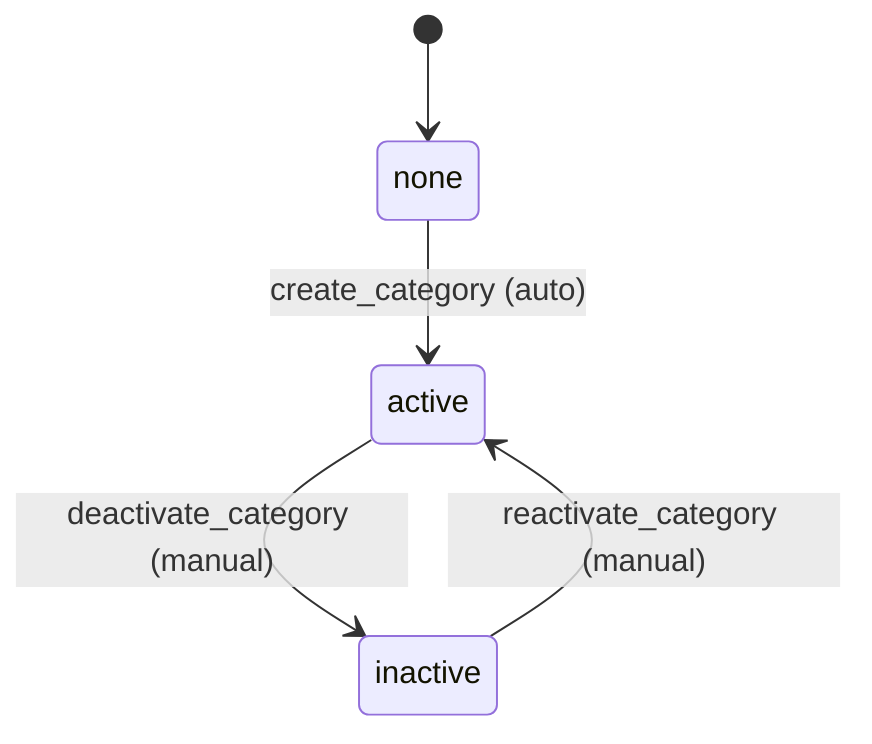
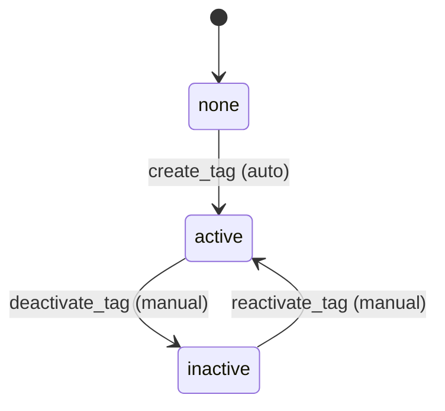

# Purrfect Pets API - Workflow Requirements

## Overview
This document defines the workflow requirements for each entity in the Purrfect Pets API system. Each entity has its own workflow with states and transitions that represent the business logic and lifecycle management.

## 1. Pet Workflow

**Name**: PetWorkflow  
**Description**: Manages the lifecycle of pets in the store from availability to sale

**States**: 
- `none` (initial state)
- `available` - Pet is available for purchase
- `pending` - Pet is reserved/pending sale
- `sold` - Pet has been sold

**Transitions**:

1. **none → available** (automatic)
   - **Name**: `initialize_pet`
   - **Type**: Automatic
   - **Processor**: `PetInitializeProcessor`
   - **Description**: Initialize a new pet and make it available

2. **available → pending** (manual)
   - **Name**: `reserve_pet`
   - **Type**: Manual
   - **Processor**: `PetReserveProcessor`
   - **Description**: Reserve a pet when an order is placed

3. **pending → sold** (automatic)
   - **Name**: `complete_sale`
   - **Type**: Automatic
   - **Processor**: `PetSaleProcessor`
   - **Criterion**: `PetSaleCriterion`
   - **Description**: Complete the sale when payment is confirmed

4. **pending → available** (manual)
   - **Name**: `cancel_reservation`
   - **Type**: Manual
   - **Processor**: `PetCancelReservationProcessor`
   - **Description**: Cancel reservation and make pet available again

## 2. Order Workflow

**Name**: OrderWorkflow  
**Description**: Manages the order fulfillment process from placement to delivery

**States**:
- `none` (initial state)
- `placed` - Order has been placed
- `approved` - Order has been approved for processing
- `delivered` - Order has been delivered
- `cancelled` - Order has been cancelled

**Transitions**:

1. **none → placed** (automatic)
   - **Name**: `place_order`
   - **Type**: Automatic
   - **Processor**: `OrderPlaceProcessor`
   - **Description**: Place a new order

2. **placed → approved** (automatic)
   - **Name**: `approve_order`
   - **Type**: Automatic
   - **Processor**: `OrderApprovalProcessor`
   - **Criterion**: `OrderApprovalCriterion`
   - **Description**: Approve order if payment and inventory checks pass

3. **placed → cancelled** (manual)
   - **Name**: `cancel_order`
   - **Type**: Manual
   - **Processor**: `OrderCancelProcessor`
   - **Description**: Cancel the order

4. **approved → delivered** (manual)
   - **Name**: `deliver_order`
   - **Type**: Manual
   - **Processor**: `OrderDeliveryProcessor`
   - **Description**: Mark order as delivered

5. **approved → cancelled** (manual)
   - **Name**: `cancel_approved_order`
   - **Type**: Manual
   - **Processor**: `OrderCancelProcessor`
   - **Description**: Cancel an approved order

## 3. User Workflow

**Name**: UserWorkflow  
**Description**: Manages user account lifecycle and verification process

**States**:
- `none` (initial state)
- `pending_verification` - User registered but not verified
- `active` - User account is active
- `inactive` - User account is inactive
- `suspended` - User account is suspended

**Transitions**:

1. **none → pending_verification** (automatic)
   - **Name**: `register_user`
   - **Type**: Automatic
   - **Processor**: `UserRegistrationProcessor`
   - **Description**: Register a new user account

2. **pending_verification → active** (manual)
   - **Name**: `verify_user`
   - **Type**: Manual
   - **Processor**: `UserVerificationProcessor`
   - **Description**: Verify user email and activate account

3. **active → inactive** (manual)
   - **Name**: `deactivate_user`
   - **Type**: Manual
   - **Processor**: `UserDeactivationProcessor`
   - **Description**: Deactivate user account

4. **inactive → active** (manual)
   - **Name**: `reactivate_user`
   - **Type**: Manual
   - **Processor**: `UserReactivationProcessor`
   - **Description**: Reactivate user account

5. **active → suspended** (manual)
   - **Name**: `suspend_user`
   - **Type**: Manual
   - **Processor**: `UserSuspensionProcessor`
   - **Description**: Suspend user account for violations

6. **suspended → active** (manual)
   - **Name**: `unsuspend_user`
   - **Type**: Manual
   - **Processor**: `UserUnsuspensionProcessor`
   - **Description**: Remove suspension and reactivate account

## 4. Category Workflow

**Name**: CategoryWorkflow  
**Description**: Manages category lifecycle and activation status

**States**:
- `none` (initial state)
- `active` - Category is active and visible
- `inactive` - Category is inactive and hidden

**Transitions**:

1. **none → active** (automatic)
   - **Name**: `create_category`
   - **Type**: Automatic
   - **Processor**: `CategoryCreateProcessor`
   - **Description**: Create and activate a new category

2. **active → inactive** (manual)
   - **Name**: `deactivate_category`
   - **Type**: Manual
   - **Processor**: `CategoryDeactivationProcessor`
   - **Description**: Deactivate category

3. **inactive → active** (manual)
   - **Name**: `reactivate_category`
   - **Type**: Manual
   - **Processor**: `CategoryReactivationProcessor`
   - **Description**: Reactivate category

## 5. Tag Workflow

**Name**: TagWorkflow  
**Description**: Manages tag lifecycle and activation status

**States**:
- `none` (initial state)
- `active` - Tag is active and can be used
- `inactive` - Tag is inactive and hidden

**Transitions**:

1. **none → active** (automatic)
   - **Name**: `create_tag`
   - **Type**: Automatic
   - **Processor**: `TagCreateProcessor`
   - **Description**: Create and activate a new tag

2. **active → inactive** (manual)
   - **Name**: `deactivate_tag`
   - **Type**: Manual
   - **Processor**: `TagDeactivationProcessor`
   - **Description**: Deactivate tag

3. **inactive → active** (manual)
   - **Name**: `reactivate_tag`
   - **Type**: Manual
   - **Processor**: `TagReactivationProcessor`
   - **Description**: Reactivate tag

## Workflow Integration Notes

1. **Cross-Entity Interactions**:
   - When a Pet transitions to `sold`, related Order should transition to `delivered`
   - When an Order is `cancelled`, related Pet should transition back to `available`
   - User suspension should prevent new Order creation

2. **Business Rules**:
   - Only `active` users can place orders
   - Only `available` pets can be reserved
   - Orders can only be placed for `available` pets
   - Categories and Tags must be `active` to be used with new pets

3. **Automatic vs Manual Transitions**:
   - Initial transitions from `none` are always automatic
   - Business logic transitions (like order approval) are automatic with criteria
   - Administrative actions (like suspension, cancellation) are manual
   - Loop transitions (returning to previous states) are manual
