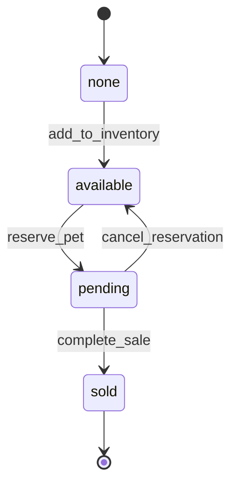
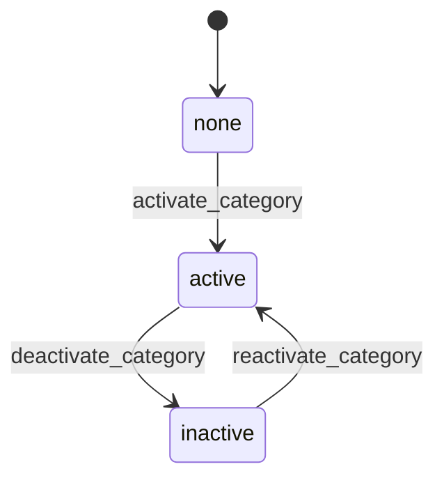
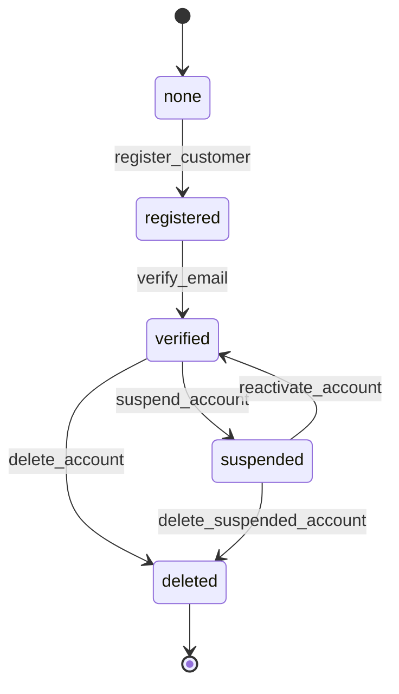
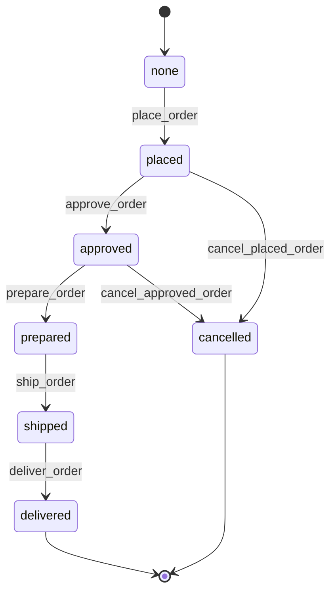
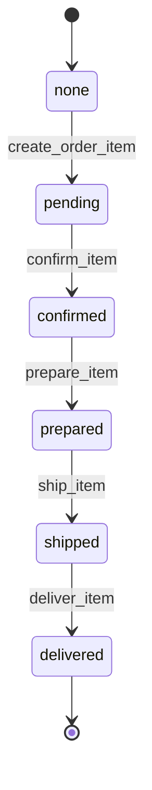

# Purrfect Pets API - Workflow Requirements

## Overview
This document defines the workflow states and transitions for each entity in the Purrfect Pets API system. Each entity has its own workflow with specific states and transitions.

## 1. Pet Workflow

**Name**: PetWorkflow

**Description**: Manages the lifecycle of pets from being added to the store until they are sold.

**States**: none → available → pending → sold

**Transitions**:

1. **Initial Transition**: `none` → `available`
   - **Name**: `add_to_inventory`
   - **Type**: Automatic
   - **Processor**: `PetInventoryProcessor`
   - **Description**: Automatically adds pet to available inventory when created

2. **Reserve Pet**: `available` → `pending`
   - **Name**: `reserve_pet`
   - **Type**: Manual
   - **Processor**: `PetReservationProcessor`
   - **Description**: Reserves pet when customer places order

3. **Complete Sale**: `pending` → `sold`
   - **Name**: `complete_sale`
   - **Type**: Manual
   - **Processor**: `PetSaleProcessor`
   - **Description**: Marks pet as sold when order is completed

4. **Cancel Reservation**: `pending` → `available`
   - **Name**: `cancel_reservation`
   - **Type**: Manual
   - **Processor**: `PetCancellationProcessor`
   - **Description**: Returns pet to available status if order is cancelled

## 2. Category Workflow

**Name**: CategoryWorkflow

**Description**: Manages category activation and deactivation.

**States**: none → active → inactive

**Transitions**:

1. **Initial Transition**: `none` → `active`
   - **Name**: `activate_category`
   - **Type**: Automatic
   - **Processor**: `CategoryActivationProcessor`
   - **Description**: Automatically activates category when created

2. **Deactivate Category**: `active` → `inactive`
   - **Name**: `deactivate_category`
   - **Type**: Manual
   - **Processor**: `CategoryDeactivationProcessor`
   - **Description**: Deactivates category (hides from public view)

3. **Reactivate Category**: `inactive` → `active`
   - **Name**: `reactivate_category`
   - **Type**: Manual
   - **Processor**: `CategoryReactivationProcessor`
   - **Description**: Reactivates previously deactivated category

## 3. Customer Workflow

**Name**: CustomerWorkflow

**Description**: Manages customer account lifecycle from registration to verification.

**States**: none → registered → verified → suspended → deleted

**Transitions**:

1. **Initial Transition**: `none` → `registered`
   - **Name**: `register_customer`
   - **Type**: Automatic
   - **Processor**: `CustomerRegistrationProcessor`
   - **Description**: Registers new customer and sends verification email

2. **Verify Email**: `registered` → `verified`
   - **Name**: `verify_email`
   - **Type**: Manual
   - **Processor**: `CustomerVerificationProcessor`
   - **Description**: Verifies customer email address

3. **Suspend Account**: `verified` → `suspended`
   - **Name**: `suspend_account`
   - **Type**: Manual
   - **Processor**: `CustomerSuspensionProcessor`
   - **Criterion**: `CustomerSuspensionCriterion`
   - **Description**: Suspends customer account for policy violations

4. **Reactivate Account**: `suspended` → `verified`
   - **Name**: `reactivate_account`
   - **Type**: Manual
   - **Processor**: `CustomerReactivationProcessor`
   - **Description**: Reactivates suspended customer account

5. **Delete Account**: `verified` → `deleted`
   - **Name**: `delete_account`
   - **Type**: Manual
   - **Processor**: `CustomerDeletionProcessor`
   - **Description**: Soft deletes customer account

6. **Delete Suspended Account**: `suspended` → `deleted`
   - **Name**: `delete_suspended_account`
   - **Type**: Manual
   - **Processor**: `CustomerDeletionProcessor`
   - **Description**: Deletes suspended customer account

## 4. Order Workflow

**Name**: OrderWorkflow

**Description**: Manages order processing from placement to delivery.

**States**: none → placed → approved → prepared → shipped → delivered → cancelled

**Transitions**:

1. **Initial Transition**: `none` → `placed`
   - **Name**: `place_order`
   - **Type**: Automatic
   - **Processor**: `OrderPlacementProcessor`
   - **Description**: Places order and reserves pets

2. **Approve Order**: `placed` → `approved`
   - **Name**: `approve_order`
   - **Type**: Manual
   - **Processor**: `OrderApprovalProcessor`
   - **Criterion**: `OrderApprovalCriterion`
   - **Description**: Approves order after payment verification

3. **Prepare Order**: `approved` → `prepared`
   - **Name**: `prepare_order`
   - **Type**: Manual
   - **Processor**: `OrderPreparationProcessor`
   - **Description**: Prepares pets for shipping

4. **Ship Order**: `prepared` → `shipped`
   - **Name**: `ship_order`
   - **Type**: Manual
   - **Processor**: `OrderShippingProcessor`
   - **Description**: Ships order to customer

5. **Deliver Order**: `shipped` → `delivered`
   - **Name**: `deliver_order`
   - **Type**: Manual
   - **Processor**: `OrderDeliveryProcessor`
   - **Description**: Confirms order delivery

6. **Cancel Order**: `placed` → `cancelled`
   - **Name**: `cancel_placed_order`
   - **Type**: Manual
   - **Processor**: `OrderCancellationProcessor`
   - **Description**: Cancels newly placed order

7. **Cancel Approved Order**: `approved` → `cancelled`
   - **Name**: `cancel_approved_order`
   - **Type**: Manual
   - **Processor**: `OrderCancellationProcessor`
   - **Description**: Cancels approved order with refund

## 5. OrderItem Workflow

**Name**: OrderItemWorkflow

**Description**: Manages individual order items within an order.

**States**: none → pending → confirmed → prepared → shipped → delivered

**Transitions**:

1. **Initial Transition**: `none` → `pending`
   - **Name**: `create_order_item`
   - **Type**: Automatic
   - **Processor**: `OrderItemCreationProcessor`
   - **Description**: Creates order item when order is placed

2. **Confirm Item**: `pending` → `confirmed`
   - **Name**: `confirm_item`
   - **Type**: Manual
   - **Processor**: `OrderItemConfirmationProcessor`
   - **Description**: Confirms item availability and pricing

3. **Prepare Item**: `confirmed` → `prepared`
   - **Name**: `prepare_item`
   - **Type**: Manual
   - **Processor**: `OrderItemPreparationProcessor`
   - **Description**: Prepares individual pet for shipping

4. **Ship Item**: `prepared` → `shipped`
   - **Name**: `ship_item`
   - **Type**: Manual
   - **Processor**: `OrderItemShippingProcessor`
   - **Description**: Ships individual item

5. **Deliver Item**: `shipped` → `delivered`
   - **Name**: `deliver_item`
   - **Type**: Manual
   - **Processor**: `OrderItemDeliveryProcessor`
   - **Description**: Confirms individual item delivery

## Workflow Integration Notes

1. **Pet-Order Integration**: When an order is placed, pets transition from `available` to `pending`
2. **Order-OrderItem Synchronization**: Order items generally follow the parent order's workflow
3. **Customer Verification**: Only verified customers can place orders
4. **Category Dependencies**: Inactive categories hide their pets from public listings
5. **Automatic Transitions**: First transitions are always automatic when entities are created
6. **Manual Transitions**: All subsequent transitions require explicit API calls with transition names
