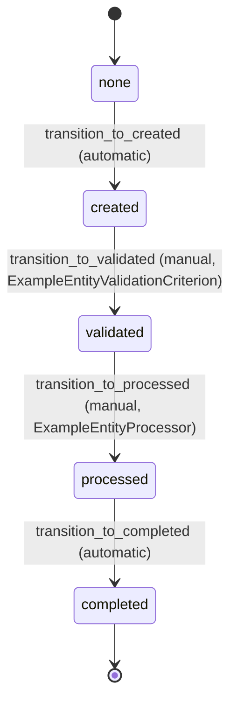
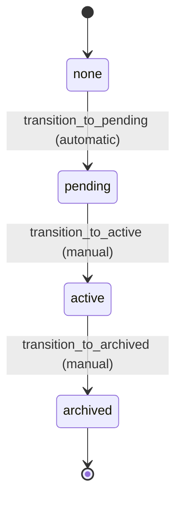

# Workflow Requirements

## ExampleEntity Workflow

### Description
The ExampleEntity workflow demonstrates a complete business process with validation, processing, and interaction with other entities.

### States
- `none`: Initial state when entity is created
- `created`: Entity has been created and is ready for validation
- `validated`: Entity has passed validation checks
- `processed`: Entity has been processed and other entities updated
- `completed`: Final state indicating successful completion

### Transitions

#### 1. transition_to_created
- **From**: none
- **To**: created
- **Type**: Automatic
- **Processor**: None
- **Criterion**: None
- **Description**: Initial transition from creation to created state

#### 2. transition_to_validated
- **From**: created
- **To**: validated
- **Type**: Manual
- **Processor**: None
- **Criterion**: ExampleEntityValidationCriterion
- **Description**: Validates the entity data before processing

#### 3. transition_to_processed
- **From**: validated
- **To**: processed
- **Type**: Manual
- **Processor**: ExampleEntityProcessor
- **Criterion**: None
- **Description**: Processes the entity and updates related OtherEntity instances

#### 4. transition_to_completed
- **From**: processed
- **To**: completed
- **Type**: Automatic
- **Processor**: None
- **Criterion**: None
- **Description**: Final transition to completed state

### Mermaid State Diagram

## OtherEntity Workflow

### Description
The OtherEntity workflow represents a simple lifecycle for entities that are updated by ExampleEntity processing.

### States
- `none`: Initial state when entity is created
- `pending`: Entity is waiting for processing
- `active`: Entity is active and available for use
- `archived`: Entity has been archived

### Transitions

#### 1. transition_to_pending
- **From**: none
- **To**: pending
- **Type**: Automatic
- **Processor**: None
- **Criterion**: None
- **Description**: Initial transition from creation to pending state

#### 2. transition_to_active
- **From**: pending
- **To**: active
- **Type**: Manual
- **Processor**: None
- **Criterion**: None
- **Description**: Activates the entity for use

#### 3. transition_to_archived
- **From**: active
- **To**: archived
- **Type**: Manual
- **Processor**: None
- **Criterion**: None
- **Description**: Archives the entity when no longer needed

### Mermaid State Diagram

